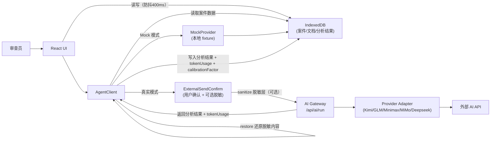
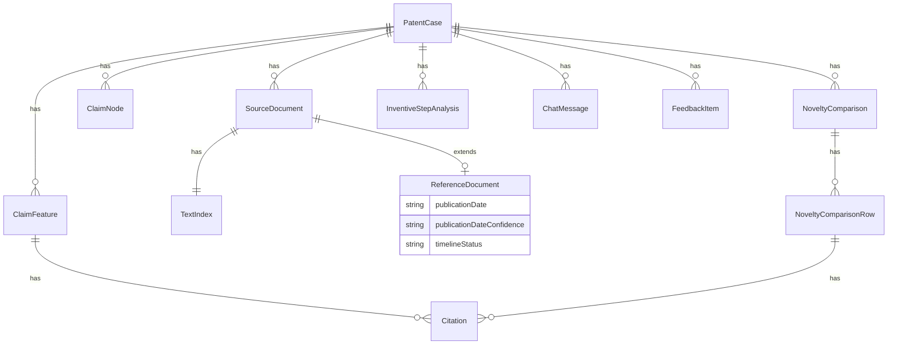
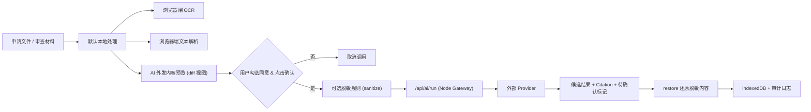

# 专利审查助手 v0.1.0 详细设计文档

<p align="right">版本 v0.1.0-r13 · 2026-05-09</p>

> 本文档面向后续维护者与开发者，描述 v0.1.0 的架构设计、关键决策、领域模型与实现约束。与 `PRD.md`（做什么）和 `DEVELOPMENT_PLAN.md`（怎么做）互为补充；如有冲突，以 PRD 为准。

### 文档变更记录

| 版本 | 日期 | 变更摘要 |
|------|------|---------|
| v0.1.0 | 2026-05-05 | 初稿 |
| v0.1.0-r1 | 2026-05-05 | 23 项修复：ocr-failed 状态、ProviderAdapter 接口、两级配置、6 条 ADR、Prompt 注入、错误处理、脱敏、Token 校准、导出、浏览器兼容、Zustand Slice、fixture 清单、Vite 代理、Pre-commit 门禁 |
| v0.1.0-r2 | 2026-05-05 | 12 项修复：ChatMessage 类型、脱敏 ADR-014（初为单向过滤，后恢复双向流程）、答复审查路由、mockDelay、ocrQualityThresholds、citationStatus OR 语义、数据流图、draft/chat 无模板说明、localStorage 边界、defectHints、自检清单移至附录、追溯矩阵领域模型列 |
| v0.1.0-r3 | 2026-05-05 | 6 项修复：数据流图 Gateway→IndexedDB 经 AgentClient 中转、ClaimNode 类型定义、targetClaimNumber 下拉行为、ocr-failed 恢复路径、头部变更记录表补全、ocr-failed 措辞修正 |
| v0.1.0-r4 | 2026-05-06 | 2 项修复：TOC 目录编号与章节标题统一（附录无编号）、删除 §8.2 孤立代码围栏 |
| v0.1.0-r5 | 2026-05-06 | 3 项修复：ADR-014 增加默认不启用说明、§7.2 状态名统一为 kebab-case、needs-review 特征高亮提醒说明 |
| v0.1.0-r6 | 2026-05-06 | 3 项修复：§11 ocrCache 增加 7 天过期策略 + 一键清除本地数据说明、§12 追溯矩阵 §6.7 行补充领域模型（复用 ClaimFeature[] + Citation） |
| v0.1.0-r7 | 2026-05-06 | 用户需求补充（3 项）：①文档解读模块 ②Firefox 兼容（降至 ≥100 + 浏览器检测）③案件历史壳子；MVP 8→9 步 |
| v0.1.0-r8 | 2026-05-07 | 三文档一致性审查修复（4 项）：§4.3.5 新颖性对照四档枚举补充、§5.4 Provider 上下文窗口 ≥128K 约束补充、§6.4 interpret Agent 上下文注入补充 textIndexDigest、版本号更新 |
| v0.1.0-r9 | 2026-05-07 | 三文档一致性审查第二轮修复（2 项）：§4.3.1 补充 textVersion 切换 stale 行为、§3.4 补充零对比文件待检索问题清单说明 |
| v0.1.0-r10 | 2026-05-09 | 部署路线调整为三阶段（本地→Vercel+Supabase远程试用→国内云合规）：§10 部署设计重构为三阶段 |
| v0.1.0-r11 | 2026-05-09 | 三文档一致性审查第三轮修复（5 项）：§4.3.6 创造性三步法定位从壳子改为核心功能、§3.4 补充文档解读模块状态机说明、§6.4 补充 interpret 截断策略细节 |
| v0.1.0-r12 | 2026-05-09 | 三文档一致性审查第四轮修复（3 项）：§3.4 状态转换图补充可选文档解读步骤、§6.1 Agent 映射补充创造性分析 Agent → `inventive` |
| v0.1.0-r13 | 2026-05-09 | 新增 Deepseek Provider（5 家）：§1.1 架构图、§2 ADR-005、§3.3 ProviderId、§4.1 数据流图、§5.4 Provider 表 |

---

## 目录

1. [总体架构](#1-总体架构)
2. [关键决策记录（ADR）](#2-关键决策记录adr)
3. [领域模型](#3-领域模型)
4. [前端设计](#4-前端设计)
5. [后端设计](#5-后端设计)
6. [AI Agent 与 Prompt 工程](#6-ai-agent-与-prompt-工程)
7. [安全设计](#7-安全设计)
8. [Mock 演示模式设计](#8-mock-演示模式设计)
9. [测试架构](#9-测试架构)
10. [部署设计](#10-部署设计)
11. [IndexedDB Schema 版本表](#11-indexeddb-schema-版本表)
12. [可追溯矩阵实现状态](#12-可追溯矩阵实现状态)
13. [Milestone 收尾记录](#13-milestone-收尾记录)
14. [验收记录](#14-验收记录)
[附录](#附录)
15. [变更记录](#15-变更记录)

---

## 1. 总体架构

### 1.1 逻辑架构

专利审查助手采用**前后端分离 + 单体仓库**架构，通过 npm workspaces 管理三个子包：

```
┌─────────────────────────────────────────────────────────────────────┐
│                     React Workbench UI (浏览器)                      │
│  ┌──────────┐  ┌───────────────┐  ┌─────────────┐  ┌────────────┐  │
│  │ 案件基线  │  │ 文档导入/OCR  │  │ 文档解读     │  │ Claim Chart  │  │
│  └──────────┘  └───────────────┘  └─────────────┘  └────────────┘  │
│  ┌──────────┐  ┌───────────────┐  ┌─────────────┐  ┌────────────┐  │
│  │ 新颖性对照│  │ 创造性       │  │ 形式缺陷     │  │ 素材草稿    │  │
│  └──────────┘  └───────────────┘  └─────────────┘  └────────────┘  │
│  ┌──────────┐  ┌───────────────┐                                     │
│  │ 导出     │  │ 案件历史      │                                     │
│  └──────────┘  └───────────────┘                                     │
│                                                                     │
│  ┌──────────────────────────────────────────────────────────────┐   │
│  │ AgentClient (Orchestrator 角色)                              │   │
│  │  · 任务分发 · 人工确认节点 · 状态提示 · 上下文隔离            │   │
│  └──────────────┬───────────────────────────────┬───────────────┘   │
│                 │                               │                   │
│  ┌──────────────▼──────────┐   ┌────────────────▼───────────────┐  │
│  │ MockProvider (离线)     │   │ ExternalSendConfirm (安全门)    │  │
│  │  · 预置 fixture 响应    │   │  · 内容预览 · 用户确认 · 脱敏   │  │
│  └─────────────────────────┘   └────────────────┬───────────────┘  │
│                                                  │                  │
└──────────────────────────────────────────────────┼──────────────────┘
                                                   │ HTTP POST /api/ai/run
                                                   ▼
┌─────────────────────────────────────────────────────────────────────┐
│                   Node Express Server (端口 3000)                    │
│  ┌──────────────────────────────────────────────────────────────┐   │
│  │ AI Gateway                                                   │   │
│  │  · Provider 选择与 fallback · API Key 使用 · Token 计量      │   │
│  └──────┬──────────┬──────────┬──────────┬─────────────────────┘   │
│         │          │          │          │                          │
│  ┌──────▼───┐ ┌────▼────┐ ┌──▼─────┐ ┌──▼──────┐ ┌──▼──────────┐ │
│  │ Kimi     │ │ GLM     │ │Minimax │ │ MiMo    │ │ Deepseek    │ │
│  │ Adapter  │ │ Adapter │ │Adapter │ │ Adapter │ │ Adapter     │ │
│  └──────────┘ └─────────┘ └────────┘ └─────────┘ └─────────────┘ │
│                                                                     │
│  ┌──────────────────────────────────────────────────────────────┐   │
│  │ 安全模块：keyStore (AES-256-GCM) + pbkdf2 + sanitize        │   │
│  └──────────────────────────────────────────────────────────────┘   │
│                                                                     │
│  ┌──────────────────────────────────────────────────────────────┐   │
│  │ 静态文件托管 (client/dist) + 路由 /api/*                     │   │
│  └──────────────────────────────────────────────────────────────┘   │
│                                                                     │
│  data/                                                               │
│  ├── keystore.enc        (API Key 加密存储)                         │
│  └── keystore.salt       (PBKDF2 salt)                              │
└─────────────────────────────────────────────────────────────────────┘
```

**关键原则：**
- PRD §5.4 的 Orchestrator Agent 在 v0.1.0 落地为前端 `AgentClient`（逻辑角色）+ 后端 `AI Gateway`，不做独立进程。
- 各 Agent 为 route handler 级别的 LLM 调用分工，非独立进程。
- 浏览器端 IndexedDB 保存所有案件 / 文档 / 文本 / 分析结果；不需要独立数据库。
- 客户端与服务端仅通过 `/api/*` HTTP 接口通信，无直接代码依赖。

### 1.2 数据流



### 1.3 仓库结构

采用 **npm workspaces**，三个 package：

| 包 | 职责 | 构建产物 |
|---|---|---|
| `client` | React 前端源码 | `client/dist/` (Vite 静态产物) |
| `server` | Node Express 服务 | `server/dist/index.js` |
| `shared` | 领域类型、zod schema、fixture、prompt 模板 | `shared/dist/` (被 client/server 以路径别名消费) |

依赖方向（禁止反向）：
```
shared  ← client
shared  ← server
client  ↛ server  （仅通过 /api/* HTTP）
server  ↛ client
```

**开发环境端口与代理配置：**

| 场景 | 前端端口 | 后端端口 | 启动命令 | 访问入口 |
|------|---------|---------|---------|---------|
| 开发（双进程） | 5173 | 3000 | `npm run dev` | `http://localhost:5173`（Vite 代理 `/api/*` 到 3000） |
| 生产（单进程） | — | 3000 | `npm run build && npm start` | `http://localhost:3000`（server 托管静态产物 + API） |

Vite `server.proxy` 配置（`client/vite.config.ts`）：
```typescript
{ "/api": { target: "http://localhost:3000", changeOrigin: true } }
```

---

## 2. 关键决策记录（ADR）

### ADR-001: Orchestrator 落地为 AgentClient + Gateway

- **背景 / 问题：** PRD §5.4 定义了 Orchestrator Agent 负责交互协调与任务分发，但 v0.1.0 不宜引入独立进程增加部署复杂度。
- **备选方案：** (a) 独立 Orchestrator 进程；(b) 前端 AgentClient + 后端 Gateway 分担职责。
- **决策：** 采用方案 (b)。前端 `AgentClient` 负责任务分发、人工确认节点、状态提示、上下文隔离；后端 `AI Gateway` 负责 Provider 选择、fallback、计量、API Key 使用、脱敏拦截。
- **影响：** 降低部署复杂度（单 Node 进程）；前端承担更多协调逻辑；后续可平滑迁移到独立 Orchestrator。
- **关联章节：** DEVELOPMENT_PLAN §4.1

### ADR-002: 包管理选 npm workspaces

- **背景 / 问题：** 需要 monorepo 管理 client/server/shared 三个包。
- **备选方案：** (a) pnpm + turborepo；(b) npm workspaces；(c) nx。
- **决策：** 采用方案 (b) npm workspaces。Node ≥ 20.11 内置 npm workspaces 能力已足够，无需额外依赖。避免引入 pnpm/turborepo/nx 的学习成本和构建复杂度。
- **影响：** 无额外依赖；构建串行（shared → client → server）足够满足 v0.1.0 规模。
- **关联章节：** DEVELOPMENT_PLAN §2.1 / §3.1

### ADR-003: API Key 默认仅存 server 内存

- **背景 / 问题：** API Key 是敏感凭据，浏览器 localStorage 明文存储存在 XSS 泄露风险。
- **备选方案：** (a) localStorage 加密存储；(b) 仅 server 内存 + 可选持久化到加密文件；(c) 独立密钥管理服务。
- **决策：** 采用方案 (b)。API Key 默认仅保存在 server 进程内存，重启后需用户重新输入。可选持久化时使用用户主密码 + PBKDF2(200k) 派生密钥 + AES-256-GCM 加密至 `data/keystore.enc`。浏览器端不持久保存任何 API Key。
- **影响：** 用户体验略有不便（进程重启需重新输入 Key），但安全性最高。持久化选项可缓解此问题。
- **关联章节：** DEVELOPMENT_PLAN §8.10

### ADR-004: Mock 演示模式默认开启

- **背景 / 问题：** 审查员首次使用工具时不应消耗 Token 或产生网络请求，且需要零门槛体验完整流程。
- **备选方案：** (a) 默认真实模式，首次配置 Key 后使用；(b) 默认 Mock 模式，手动切换真实模式。
- **决策：** 采用方案 (b)。首次启动默认进入 Mock 模式，所有"AI 输出"由预置响应替代，零 Token、零联网。切换真实模式时显示安全提示并二次确认。Mock 响应与真实 AI 输出使用相同 JSON schema，切换模式时零改造。
- **影响：** 降低使用门槛；保证安全（未配置 Key 时不会意外外发）；需维护 Mock fixture 数据。
- **关联章节：** DEVELOPMENT_PLAN §8.11 / PRD §6.11

### ADR-005: Provider fallback 策略

- **背景 / 问题：** 单一 Provider 可能因配额、网络等原因不可用，需要 fallback 机制保证可用性。
- **备选方案：** (a) 仅支持单一 Provider；(b) 多 Provider 按优先级 fallback + MiMo 内部模型级 fallback。
- **决策：** 采用方案 (b)。支持 5 家 Provider（Kimi/GLM/Minimax/MiMo/Deepseek），按用户配置的优先级顺序 fallback。MiMo/Token Plan 额外支持模型级 fallback（MiMo-V2.5-Pro → MiMo-V2.5 → MiMo-V2-Pro → MiMo-V2-Omni）。429/配额错误立即切换；5xx/网络错误指数退避后重试；401 鉴权失败不重试不切换。
- **影响：** 提高系统可用性；增加 Gateway 复杂度（需管理重试逻辑和 attempt 记录）。
- **关联章节：** DEVELOPMENT_PLAN §8.9.3

### ADR-006: OCR 本地执行（不上云）

- **背景 / 问题：** 扫描版 PDF 申请文件为未公开内容，不应发送至外部 OCR 服务。
- **备选方案：** (a) 云端 OCR（百度/腾讯）；(b) 浏览器端 Tesseract.js 本地执行。
- **决策：** 采用方案 (b)。使用 Tesseract.js 在浏览器端执行 OCR，语言包 (`chi_sim` + `eng`) 本地托管于 `client/public/tessdata/`。扫描内容完全不外发。OCR 结果缓存到 IndexedDB（cacheKey = sha256(file) + lang + pageCount），同一文件不重复 OCR。
- **影响：** 识别速度受用户设备性能影响（15–30 秒/文件）；准确率低于云端方案；但满足"数据不外发"的安全硬约束。
- **关联章节：** DEVELOPMENT_PLAN §8.1.3 / PRD §7.1

### ADR-007: Token Plan 作为默认真实模式测试 usage method

- **背景 / 问题：** 需要统一开发者测试和 APP 用户真实模式的 AI Provider 入口，同时隔离两类 Key 来源。
- **备选方案：** (a) 开发者测试和 APP 用户共用同一 Key 来源；(b) 分离 Key 来源：APP 用户通过 UI 配置，开发者通过环境变量/.env。
- **决策：** 采用方案 (b)。MiMo Token Plan（`https://token-plan-cn.xiaomimimo.com/v1`）作为 v0.1.0 真实模式的默认 usage method。APP 用户 Key 只由用户在 APP 设置页配置，存入 server 内存/可选加密 keystore；开发者自动测试 Key 只来自 `TOKEN_PLAN_API_KEY` 环境变量或仓库根目录 `.env`。两类 Key 严格隔离，互不读取。
- **影响：** 保证测试可重复性；避免开发者测试意外使用用户 Key；`.env` 被 `.gitignore` 忽略。
- **关联章节：** DEVELOPMENT_PLAN §8.9.2 / §8.10.5 / §9.7

### ADR-008: ID 生成策略 — UUIDv4

- **背景 / 问题：** 需要为所有实体生成唯一主键 ID。
- **备选方案：** (a) ULID（有序、可排序）；(b) UUIDv4（`crypto.randomUUID()`，随机）。
- **决策：** v0.1.0 采用方案 (b) UUIDv4，使用浏览器和 Node 均内置的 `crypto.randomUUID()`，无需额外依赖。ULID 留作后续优化（若需要按 ID 排序的场景）。
- **影响：** 零依赖；ID 不可排序（v0.1.0 通过 `createdAt` 时间戳排序，不受影响）。
- **关联章节：** DEVELOPMENT_PLAN §6.1

### ADR-009: 日期比较规则 — 字面比较，不做时区偏移

- **背景 / 问题：** 时间轴校验需要比较公开日与申请日/优先权日，涉及日期比较的精度和时区处理。
- **备选方案：** (a) UTC 时间戳比较；(b) 字面日期字符串比较（`YYYY-MM-DD`）。
- **决策：** 采用方案 (b)。所有日期统一为 `YYYY-MM-DD` 格式（`ISODateString`），同日判定按"字面相等"，不做时区换算。基准日 = `priorityDate ?? applicationDate`。
- **影响：** 避免时区转换引入的 Off-by-One 错误；简化实现；对于专利审查场景（日期精度到天）完全够用。
- **关联章节：** DEVELOPMENT_PLAN §6.5

### ADR-010: Citation 四级映射策略

- **背景 / 问题：** AI 输出的 Citation 段落号可能与实际文本索引不完全一致，需要容错匹配机制。
- **备选方案：** (a) 仅精确匹配；(b) 四级容错匹配。
- **决策：** 采用方案 (b)。按优先级尝试四级匹配：
  1. **段落号精确匹配**：归一化后（去前导 0、去空白）在 `paragraphs[]` 中找到 → `confidence: "high"`。
  2. **段落号 ±1 近邻容错**：±1 段落号窗口内命中 → `confidence: "medium"`，UI 标"请确认"。
  3. **引文片段搜索**：`citation.quote` 非空，全文最长公共子串查找（阈值 ≥ 10 字符且唯一）→ `confidence: "medium"`。
  4. **以上都失败**：返回 `not-found`，`citationStatus` 置为 `needs-review`，保留用户可见的标签。
- **影响：** 兼顾精确性和容错性；四级策略确保即使 AI 输出有小偏差也能部分恢复；`citationMatch.ts` 实现此逻辑。
- **关联章节：** DEVELOPMENT_PLAN §8.1.7

### ADR-011: OCR 质量评分公式

- **背景 / 问题：** OCR 完成后需要评估识别质量，告知用户是否可以信任识别结果。
- **决策：** 采用多维度复合公式：
  ```
  effectiveChars = 去除空白后字符数
  cjkRatio = 中日韩字符 / effectiveChars
  asciiRatio = 可打印 ASCII / effectiveChars
  junkRatio = (非可打印 - 空白 - 换行 - 常见标点) / effectiveChars
  shortPageRatio = 有效字符 < 50 的页数 / 总页数
  quality = clamp(1 - (junkRatio * 2) - (shortPageRatio * 0.5), 0, 1)
  ```
  UI 三档映射：≥0.70 绿色"良好" / 0.40–0.70 黄色"一般" / <0.40 红色"较差"（需二次确认）。
- **影响：** 用户可快速判断 OCR 结果可信度；阈值可通过 `AppSettings.ocrQualityThresholds` 调节。
- **关联章节：** DEVELOPMENT_PLAN §8.1.4

### ADR-012: IndexedDB 封装选择 `idb` 库

- **背景 / 问题：** 原生 IndexedDB API 为回调风格，使用不便且容易出错。
- **备选方案：** (a) 原生 IndexedDB；(b) `idb` 库（Jake Archibald 维护）；(c) Dexie.js。
- **决策：** 采用方案 (b) `idb ^8.0`。提供 Promise-based 封装，体积小（~3KB gzip），与 TypeScript 类型推导兼容好。Dexie 功能更多但体积更大，v0.1.0 不需要其高级查询能力。
- **影响：** 简化 IndexedDB 操作代码；保持轻量依赖。
- **关联章节：** DEVELOPMENT_PLAN §2.1

### ADR-013: 错误处理分级策略

- **背景 / 问题：** 系统涉及多种外部依赖（AI Provider、浏览器 API、IndexedDB），需要统一的错误分类与处理策略。
- **决策：** 按错误类别分级处理：

| 错误类别 | 处理策略 | UI 反馈 |
|---------|---------|---------|
| `429 / quota` | Provider 级 fallback（立即切换下一个）；MiMo 先模型级 fallback | "配额不足，已自动切换" |
| `5xx / 网络错误` | 指数退避重试 [500ms, 1500ms, 3000ms]，最多 2 次；仍失败 → fallback | "网络异常，正在重试…" |
| `401 / 鉴权失败` | 不重试、不切换；直接返回 `retryable=false` | "API Key 无效，请检查设置" |
| `400 / schema 校验失败` | 尝试一次"修复为 JSON"调用；仍失败 → 原错误返回 | "AI 输出格式异常" |
| 超时 (>60s) | AbortController 取消；按网络错误处理 | "请求超时，请重试" |
| `QuotaExceededError` | catch，提示用户导出清理 | "存储空间不足" |
| OCR 失败 (WASM 崩溃) | 降级到手动输入路径 | "无法识别，请手动粘贴" |
| IndexedDB 写入失败 | catch，记录日志，提示用户 | "保存失败，请导出数据" |

- **影响：** 统一错误处理框架；用户始终得到可操作的反馈；系统在部分失败时优雅降级。
- **关联章节：** DEVELOPMENT_PLAN §8.9.3 / §14

### ADR-014: 脱敏为双向过滤（sanitize → AI → restore）

- **背景 / 问题：** 脱敏层设计需要决定是否在 AI 返回结果后反向还原（sanitize → AI → restore）。
- **备选方案：** (a) 完整的 sanitize → AI → restore 往返流程（需解决 LLM 改写占位符、递归遍历 JSON 还原等复杂度）；(b) 单向外发过滤，AI 输出中保留替换后的文本。
- **决策：** 采用方案 (a)。脱敏为双向流程：外发前用占位符替换敏感文本（sanitize），AI 返回后将占位符还原为原始文本（restore）。此方案确保 AI 输出中的 Citation、特征描述等引用原始文本，审查员无需人工对照还原。该能力内置于系统中，用户可在 ExternalSendConfirm 弹窗中选择是否启用（默认不启用）。
- **实现要点：**
  - sanitize 阶段：使用确定性占位符（如 `__REDACTED_0__`、`__REDACTED_1__`），维护 `Map<placeholder, originalText>` 映射表。
  - restore 阶段：对 AI 输出的 JSON 递归遍历所有 string 字段，精确匹配占位符并替换回原始文本。
  - 风险缓解：若 LLM 改写占位符格式导致精确匹配失败，降级为"AI 备注区提示部分脱敏内容未还原"，不丢失分析结果。
- **影响：** 实现复杂度略高于单向方案，但用户体验更好（AI 输出可直接阅读，无需手动对照）。
- **关联章节：** DEVELOPMENT_PLAN §8.11

---

## 3. 领域模型

### 3.1 核心实体关系



### 3.2 核心类型定义

所有类型定义位于 `shared/src/types/domain.ts`，以下为核心接口摘要：

**PatentCase（案件）：** 包含申请号、发明名称、申请人、申请日、优先权日、目标权利要求编号、工作流状态等字段。`workflowState` 驱动主流程状态机。

**SourceDocument（源文档）：** 申请文件与对比文件的基础记录，包含文件类型、文字层状态（`textLayerStatus`：`"present"` / `"absent"` / `"unknown"`，`"unknown"` 为文档尚未处理时的初始值）、OCR 状态、抽取文本、文本索引。

**ReferenceDocument（引用文献）：** 继承 SourceDocument，扩展公开日、公开日置信度、时间轴状态等字段。

**ClaimFeature（权利要求特征）：** 特征编号 (A/B/C)、特征描述、说明书出处 Citation 列表、出处确认状态、用户备注。

**NoveltyComparison（新颖性对照）：** 包含逐特征的公开状态行 (NoveltyComparisonRow)、区别特征候选编码列表、待检索问题列表。

**InventiveStepAnalysis（创造性分析）：** 最接近现有技术、共同特征、区别特征、实际技术问题、技术启示证据、候选判断（四档：可能缺乏创造性 / 可能具备创造性 / 证据不足 / 未分析）。

**Citation（引用出处）：** 文档 ID、标签、页号、段落号、行号范围、引文片段、置信度（high/medium/low）。

**ClaimNode（权利要求节点）：** 由 `claimParser.ts` 解析输出，表示权利要求树的一个节点。

```typescript
interface ClaimNode {
  id: string;
  claimNumber: number;
  type: "independent" | "dependent" | "unknown";
  dependsOn: number[];       // 引用的权要编号（独权为空数组）
  rawText: string;           // 权利要求原文
}
```

**ChatMessage（对话消息）：**

```typescript
interface ChatMessage {
  id: string;
  caseId: string;
  moduleScope: "claim-chart" | "novelty" | "inventive"
    | "summary" | "draft" | "defects" | "case" | "documents";
  role: "user" | "assistant" | "system";
  content: string;
  attachedContextSnapshot?: { digestHash: string; summary: string };
  externalSendMeta?: { provider: string; modelId: string; tokenInput: number; tokenOutput: number };
  createdAt: ISODateTimeString;
}
```

> `moduleScope` 的 8 个联合值覆盖了所有可对话的 UI 模块，比 `AgentAssignment.agent` 的 7 个值多出 `defects`、`case`、`documents` 三个。其中 `"case"` 用于文档解读模块（§4.3.4.5）的案件级对话；`"documents"` 在 v0.1.0 中暂未使用（文档导入模块无独立聊天 UI），为后续扩展预留。`externalSendMeta` 仅在真实模式外发后填充，用于审计日志和 token 统计。

### 3.3 两级配置模型

类型定义位于 `shared/src/types/agents.ts`：

**第一级：模型连接（`ProviderConnection`）**

```typescript
type ProviderId = "kimi" | "glm" | "minimax" | "mimo" | "deepseek";

interface ProviderConnection {
  providerId: ProviderId;
  baseUrl?: string;                   // 可覆盖默认 Base URL
  protocol?: "openai-compatible" | "anthropic-compatible"; // MiMo/Token Plan 默认 openai-compatible
  apiKeyRef: string;                  // 指向 keystore 中的别名，前端不直接拿 key
  modelIds: string[];
  enabled: boolean;
}
```

**第二级：Agent 分配（`AgentAssignment`）**

```typescript
interface AgentAssignment {
  agent: "interpret" | "claim-chart" | "novelty" | "inventive" | "summary" | "draft" | "chat";
  providerOrder: ProviderId[];        // Provider fallback 优先级顺序
  modelId: string;
  modelFallbacks?: string[];          // 模型级 fallback 链（MiMo 默认：MiMo-V2.5-Pro → MiMo-V2.5 → MiMo-V2-Pro → MiMo-V2-Omni）
  reasoningLevel?: "low" | "medium" | "high";  // 推理强度，由 Gateway 映射到 system prompt / temperature
  maxTokens: number;                  // 每 Agent 的 token 上限
}
```

**全局配置（`AppSettings`）**

```typescript
interface AppSettings {
  mode: AppMode;                      // "mock" | "real"
  guidelineVersion: string;           // 审查指南版本，默认 "2023"
  providers: ProviderConnection[];
  agents: AgentAssignment[];
  sanitizeRules?: Array<{ pattern: string; replace: string; note?: string }>;
  ocrQualityThresholds?: { good: number; poor: number };  // 默认 { good: 0.70, poor: 0.40 }
  persistKeysEncrypted: boolean;      // v0.1.0 默认 false = 仅内存
}
```

支持 Provider：Kimi (Moonshot)、GLM (智谱)、Minimax、MiMo (Token Plan，默认候选)、Deepseek。

### 3.4 工作流状态机

案件生命周期由 `CaseWorkflowState` 驱动（完整联合类型）：

```
"empty" | "case-ready" | "application-uploaded" | "text-extracted"
| "ocr-running" | "ocr-failed" | "ocr-review" | "text-confirmed"
| "references-ready" | "timeline-checked" | "claim-chart-ready"
| "claim-chart-reviewed" | "novelty-ready" | "inventive-ready"
| "export-ready"
```

状态转换图：

```
empty → case-ready → application-uploaded
  application-uploaded → text-extracted       （有文字层，直接抽取）
  application-uploaded → ocr-running          （无文字层，启动 OCR）
  ocr-running → ocr-review                    （OCR 完成，用户确认质量）
  ocr-running → ocr-failed                    （OCR 失败：WASM 崩溃/内存不足/PDF 损坏）
  ocr-failed → case-ready                     （恢复路径：用户重新上传文件，再经 case-ready → application-uploaded 回到正常流程；同时提供"手动粘贴文本"入口，允许用户绕过 OCR 直接输入权利要求文字，与 PRD §6.3 一致）
  ocr-review → text-confirmed                 （用户确认 OCR 质量）
  text-extracted → text-confirmed             （有文字层直接确认）
  text-confirmed → [可选：AI 文档解读（§4.3.4.5）] → references-ready / claim-chart-ready
  text-confirmed → references-ready           （上传/添加对比文件；解读步骤可在此前或跳过）
  text-confirmed → claim-chart-ready          （零对比文件路径，跳过文献清单+时间轴）
  references-ready → timeline-checked         （时间轴校验完成）
  timeline-checked → claim-chart-ready        （生成 Claim Chart）
  claim-chart-ready → claim-chart-reviewed    （用户编辑确认）
  claim-chart-reviewed → novelty-ready        （新颖性对照）
  novelty-ready → inventive-ready             （创造性分析，可选）
  novelty-ready → export-ready                （跳过创造性）
  inventive-ready → export-ready              （用户审核）
```

> **文档解读步骤：** `text-confirmed` 后、进入权利要求拆解之前，用户可选择进行 AI 文档解读（§4.3.4.5）。此步骤复用 `chatSlice`（`moduleScope: "case"`），不引入独立工作流状态，用户可跳过直接进入拆解。

**状态门禁规则：**
- `canRunNovelty`：仅当 `claim-chart-reviewed` 且目标权要所有特征 `citationStatus !== "not-found"`。`needs-review` 特征不阻塞新颖性对照，但 UI 应高亮提醒存在待确认引用。
- `canRunInventive`：仅当 `novelty-ready` 且对应 NoveltyComparison `status === "user-reviewed"`。
- 零对比文件路径：`text-confirmed` 可直接跳到 `claim-chart-ready`，跳过文献清单和时间轴。新颖性/创造性面板显示"未上传对比文件，跳过对照"。v0.1.0 零对比文件时由 Claim Chart Agent 生成待检索问题清单（`claimChartSchema.pendingSearchQuestions`）；后续补充对比文件并触发新颖性对照后，由 Novelty Agent 补充/覆盖该清单。
- OCR 失败恢复：`ocr-failed` 状态下 UI 显示"无法识别文字，请提供含文字层的 PDF 或手动粘贴文本"，允许用户重新上传文件回到 `case-ready`。

**citationStatus 自动提升规则：**
- 当 ClaimFeature 的 `specificationCitations: Citation[]` 中**任一** Citation 的 `confidence === 'high'` 时（OR 语义），自动将 `citationStatus` 提升为 `'confirmed'`。
- 适用时机：Citation 四级匹配完成后、保存前执行此判断。
- 全部 Citation 为 `medium` 或 `low` 时，`citationStatus` 保持 `'needs-review'`，由用户手动确认。

**状态转换由各模块驱动（参见 §4.3 各模块设计）：**
- 文档导入模块 → `application-uploaded` → `text-extracted` / `ocr-running` / `ocr-failed` / `ocr-review` → `text-confirmed`（参见 §4.3.2）
- 文档解读模块 → `text-confirmed` 之后、权利要求拆解之前为可选步骤，用户可跳过直接进入拆解。解读模块复用 `chatSlice`（`moduleScope: "case"`），不引入独立工作流状态（参见 §4.3.4.5）
- 文献清单模块 → `references-ready` → `timeline-checked`（参见 §4.3.3）
- Claim Chart 模块 → `claim-chart-ready` → `claim-chart-reviewed`（参见 §4.3.4）
- 新颖性模块 → `novelty-ready`（参见 §4.3.5）
- 创造性模块 → `inventive-ready`（参见 §4.3.6）

---

## 4. 前端设计

### 4.1 技术选型

| 技术 | 版本 | 用途 |
|------|------|------|
| React | ^18.3 | UI 框架 |
| Zustand | ^4.5 | 状态管理（模块化 slice） |
| react-router-dom | ^6.26 | 模块 Tab 切换 + 深链 |
| react-hook-form | ^7.52 | 表单（非受控 + 校验） |
| Vite | ^5.4 | 构建与开发服务器 |
| TypeScript | ^5.5 | 端到端类型 |
| 原生 CSS + CSS Modules | — | 样式（朴素办公工具风格） |

不引入任何 UI 组件库、动画库、CSS-in-JS、状态机库。

**Zustand Slice 架构：**
- **切分策略：** 按功能模块切分（每个 feature 目录一个 slice），而非按数据实体。一个 slice 可管理多个 IndexedDB store 的读写。
- **Slice 文件命名：** `<feature>Slice.ts`，导出 `create<Feature>Slice(set, get)` 工厂函数与 `use<Feature>Store` hook。
- **跨 Slice 通信：** 通过 `store/index.ts` 聚合后的 `useStore` 读取其他 slice 状态（`get()` 方式），不使用事件总线。写操作只允许修改本 slice。
- **持久化：** 不使用 Zustand persist middleware——所有持久化走 IndexedDB repositories（防抖 400ms）。仅 `settingsSlice` 中的 `mode` 字段在 localStorage 中缓存（低敏偏好，允许丢失）。localStorage 仅存储 UI 偏好（mode、侧栏折叠状态等），不含任何业务数据、凭据或案件信息。

**浏览器兼容矩阵（v0.1.0）：**

| 浏览器 | 支持度 | 说明 |
|--------|--------|------|
| Chrome / Edge ≥ 116 | 一等公民 | File System Access API、OPFS、Tesseract.js 5 全部可用 |
| Firefox ≥ 100 | 次等 | 无 File System Access API → 文件夹导入降级为"多文件选择"；版本可能非最新，需覆盖旧版测试 |
| Safari ≥ 17 | 次等 | 同 Firefox；IndexedDB 配额较小，需提示用户 |
| 其他 | 不保证 | UI 给出"建议使用 Chrome/Edge"提示 |

**浏览器检测通知：** 首次访问时通过 `navigator.userAgent` 检测浏览器类型。Firefox 用户显示非阻断性提示条："检测到 Firefox 浏览器，部分功能（文件夹导入、文件保存对话框）不可用，您可通过多文件选择和下载方式替代。"不强制升级、不弹窗阻断。

**能力降级矩阵：**

| 特性 | 首选 | 降级 |
|------|------|------|
| 文件夹导入 | `showDirectoryPicker` | `<input type="file" multiple>` + 提示"当前浏览器不支持文件夹导入" |
| 大量文本缓存 | IndexedDB（主） | localStorage 仅存偏好 |
| OCR Worker | `tesseract.js` Web Worker | 同步 fallback（仅小文件，加警告） |
| 复制到剪贴板 | `navigator.clipboard` | 文本区 + 手动 Ctrl/Cmd+C |
| 导出保存 | `showSaveFilePicker` | `<a download>` 下载 |

### 4.2 工作台布局

```
┌─────────────────────────────────────────────────────────────┐
│ 顶部栏：Logo | 模式横幅(Mock/真实) | 当前案件名 | 设置 | 导出   │
├──────────────┬────────────────────────────────┬─────────────┤
│ 左侧导航      │ 中央工作区                       │ 右侧 AI 对话 │
│ - 案件基线    │ 当前模块表单 / 表格 / 预览         │ 独立上下文   │
│ - 申请文件    │                                │             │
│ - 文档解读    │                                │             │
│ - 文献清单    │                                │             │
│ - Claim Chart │                                │             │
│ - 新颖性对照  │                                │             │
│ - 创造性分析  │                                │             │
│ - 形式缺陷    │                                │             │
│ - 素材草稿    │                                │             │
│ - 答复审查    │                                │             │
│ - 案件历史    │                                │             │
└──────────────┴────────────────────────────────┴─────────────┘
```

**UI 风格硬约束：**
- 中文界面，朴素办公工具风格，禁止装饰性动画。
- 状态色仅限：available=绿、warning=黄、error=红、pending=灰、user-edit=蓝。
- 可编辑表格双击进入编辑，失焦/Enter 提交，Esc 取消。
- 长任务显示进度条与预计剩余时间，运行中禁用触发按钮（`disabled + aria-busy`）。
- 每个模块右上角有 `FeedbackButtons`（like/dislike + 可选评论）。

### 4.3 模块设计

#### 4.3.1 案件基线模块

- **组件：** `CaseBaselineForm.tsx`
- **Slice：** `caseSlice.ts`
- **校验：** `caseValidation.ts`（纯函数，与 UI 解耦）
- **字段与校验规则：**

| 字段 | 必填 | 校验规则 | 备注 |
|------|------|---------|------|
| `applicationNumber` | 否 | `^(CN)?\d{9,13}[A-Z]?$`（旧格式9位、新格式12–13位） | 自动提取若匹配则预填，置信度低标"待确认" |
| `title` | 是 | 1–120 字 | — |
| `applicant` | 否 | 0–120 字 | — |
| `applicationDate` | 是 | `YYYY-MM-DD`，不晚于今日 | 通过 `dateParse.ts` 校验格式 |
| `priorityDate` | 否 | `YYYY-MM-DD`，若填写必须 ≤ `applicationDate` | 填错给出 inline 错误 |
| `targetClaimNumber` | 是 | 正整数，默认 1 | 上传申请文件后下拉列出所有独权编号 |
| `textVersion` | 是 | 默认 `"original"` | 下拉：original / amended-1 / amended-2 ... |
| `examinerNotes` | 否 | 0–2000 字 | 多行文本 |

- **校验策略：** 实时校验（react-hook-form `mode: "onChange"`）+ 保存前二次校验。`applicationDate` / `priorityDate` 格式由 `dateParse.ts` 解析，解析失败标红提示。
- **自动提取：** 上传申请文件 + OCR 完成后，扫描前 3 页提取申请号/名称/申请人/申请日，按置信度自动填入或标"待确认"。同时 `claimParser.ts` 解析权利要求结构，`targetClaimNumber` 下拉动态列出所有独权编号供用户选择。
- **保存策略：** 防抖 400ms 保存到 IndexedDB；申请日/优先权日变更触发所有文献时间轴重算。
- **textVersion 切换行为：** 切换 `textVersion` 时，已生成的 `ClaimFeature[]` 的 `citationStatus` 自动重置为 `"needs-review"`（对应 `claimCharts` store）；`NoveltyComparison` 和 `InventiveStepAnalysis` 的 `status` 自动标记为 `"stale"`；UI 弹提示"审查文本版本已变更，建议重新生成拆解/对照/分析结果"。

#### 4.3.2 文档导入模块

- **组件：** `DocumentUploadPanel.tsx`、`OcrProgressPanel.tsx`、`OcrReviewPanel.tsx`
- **Slice：** `documentsSlice.ts`
- **支持格式：** PDF（含 OCR）、DOCX、TXT、HTML。
- **OCR 流程：** 检测无文字层 → 启动 Tesseract.js Web Worker → 分页进度回调 → 质量评分 → 用户确认。
- **文字层检测：** 抽样前 5 页，平均每页 ≥ 40 个有效字符视为有文字层。
- **质量评分：** `quality = clamp(1 - (junkRatio * 2) - (shortPageRatio * 0.5), 0, 1)`，三档 UI 映射（≥0.70 绿 / 0.40–0.70 黄 / <0.40 红）。

#### 4.3.3 文献清单模块

- **组件：** `ReferenceLibraryPanel.tsx`、`ReferenceEditForm.tsx`
- **Slice：** `referencesSlice.ts`
- **导入方式：** 单文件 / 多文件 / 文件夹（File System Access API，Chrome/Edge）/ 手动添加。
- **对比文件数量上限：** 10 篇。超出时 UI 提示"超出数量上限，请合并或分批分析"，阻止继续添加。
- **自动提取：** 文献号（正则）、标题、公开日（`dateParse.ts`）。
- **时间轴校验：** 纯函数 `classifyReferenceDate(baselineDate, pubDate, pubConfidence) → TimelineStatus`，批量 O(n)。
- **UI：** `TimelineStatusBadge` 绿/黄/红/灰 + tooltip 法律依据。

#### 4.3.4 Claim Chart 模块

- **组件：** `ClaimChartTable.tsx`、`ClaimChartActions.tsx`
- **Slice：** `claimsSlice.ts`
- **权利要求解析：** `claimParser.ts` 识别权利要求区域、拆分独立/从属权利要求、构建引用链。
- **特征拆解：** AgentClient 调用 claim-chart agent，输入目标权利要求文本 + 说明书片段，输出 ClaimFeature 数组。
- **Citation 映射：** `citationMatch.ts` 四级容错：段落号精确匹配 → ±1 近邻容错 → 引文片段搜索 → not-found。
- **可编辑：** 用户可直接编辑特征描述、Citation、备注；编辑后 source 标记为 "user"。

#### 4.3.4.5 文档解读模块

- **组件：** `InterpretPanel.tsx`（解读输出展示 + 追问输入框）
- **Slice：** 复用 `chatSlice.ts`（`moduleScope: "case"`）
- **触发时机：** 文字提取/OCR 确认后，权利要求拆解之前。用户可跳过。
- **Agent 调用：** AgentClient 调用 `interpret` agent，输入为申请文件全文（经 TextIndex 按 token 预算裁剪后）。首次调用输出通俗语言的专利解读。
- **交互模式：** 首次解读输出后，用户可在同一对话框中自由追问（不限轮数），上下文持续累积。复用 `AgentChatPanel.tsx` 的通用对话组件。
- **解读输出结构（AI 自由文本，非 JSON）：** 技术方案概述 → 发明要解决的问题 → 关键技术手段 → 独立权利要求保护范围解读 → 初步创新点观察（标注"仅供参考"）。
- **与后续模块的关系：** 此模块是"理解阶段"，Claim Chart 是"拆解阶段"。两者独立——解读不影响拆解结果，拆解也不依赖解读。解读对话记录持久化到 IndexedDB。
- **Mock 模式：** G1/G2/G3 各有预置解读响应。

#### 4.3.5 新颖性对照模块

- **组件：** `NoveltyComparisonTable.tsx`、`NoveltyAgentTrigger.tsx`
- **Slice：** `noveltySlice.ts`
- **触发条件：** 目标权要所有特征 `citationStatus !== "not-found"` 且选中对比文件 `timelineStatus === "available"`。
- **输出：** 逐特征公开状态（四档：`clearly-disclosed` 已明确公开 / `possibly-disclosed` 可能公开·待确认 / `not-found` 未找到对应公开 / `not-applicable` 不适用）+ Citation + 区别特征候选 + 待检索问题清单（最多 5 条）。
- **UI 交互：** 对比文件下拉仅列出可用文献；不可用文献灰色展示，hover 显示原因；结果表可编辑 reviewerNotes。

#### 4.3.6 创造性三步法模块（v0.1.0 核心）

- **组件：** `InventiveStepPanel.tsx`
- **Slice：** `inventiveSlice.ts`
- **UI 三列布局：** Step 1（最接近现有技术选择）/ Step 2（区别特征 + 实际解决的技术问题）/ Step 3（技术启示证据）。
- **Mock 模式：** G2 完整演示（结论："可能缺乏创造性（待确认）"）。
- **真实模式：** 可调用 AI 生成 Step 1/2/3 结构化骨架内容，所有结论字段必须以"候选/待确认"措辞标注。
- **硬约束：** 仅基于上传的对比文件内容判断技术启示，不使用模型训练知识中的外部技术信息（与 PRD §6.5.2 Step 3 一致）。
- **v0.1.0 能力：** Mock 模式完整演示；真实模式可输出三步法结构化骨架，结论标注"候选/待审查员确认"。不要求完整 AI 分析质量达到生产级。

#### 4.3.7 AI 对话框（每模块独立上下文）

- **组件：** `AgentChatPanel.tsx`
- **Slice：** `chatSlice.ts`
- **上下文隔离：** 每个 `moduleScope` 的消息列表互不共享，禁止在提示词里拼接其它 scope 的消息。
- **两种操作：** 追问（基于当前上下文提问）和请求重新分析（用编辑后的数据重新触发 Agent）。
- **持久化：** 写入 IndexedDB `chatMessages` store，按 `caseId + moduleScope + createdAt` 查询。

#### 4.3.7.5 案件历史与交互记录模块

- **组件：** `CaseHistoryPanel.tsx`（壳子）、`CaseListView.tsx`（壳子）
- **Slice：** `historySlice.ts`（壳子，v0.1.0 仅占位）
- **数据已就绪：** v0.1.0 所有 ChatMessage 已写入 IndexedDB `chatMessages` store（按 `caseId + moduleScope + createdAt` 索引），PatentCase 已写入 `cases` store——数据层完整，缺的是浏览 UI。
- **v0.1.0（壳子）：** 左侧导航显示"案件历史"入口，点击后展示已有案件列表（从 `cases` store 读取），可点击载入任一案件继续工作。
- **v0.2.0（完整实现）：**
  - 按案件查看完整 AI 交互历史（从 `chatMessages` store 按 `caseId` 聚合）
  - 按 `moduleScope` 分组展示（文档解读 / 权利要求拆解 / 新颖性对照 / 创造性分析等）
  - 关键词搜索（遍历 `chatMessages.content` 字段）
  - 导出交互历史：HTML 导出附"AI 交互记录"章节，包含完整的问答记录

#### 4.3.8 导出模块

- **组件：** `ExportPanel.tsx`
- **Slice：** `exportSlice.ts`
- **库函数：** `exportHtml.ts`、`exportMarkdown.ts`（壳子）、`fileNameSanitize.ts`

**导出内容组装流程：**
1. 从 IndexedDB 读取当前案件的所有已确认数据（案件基线 + Claim Chart + 新颖性对照 + 区别特征候选 + 待检索问题清单）。
2. 按 HTML 模板组装各节（案件基线 → 文件清单 → Claim Chart 表 → 新颖性对照表 → 区别特征候选 → 待检索问题）。
3. 顶部固定法律免责声明："本文件为审查辅助素材，不构成法律结论。"
4. 可选附"审查员反馈摘要"分节（从 feedback store 读取）。

**文件名规则：** `buildExportFilename({ applicationNumber, title, type, date })`：
```
{申请号}_{发明名称(截断≤40字)}_{内容类型}_{YYYYMMDD}.html
```
- 非法字符（`/\:*?"<>|` 及控制字符）替换为 `_`。
- 发明名称超长时优先缩短 title 段（信息量最低），保留申请号和日期可辨识。
- 同日同类型文件名冲突时自动追加序号 `_2`、`_3`。
- 总文件名字符数 ≤ 200（UTF-8 ≤ 255 字节，适配 ext4/HFS+/NTFS）。

**保存方式：** 优先 `showSaveFilePicker`（File System Access API）；降级为 `<a download>` 下载到浏览器默认目录。不经过 server 写盘。

**Markdown 导出：** v0.1.0 为壳子（有入口与占位 UI），使用标准 `|---|---|` 表格语法，每节附免责声明。

### 4.4 路由设计

使用 react-router-dom，路由路径全小写短横：

| 路径 | 模块 |
|------|------|
| `/` | 重定向到 `/cases/new` |
| `/cases/new` | 新建案件 |
| `/cases/:caseId/baseline` | 案件基线 |
| `/cases/:caseId/documents` | 申请文件 |
| `/cases/:caseId/references` | 文献清单 |
| `/cases/:caseId/claim-chart` | Claim Chart |
| `/cases/:caseId/novelty` | 新颖性对照 |
| `/cases/:caseId/inventive` | 创造性分析 |
| `/cases/:caseId/defects` | 形式缺陷 |
| `/cases/:caseId/draft` | 素材草稿 |
| `/cases/:caseId/response` | 答复审查（壳子，复用 `DocumentUploadPanel.tsx`，通过 `documents.role="office-action-response"` 区分） |
| `/cases/:caseId/interpret` | 文档解读（AI 交互式理解） |
| `/cases/:caseId/export` | 导出 |
| `/cases` | 案件历史列表（壳子） |
| `/settings` | 设置 |

### 4.5 data-testid 约定

所有 E2E 需要定位的元素必须提供 `data-testid`：

| 模式 | 示例 | 说明 |
|------|------|------|
| `page-<featureId>` | `page-claim-chart` | 顶层页面容器 |
| `btn-<action>` | `btn-run-claim-chart`, `btn-confirm-send` | 动作按钮 |
| `input-<field>` | `input-application-date` | 表单字段 |
| `row-<featureCode>` | `row-feature-A` | 表格行 |
| `cell-<field>-<rowKey>` | `cell-citation-A` | 表格单元格 |
| `banner-mode` | — | 顶部模式横幅 |
| `modal-external-send` | — | 外发确认弹窗 |
| `modal-mode-switch` | — | 模式切换弹窗 |
| `badge-timeline-<refId>` | — | 时间轴状态徽标 |
| `chat-<moduleScope>` | `chat-claim-chart`, `chat-case` | 对话面板 |
| `page-interpret` | — | 文档解读页面 |
| `btn-run-interpret` | — | 触发文档解读按钮 |
| `banner-browser-notice` | — | 浏览器检测提示条 |
| `page-case-history` | — | 案件历史列表页面 |

---

## 5. 后端设计

### 5.1 技术选型

| 技术 | 版本 | 用途 |
|------|------|------|
| Express | ^4.19 | HTTP 服务框架 |
| TypeScript | ^5.5 | 语言 |
| tsx | ^4.17 | 开发时运行 |
| pino | ^9.3 | 结构化日志 |
| zod | ^3.23 | 运行期 schema 校验 |
| Node crypto | 内置 | AES-256-GCM + PBKDF2 |

### 5.2 API 路由

| 方法 | 路径 | 说明 |
|------|------|------|
| GET | `/api/health` | 健康检查 |
| POST | `/api/ai/run` | AI 调用入口（外发前需前端确认） |
| GET | `/api/settings/providers` | 获取 Provider 列表（不含 apiKey） |
| PUT | `/api/settings/providers` | 更新 Provider 列表 |
| PUT | `/api/settings/keys` | 设置 API Key（内存或持久化） |
| DELETE | `/api/settings/keys/:apiKeyRef` | 清除指定 Key |
| POST | `/api/settings/unlock` | 解锁持久 keystore |
| POST | `/api/export/save` | 可选：写入用户指定目录（v0.1.0 保留占位，不启用） |

### 5.3 AI Gateway 处理流程

```
POST /api/ai/run
  → zod schema 校验请求体
  → 读取 providerPreference 顺序
  → 按顺序尝试 Provider Adapter：
      → 读取对应 API Key
      → 构造 chat completion 请求
      → 发送至外部 Provider API
      → 若 429/quota → 立即切换下一个 Provider
      → 若 5xx/网络错误 → 指数退避重试（最多 2 次）→ 切换下一个
      → 若 401 → 不重试不切换，返回错误
      → 若返回 JSON → 校验 expectedSchemaName
        → 校验失败 → 尝试一次"修复为 JSON"调用
        → 仍失败 → 返回原始错误
  → 汇总 token usage、duration、attempts
  → 返回 AiRunResponse
```

### 5.4 Provider Adapter 接口

```typescript
interface ProviderAdapter {
  id: ProviderId;
  defaultBaseUrl: string;
  supportedModels(): string[];
  chat(req: {
    modelId: string;
    messages: Array<{ role: "system" | "user" | "assistant"; content: string }>;
    temperature?: number;
    maxTokens?: number;
    apiKey: string;
    signal?: AbortSignal;
  }): Promise<{
    text: string;
    tokenUsage?: { input: number; output: number; total: number };
    rawResponse: unknown;
  }>;
}
```

> **注意：** `reasoningLevel` 不在 Provider Adapter 层处理。Gateway 根据 `AgentAssignment.reasoningLevel` 在构造请求时将其映射为 system prompt 前缀或 temperature 调节（例如 `high` → temperature 0 + "请进行深入分析" 系统提示），再传给 Adapter。各 Provider API 对推理强度的支持不一致，Adapter 层不应感知此参数。

v0.1.0 实现五家的非流式 chat completions：

| Provider | Base URL | 协议兼容 |
|---------|---------|---------|
| Kimi (Moonshot) | `https://api.moonshot.cn/v1` | OpenAI-like |
| GLM (智谱) | `https://open.bigmodel.cn/api/paas/v4` | OpenAI-like |
| Minimax | `https://api.minimax.chat/v1` | 自有 schema，adapter 内转换 |
| MiMo (Token Plan) | `https://token-plan-cn.xiaomimimo.com/v1` | OpenAI-compatible |
| Deepseek | `https://api.deepseek.com` | OpenAI-compatible |

> **上下文窗口约束：** 申请文件通常 30–100 页 PDF，多篇对比文件各 10–50 页。各 Provider 选用的模型 context window 需 ≥ 128K tokens，否则超长文档可能导致截断丢失关键段落。Gateway 在 Provider 选择时应校验此约束。

### 5.5 安全模块

| 模块 | 文件 | 职责 |
|------|------|------|
| keyStore | `server/src/security/keyStore.ts` | 读写 `data/keystore.enc`（AES-256-GCM） |
| pbkdf2 | `server/src/security/pbkdf2.ts` | PBKDF2(password, salt, 200000, 32) 派生密钥 |
| sanitize | `server/src/security/sanitize.ts` | 服务端可选脱敏层 |

---

## 6. AI Agent 与 Prompt 工程

### 6.1 Agent 架构

v0.1.0 的 Agent 为逻辑角色，通过 `AgentClient` 统一调度（架构参见 §1.1）：

| Agent | 对应模块 (§4.3) | 输入 | 输出 Schema | maxTokens |
|-------|---------|------|------------|-----------|
| interpret | §4.3.4.5 | 申请文件全文 + TextIndex 摘要 | 自由文本 | 2000 |
| claim-chart | §4.3.4 | 目标权利要求 + 说明书片段 | `claimChartSchema` | 1500 |
| novelty | §4.3.5 | Claim Chart + 单篇对比文件 | `noveltySchema` | 2000 |
| inventive | §4.3.6 | Claim Chart + 所有可用对比文件 | `inventiveSchema` | 2000 |
| summary | — | 已确认 ClaimChart + Citation | `summarySchema` | 800 |
| draft | — | 四分区当前内容 | `draftSchema` | 1500 |
| chat | §4.3.7 | 模块上下文 + 用户消息 | 自由文本 | 1200 |

> **PRD Agent 名 ↔ Design Agent ID 映射：** PRD §5.4 图中的"文档解读 Agent"→ `interpret`（`moduleScope: "case"`）；"创新点研读 Agent"对应 `claim-chart` + `novelty` 两个 Agent；"创造性分析 Agent"→ `inventive`；"简述 Agent"→ `summary`；"审查意见素材 Agent"→ `draft`。HTML 格式转换不作为 Agent，由导出模块直接处理。Orchestrator 落地为前端 AgentClient + 后端 AI Gateway（见 ADR-001）。

### 6.2 Prompt 设计原则

1. **硬约束法律边界：** 每个 prompt 开头声明"不得输出任何法律结论"。
2. **Citation 强制：** 每个事实必须给出可映射到说明书段落号的 Citation；无法定位时标 `needs-review`，禁止编造。
3. **JSON Schema 锁定：** 要求严格按 JSON schema 输出，禁止自由文本说明（适用于 claim-chart / novelty / inventive / summary / draft Agent；interpret Agent 和 chat Agent 输出自由文本，不使用 JSON schema 约束）。
4. **上下文注入：** 按 scope 注入当前模块的数据快照（Claim Chart JSON / 对比文件摘要等）。

### 6.3 Prompt 模板位置

| 文件 | Agent |
|------|-------|
| `shared/src/prompts/interpret.prompt.md` | 文档解读 |
| `shared/src/prompts/claimChart.prompt.md` | 权利要求特征拆解 |
| `shared/src/prompts/novelty.prompt.md` | 新颖性对照 |
| `shared/src/prompts/inventive.prompt.md` | 创造性三步法 |
| `shared/src/prompts/summary.prompt.md` | 专利申请简述 |

变量使用 `{{name}}` 格式，在 AgentClient 构造请求时展开。

> **注意：** `draft` 和 `chat` Agent 不使用独立 prompt 模板文件。`draft` 的输入由 AgentClient 直接拼接四分区内容作为 user prompt；`chat` 的 system prompt 由 AgentClient 根据 `moduleScope` 动态构造（包含当前模块上下文摘要和对话规则）。

### 6.4 Prompt 注入策略

**System prompt 与 User prompt 分离：**
- System prompt：包含角色定义、法律边界约束、JSON schema 要求、输出格式规范。由 `*.prompt.md` 模板提供，在每次调用中固定不变。
- User prompt：包含当前案件的具体数据（权利要求文本、说明书片段、对比文件内容等）。由 AgentClient 根据 scope 动态构造。

**各 Agent 上下文注入范围：**

| scope | 注入上下文 | 截断策略 |
|-------|----------|---------|
| `case` (interpret) | 申请文件全文 + TextIndex 摘要 + textIndexDigest（段落号样式 + 样例） | 优先保留权利要求全文 + 说明书前 30%（含技术领域、背景技术、发明内容）+ 摘要，超出 token 预算时截断说明书实施例部分 |
| `claim-chart` | 目标权利要求全文 + 从属链 + 说明书摘要 + TextIndex 样例 | 说明书按 token 预算裁剪（保留与权利要求最相关的段落） |
| `novelty` | Claim Chart（已确认部分）+ 选中对比文件全文 + TextIndex 样例 | 对比文件按 token 预算裁剪 |
| `inventive` | Claim Chart + 所有可用对比文件摘要 | 每篇对比文件取前 30% + 关键段落 |
| `summary` | 已确认 ClaimChart + Citation 片段 | 仅注入 confirmed 的特征 |
| `draft` | 四分区当前内容 | 直接注入，长度可控 |
| `chat` | 当前 scope 的上下文快照 + 消息历史 | 消息历史截断至最近 10 轮 |

**`{{name}}` 变量展开安全处理：**
- 变量值来自领域模型字段（已通过 zod schema 校验），不含用户自由输入的原始文本。
- Prompt 模板中的变量占位符使用 `{{var}}` 双花括号，与 JSON schema 中的花括号不冲突。
- 展开时不做 HTML 转义（LLM 不解析 HTML）。Prompt 模板变量 (`{{name}}`) 中的值来自领域模型结构化字段（非用户自由输入），不做额外过滤。但 AgentChatPanel 中用户自由输入的追问/重新分析请求走 `user` role，不经过模板变量展开；system prompt 的约束优先级高于 user prompt，恶意指令注入风险在 v0.1.0 审查员使用场景下可接受。

**temperature 与 maxTokens 默认映射：**

| Agent | temperature | maxTokens | 说明 |
|-------|-------------|-----------|------|
| interpret | 0.3 | 2000 | 通俗理解，需自然语言表达 |
| claim-chart | 0 | 1500 | 结构化输出需确定性 |
| novelty | 0 | 2000 | 多特征 + Citation |
| inventive | 0.2 | 2000 | 三步法结构，允许轻微发散 |
| summary | 0 | 800 | 300–600 字简述 |
| draft | 0.3 | 1500 | 四分区文本 |
| chat | 0.5 | 1200 | 对话需自然语言 |

### 6.5 Token 估算与校准

**粗估公式：**
```
zhChars = 中文（含全角标点）字符数
latinChars = 其余字符数
approxTokens = ceil(zhChars * 0.6 + latinChars * 0.3)
```

**校准机制：**
- 首次真实调用后，记录实际 `tokenUsage.input` 与估算值的比率作为 `calibrationFactor`。
- 后续调用：`displayEstimate = approxTokens * calibrationFactor`。
- 校准系数持久化到 IndexedDB `settings` store 中，随每次实际 usage 更新（滑动窗口平均，窗口大小 = 最近 5 次调用）。
- Mock 模式不进行校准（无真实 token 数据）。

发送确认框显示：`估算 Token ≈ {displayEstimate} + maxTokens {output}`；发送后用实际 usage 覆盖并累计到 `localMetrics`。

---

## 7. 安全设计

### 7.1 安全架构总览



### 7.2 硬性安全规则

1. **Mock 模式不得进行任何 network call**。
2. 真实模式每次调用前必须展示：调用模块、发送字段列表、估算 tokens、Provider、模型 ID、敏感文本标记。
3. **API Key 不进 localStorage**；浏览器端不持久保存任何 API Key 明文/密文。
4. 所有 AI 结论默认携带 `legalCaution` 字段，UI 标注"候选 / 待审查员确认"。
5. OCR 本地运行，扫描内容不外发；Tesseract WASM + Worker + 语言包全部本地化。
6. 所有运行时资源必须本地托管或国内 CDN，禁止引用海外 CDN。

### 7.3 外发确认弹窗（ExternalSendConfirm）

每次真实模式 AI 调用必须展示：
1. 目标 Agent / 模块。
2. Provider 与 Model ID。
3. 估算 Token 数。
4. 发送字段摘要表（字段 / 类别 / 长度）。
5. 完整明细（折叠展开）。
6. 可选脱敏规则 checkbox。
7. "我确认已审阅上述内容" checkbox（勾选后才能点击确认发送）。

### 7.4 API Key 存储策略

| 场景 | 存储位置 | 说明 |
|------|---------|------|
| APP 用户默认 | server 进程内存 | 进程重启后需重新输入；通过 `PUT /api/settings/keys` 写入 |
| APP 用户可选持久化 | `data/keystore.enc` | PBKDF2(200k) 派生密钥 + AES-256-GCM 加密 |
| 浏览器 | 不存储 | `apiKeyRef` 只保存别名用于后端查找 |
| **开发者测试** | **环境变量 / `.env`** | **`TOKEN_PLAN_API_KEY` 仅用于 `test:ai-smoke`；不得读取 APP 设置、IndexedDB、`data/keystore.enc`** |

**APP 用户 Key 与开发者 Key 严格隔离：**
- APP 用户 Key 来源：用户在 APP `设置 → 模型连接` 中配置 → server 内存/可选加密 keystore。
- 开发者测试 Key 来源：`TOKEN_PLAN_API_KEY` 环境变量或仓库根目录 `.env`（被 `.gitignore` 忽略）。
- 两类 Key 互不读取：`test:ai-smoke` 脚本不得访问 APP 状态；APP 不得读取 `.env`。
- 日志脱敏：只输出末 4 位（如 `tp-...abcd`），不得打印完整 Key 或 Authorization header。

### 7.5 错误处理总览

| 错误场景 | 处理策略 | UI 反馈 | 降级路径 |
|---------|---------|---------|---------|
| OCR WASM 崩溃 / 内存不足 | catch 异常，设 `ocrStatus = "failed"` | 红色提示"无法识别文字" | 允许用户手动粘贴文本 |
| OCR 质量极差 (<0.40) | 通过质量评分检测 | 红色提示"建议提供含文字层 PDF" | 用户二次确认后继续或重新上传 |
| PDF 无文字层 | `hasTextLayer()` 返回 false | 自动启动 OCR | — |
| 文件大小超限 (>100MB / >200页) | 上传时拦截 | 提示"文件过大，请拆分后上传" | 不进入 pipeline |
| IndexedDB QuotaExceededError | catch 写入操作 | 提示"存储空间不足，请导出并清理旧案件" | 引导用户清理或导出 |
| IndexedDB 一般写入失败 | catch，记录 pino 日志 | 提示"保存失败" + 重试按钮 | 可重试 |
| 网络断开（真实模式） | `navigator.onLine` 检测 + fetch 失败 | 提示"网络不可用，请检查连接" | 不自动降级到 Mock（需用户主动切换） |
| Provider 401 鉴权失败 | 不重试不切换 | 提示"API Key 无效，请检查设置" | 引导用户到设置页 |
| Provider 429 配额 / 5xx | fallback 或退避重试（见 ADR-013） | "正在切换 Provider…" / "正在重试…" | 按 providerPreference 顺序 fallback |
| Schema 校验失败 | 尝试一次"修复为 JSON"重试 | "AI 输出格式异常，正在重试…" | 仍失败则显示原始输出 |
| 超时 (>60s) | AbortController 取消 | "请求超时，请重试" | 用户手动重试 |

### 7.6 脱敏层（Sanitize）设计

**工作流程：** `sanitize(外发文本) → AI API → restore(AI 输出)`（双向流程，见 ADR-014）

- **配置方式：** 用户在设置中定义脱敏规则（`AppSettings.sanitizeRules[]`），每条规则包含 `pattern`（正则）和 `replace`（替换文本）。
- **脱敏粒度：** 全文级别——对即将发送给 AI 的完整文本统一执行正则替换（`applySanitizeRules(text, rules)`）。
- **占位符格式：** 使用确定性占位符（如 `__REDACTED_0__`、`__REDACTED_1__`），维护 `Map<placeholder, originalText>` 映射表随请求传递。
- **restore 还原：** AI 返回后，对输出 JSON 递归遍历所有 string 字段，精确匹配占位符并替换回原始文本。若 LLM 改写占位符格式导致匹配失败，降级为"AI 备注区提示部分脱敏内容未还原"，不丢失分析结果。
- **Citation 影响：** 脱敏不改变段落号和行号结构（仅替换文本内容），因此 Citation 映射不受影响。restore 后 `quote` 字段还原为原始文本。
- **启用/禁用：** 默认不启用（技术方案本身敏感时建议启用，但非强制）。在 `ExternalSendConfirm` 弹窗中以 checkbox 形式供用户选择。
- **位置：** 前端 `client/src/lib/sanitizeSend.ts`（执行 sanitize + restore）+ 后端 `server/src/security/sanitize.ts`（可选的二次校验）。

---

## 8. Mock 演示模式设计

### 8.1 核心规则

| 规则 | 说明 |
|------|------|
| 零 Token 消耗 | 不调用任何 AI API |
| 完全离线 | 不需要网络连接；不需要 API Key |
| 完整流程覆盖 | 所有 Agent 均有对应 Mock 响应 |
| 仿真延迟 | 默认随机 800ms–2000ms；可通过以下方式覆盖：`?mockDelay=fast` 固定 200ms（快速演示）、`?mockDelay=0` 零延迟（E2E 测试）、`window.__PATENT_MOCK_DELAY__ = 0`（JS 全局变量） |
| 明显标识 | 顶部常驻横幅 |
| 默认开启 | 首次启动默认 Mock 模式 |

### 8.2 Fixture 结构

`shared/src/fixtures/<eval-id>.json`：

```json
{
  "evalId": "g1",
  "case": { "PatentCase 对象" },
  "applicationText": "含段落号的纯文本",
  "applicationTextIndex": { "TextIndex 预生成" },
  "claimNodes": [],
  "references": [{ "id": "ref-d1", "label": "D1", "doc": {}, "text": "" }],
  "agentResponses": {
    "interpret": "自由文本解读内容",
    "claim-chart:1": { "claimChartSchema 输出" },
    "novelty:ref-d1:1": { "noveltySchema 输出" }
  },
  "defectHints": ["string[] 缺陷风险提示文本"]
}
```

- `defectHints: string[]`：每个元素为缺陷风险提示文本（如"权利要求引用关系可能不清楚"），由 fixture 预置，在形式缺陷模块（`DefectPanel.tsx`，壳子）中展示。

### 8.3 MockProvider 路由

```
resolveFixture(req) → fixture key
  interpret       → "interpret"
  claim-chart     → "claim-chart:{claimNumber}"
  novelty         → "novelty:{referenceId}:{claimNumber}"
  inventive       → "inventive:{claimNumber}"
  summary         → "summary:{claimNumber}"
  chat            → "chat:{moduleScope}"
```

### 8.4 预置案例与 Fixture 清单

**Golden Cases（内置 Mock 演示入口）：**

| 案例 | Fixture 文件 | 覆盖流程 | Mock 预置 |
|------|------------|---------|----------|
| G1: LED 散热装置 | `g1-led.json` | 新颖性对照、时间轴校验、Citation | 全套 |
| G2: 锂电池快充方法 | `g2-battery.json` | 创造性三步法 Step 1/2/3 | 全套 |
| G3: 智能温控传感器 | `g3-sensor.json` | 多从权、形式缺陷、零对比文件 | 全套 |

**Adversarial Cases（用于 Evaluation Set 测试，Mock 模式中不默认显示在"载入预置案例"入口）：**

| 案例 | Fixture 文件 | 考察点 |
|------|------------|--------|
| A1: 功能性限定权利要求 | `a1-functional.json` | 模糊输入优雅降级、`functional-language` warning |
| A2: 对比文件公开日当日边界 | `a2-boundary-date.json` | 同日不可用判断、法律依据引用 |
| A3: PCT 转国家阶段·优先权日 | `a3-pct-priority.json` | 优先权日 vs 申请日基准选择 |

**Edge Cases（用于 Evaluation Set 测试）：**

| 案例 | Fixture 文件 | 考察点 |
|------|------------|--------|
| E1: 零对比文件 | `e1-no-reference.json` | 空文件列表处理、待检索问题清单 |
| E2: 扫描 PDF（OCR 场景） | `e2-scanned-pdf.json` | OCR 流程正确性、质量提示 |
| E3: 多项独立权利要求 | `e3-multi-independent.json` | 多独权识别、从属链、单一性提示 |

**fixture 文件位置：** `shared/src/fixtures/`。所有 9 个 fixture 的 `agentResponses` 必须通过对应 schema 的 `safeParse` 验证，确保 Mock 与真实模式的 JSON 结构一致。

### 8.5 网络隔离保证

- Mock 模式下 `fetch` / `XMLHttpRequest` 不得被调用。
- 单元测试：对 `fetch` spy 断言 `calls.length === 0`。
- E2E 测试：通过 `page.on('request')` 捕获非同源请求。

---

## 9. 测试架构

### 9.1 测试分层

| 层 | 工具 | 目的 |
|----|------|------|
| Unit | Vitest + @testing-library/react | 纯函数、组件渲染、slice reducer |
| Integration | Vitest + msw | 跨模块行为（pipeline、gateway、repository） |
| E2E | Playwright (Chromium) | 浏览器端真实用户路径 |
| Evaluation | Vitest | 9 条评测集自动评分 |

### 9.2 关键测试策略

1. **MSW 拦截：** 真实模式 E2E/集成测试不真联网，用 msw 拦截 `/api/ai/run` 和外部 Provider URL。
2. **Mock 零外发验证：** Mock 模式任何 `fetch` 调用均触发 `MockModeBrokenError`。
3. **Schema 兼容：** Mock fixture 和真实 Provider 返回使用相同 JSON schema，通过 `safeParse` 统一校验。
4. **Evaluation Set：** 9 条测试用例（G1/G2/G3 + A1/A2/A3 + E1/E2/E3），自动评分覆盖率/Citation准确率/区别特征准确率/时间轴分数。

### 9.3 评分公式

| 指标 | 公式 | 阈值 |
|------|------|------|
| Claim Feature Coverage | `|A ∩ E| / |E|` | ≥ 0.8 |
| Citation Accuracy | 命中数 / 期望总数 | ≥ 0.8 |
| Difference Candidate Correctness | `1 - |D_exp △ D_act| / max(|D_exp ∪ D_act|, 1)` | ≥ 0.9 |
| Timeline Check | 完全一致 = 1，否则 = 0 | = 1.0 |

### 9.4 CI / Pre-commit 质量门禁

**脚本链：** `npm run verify:precommit` = `verify` + `test:ai-smoke`

```
npm run verify
  = typecheck → lint → test(unit) → test:integration → test:e2e → test:evaluation

npm run verify:precommit
  = verify → test:ai-smoke（Token Plan 真实 API smoke）
```

**各步骤预期耗时（参考 MBP M2 Pro）：**

| 步骤 | 预期耗时 | 说明 |
|------|---------|------|
| typecheck | ~5s | tsc 全量编译 |
| lint | ~10s | eslint 全量 |
| test (unit) | ~15s | 纯函数 + 组件 + schema |
| test:integration | ~30s | pipeline + gateway + keystore |
| test:e2e | ~60s | Playwright Chromium，Mock 模式 |
| test:evaluation | ~10s | 9 条评测集 Mock 路径 |
| test:ai-smoke | ~30s | 2 次真实 API 调用 + 限速延迟 |

**失败处理：**
- 任一步骤失败 → 整个 verify 链终止，不得 commit。
- `test:ai-smoke` 失败（缺 Key 或 API 不可用）→ 阻断 `verify:precommit`；开发者需配置 `TOKEN_PLAN_API_KEY` 或检查网络。
- `test:ai-smoke` 不使用 APP 用户 Key，仅通过环境变量或 `.env` 注入。

> 完整 14 条提交前自检清单参见附录 A。

---

## 10. 部署设计（三阶段）

### 10.1 阶段一：本地验证（v0.1.0，当前）

```
本地/内网机器（单台）
  └── Node.js Server（HTTP :3000）
       ├── 前端静态文件 (client/dist)
       ├── POST /api/ai/run (AI Gateway)
       ├── GET /api/health
       └── /api/settings/* (Provider 配置)
```

启动：`npm run build && npm start` → 浏览器打开 `http://localhost:3000`。

### 10.2 阶段二：远程试用（Vercel + Supabase，本地验证通过后）

```
Vercel（前端 + Serverless Functions）
  ├── React SPA 静态托管（client/dist）
  └── Serverless Functions
       ├── POST /api/ai/run（AI Gateway，适配为无状态函数）
       ├── GET /api/health
       └── /api/settings/*

Supabase（后端服务）
  ├── PostgreSQL 数据库（替代浏览器端 IndexedDB，实现多用户数据持久化）
  │    └── 案件/文档/分析结果/对话记录等业务数据
  ├── Auth（可选，替代 HTTP Basic Auth）
  └── Edge Functions（可选，替代部分 Express 路由）
```

**适配要点：**
- Express 中间件需适配为 Vercel Serverless Function 格式（`api/` 目录结构）
- IndexedDB 读写需迁移为 Supabase JS SDK 调用（数据模型不变，仅存储层替换）
- API Key 加密存储从文件系统 (`data/keystore.enc`) 改为 Supabase 数据库加密字段或 Vercel 环境变量
- 免费套餐限制：Vercel 100GB 带宽/月、Supabase 500MB 数据库、适合 5–10 人试用

**试用规则：** 此阶段不处理真实申请文件，仅用于功能演示和流程验证。

### 10.3 阶段三：国内云合规部署（远程试用反馈确认后）

```
国内云服务器（阿里云/腾讯云/华为云 轻量 ECS）
  ├── nginx（反向代理）
  │    ├── HTTPS 终止 + 域名绑定
  │    ├── HTTP Basic Auth 或 IP 白名单认证
  │    └── 代理 → localhost:3000
  └── Node.js Server（PM2/systemd）
       └── 同一打包产物
```

架构与阶段一相同，仅部署目标从 localhost 变更为国内域名。应用核心逻辑不变，仅替换部署目标和数据库后端。

---

## 11. IndexedDB Schema 版本表

数据库名：`patent-examiner-v1`

| Object Store | keyPath | 主要索引 | 说明 |
|-------------|---------|---------|------|
| `cases` | `id` | `updatedAt` | PatentCase |
| `documents` | `id` | `caseId`, `role`, `fileHash` | 源文档记录。`ReferenceDocument` 的扩展字段（`publicationDate`、`timelineStatus` 等）直接存储在同一记录中，通过 `role` 字段区分 `"application"` / `"reference"` / `"office-action-response"` |
| `textIndex` | `documentId` | — | TextIndex 按需载入 |
| `claimNodes` | `id` | `caseId` | ClaimNode |
| `claimCharts` | `id` | `caseId`, `claimNumber` | ClaimFeature（一条 = 一个特征） |
| `novelty` | `id` | `caseId`, `referenceId` | NoveltyComparison |
| `inventive` | `id` | `caseId` | InventiveStepAnalysis |
| `ocrCache` | `cacheKey` | — | key = sha256(file)+lang+pageCount；写入时附 `createdAt`，读取时检查是否超过 7 天，过期条目自动删除 |
| `chatMessages` | `id` | `caseId`, `moduleScope`, `createdAt` | 每模块独立会话 |
| `feedback` | `id` | `caseId`, `subjectType`, `subjectId` | like/dislike/comment |
| `settings` | `id`="app" | — | 单例 AppSettings（不含 API Key 明文） |

**迁移策略：** `open(db, version, { upgrade(db, oldV, newV, tx) })`，按版本分支处理。禁止破坏性清库（除非 major 版本变更并在 UI 提示）。

**QuotaExceededError 处理：** 所有写入操作必须 catch，提示用户"存储空间不足，请导出并清理旧案件"。

**一键清除所有本地数据：** 设置页提供"清除所有本地数据"按钮，行为 = 删除 IndexedDB `patent-examiner-v1` 数据库 + 清除 localStorage 中 `mode` 缓存。操作前需二次确认。

---

## 12. 可追溯矩阵实现状态

> 每个 Milestone 完成后补充 ✅/🟡/❌。

### PRD §6 功能需求

| PRD 条 | 需求要点 | 领域模型（§3 类型） | 代码模块（精确文件） | 实现状态 |
|--------|---------|-------------------|-------------------|---------|
| §6.1 | 案件基线字段 | `PatentCase` | `CaseBaselineForm.tsx`, `caseSlice.ts`, `caseValidation.ts`, `dateRules.ts`, `dateParse.ts` | ⬜ |
| §6.2 | 文献清单 + 时间轴 | `ReferenceDocument`, `TimelineStatus` | `ReferenceLibraryPanel.tsx`, `ReferenceEditForm.tsx`, `referencesSlice.ts`, `TimelineStatusBadge.tsx` | ⬜ |
| §6.3 | OCR 解析 | `SourceDocument`, `TextIndex` | `pdfText.ts`, `ocrWorker.ts`, `OcrProgressPanel.tsx`, `OcrReviewPanel.tsx` | ⬜ |
| §6.3.5 | 文档解读（核心） | 复用 `ChatMessage`（`moduleScope: "case"`） | `InterpretPanel.tsx`, `AgentChatPanel.tsx`, `chatSlice.ts`, `interpret.prompt.md` | ⬜ |
| §6.4 | 权利要求特征拆解 | `ClaimNode`, `ClaimFeature`, `Citation` | `claimParser.ts`, `ClaimChartTable.tsx`, `ClaimChartActions.tsx`, `claimsSlice.ts` | ⬜ |
| §6.5.1 | 新颖性对照 | `NoveltyComparison`, `NoveltyComparisonRow` | `NoveltyComparisonTable.tsx`, `NoveltyAgentTrigger.tsx`, `noveltySlice.ts` | ⬜ |
| §6.5.2 | 创造性三步法 | `InventiveStepAnalysis` | `InventiveStepPanel.tsx`, `inventiveSlice.ts` | ⬜ |
| §6.6 | 形式缺陷（壳子） | `FeedbackItem` | `DefectPanel.tsx` | ⬜ |
| §6.7 | 申请简述（壳子） | 复用 `ClaimFeature[]` + `Citation`（无独立领域类型） | `SummaryPanel.tsx` | ⬜ |
| §6.8 | 审查意见素材草稿 | — | `DraftMaterialPanel.tsx` | ⬜ |
| §6.9 | 答复审查意见（壳子） | `SourceDocument`（`role="office-action-response"`） | 复用 `DocumentUploadPanel.tsx` | ⬜ |
| §6.10 | 导出 HTML/Markdown | — | `ExportPanel.tsx`, `exportSlice.ts`, `exportHtml.ts`, `exportMarkdown.ts`, `fileNameSanitize.ts` | ⬜ |
| §6.11 | Mock 演示模式 | — | `MockProvider.ts`, `mockRouter.ts`, `shared/src/fixtures/*.json` | ⬜ |
| §6.12 | 案件历史与交互记录（壳子） | `PatentCase`, `ChatMessage` | `CaseHistoryPanel.tsx`, `CaseListView.tsx`, `historySlice.ts` | ⬜ |

### PRD §7 非功能需求

| PRD 条 | 需求要点 | 领域模型（§3 类型） | 代码模块（精确文件） | 实现状态 |
|--------|---------|-------------------|-------------------|---------|
| §7.1 | 安全（外发确认/加密/OCR本地） | `AppSettings` | `ExternalSendConfirm.tsx`, `ConfirmModal.tsx`, `keyStore.ts`, `pbkdf2.ts`, `sanitizeSend.ts` | ⬜ |
| §7.2 | 性能（进度/禁并发/缓存） | — | `ProgressBar.tsx`, `OcrProgressPanel.tsx`, `ocrCacheRepo.ts` | ⬜ |
| §7.3 | 部署（本地单机一键） | — | `server/src/index.ts` | ⬜ |
| §7.4 | UI（中文/独立对话/Token预估/浏览器检测） | `ChatMessage` | `AgentChatPanel.tsx`, `chatSlice.ts`, `tokenEstimate.ts`, `ModeBanner.tsx`, `BrowserNotice.tsx` | ⬜ |
| §7.5 | 两级配置 + Fallback | `ProviderConnection`, `AgentAssignment` | `ProvidersConfigPanel.tsx`, `AgentsAssignmentPanel.tsx`, `settingsSlice.ts`, `server/src/providers/registry.ts` | ⬜ |
| §7.6 | 资源优化（去重/maxTokens） | — | `fileHash.ts`, `ocrCacheRepo.ts` | ⬜ |

---

## 13. Milestone 收尾记录

> 每个 Milestone 结束时追加。

---

## 14. 验收记录

> v0.1.0 发布前逐项勾选，记录勾选人与日期。

### A. MVP 闭环 10 步

- [ ] A1 上传发明专利申请文件（.pdf/.docx/.txt/.html）
- [ ] A2 扫描 PDF 自动 OCR + 用户确认质量
- [ ] A3 AI 交互式解读申请文件（通俗理解 + 追问）
- [ ] A4 填写申请号/发明名称/申请日/优先权日/目标权利要求编号
- [ ] A5 上传对比文件 + 自动提取公开日 + 时间轴校验
- [ ] A6 生成 Claim Chart（特征/描述/Citation/备注）
- [ ] A7 新颖性对照（公开状态 + Citation + 区别特征候选 + 待检索问题）
- [ ] A8 创造性三步法分析（最接近现有技术 → 区别特征 → 技术启示，结论标注"候选/待确认"）
- [ ] A9 独立 AI 对话入口 + 可编辑 + 持久化
- [ ] A10 导出 HTML（可打印，文件名自动生成）

### B. Mock 演示模式

- [ ] B1 默认开启，零 Token，完全离线
- [ ] B2 G1/G2/G3 预置案例完整覆盖
- [ ] B3 模式切换安全提示正确
- [ ] B4 顶部横幅常驻显示

### C. 安全

- [ ] C1 真实模式每次外发需确认弹窗
- [ ] C2 API Key 不进 localStorage
- [ ] C3 Mock 模式零外发
- [ ] C4 所有 AI 结论带 legalCaution 标注

### D. 测试

- [ ] D1 `npm run verify` 全绿
- [ ] D2 Evaluation Set G1/G2/G3 自动评分达标
- [ ] D3 E2E Happy Path (G1) 全步骤通过
- [ ] D4 Firefox 用户访问时显示浏览器检测提示条
- [ ] D5 案件历史列表页面存在，可展示已有案件并载入

**勾选人：** ________ **日期：** ________

---

## 附录

### 附录 A: 提交前 14 条自检清单（摘自 Dev Plan §13.2）

1. 类型安全：`typecheck` exit 0，无 `any` 新增，禁止 `// @ts-ignore`。
2. Lint 零错误。
3. 单元测试全绿，覆盖新增/修改的纯函数、reducer、组件。
4. 集成测试全绿。
5. E2E 测试全绿。
6. 评测集全绿（若触达 fixture/schema）。
7. 开发者 AI smoke 全绿。
8. Mock 零外发。
9. API Key 零明文落盘（`localStorage` 无 Key）。
10. 法律结论零泄漏（grep 扫描无 "不具备创造性" 等措辞）。
11. 依赖受控（无未经确认的新增依赖）。
12. 文档同步（README/DESIGN/CHANGELOG 已更新）。
13. 测试未跳过（无 `test.skip` / `it.skip`）。
14. `.gitignore` 干净（无 `.env`、`keystore.enc`、评测报告等）。

---

## 15. 变更记录

| 版本 | 日期 | 变更摘要 |
|------|------|---------|
| v0.1.0 | 2026-05-05 | 初稿：总体架构、7 条 ADR、领域模型、前后端设计、安全设计、Mock 模式、测试架构 |
| v0.1.0-r1 | 2026-05-05 | Review 修复（23 项）：补充 ocr-failed 状态、ProviderAdapter 接口修正、两级配置完整接口、6 条新 ADR、Prompt 注入策略、错误处理总览、脱敏层设计、Token 校准机制、导出模块设计、浏览器兼容矩阵、Zustand Slice 架构、9-case fixture 清单、Vite 代理配置、Pre-commit 门禁详情、可追溯矩阵精确路径、交叉引用、版本号与变更记录 |
| v0.1.0-r2 | 2026-05-05 | 第二轮 Review 修复（12 项）：补充 ChatMessage 类型定义、脱敏 ADR-014（初为单向外发过滤，后恢复双向 sanitize→restore 流程）、答复审查路由复用说明、mockDelay 三种模式统一描述、AppSettings 增加 ocrQualityThresholds、citationStatus 自动提升 OR 语义明确、数据流图补充 IndexedDB 双向/脱敏/校准路径、draft/chat 无 prompt 模板说明、localStorage 安全边界说明、defectHints 类型定义、14 条自检清单移至附录、可追溯矩阵增加领域模型列 |
| v0.1.0-r3 | 2026-05-05 | 第三轮 Review 修复（6 项）：修正数据流图 Gateway→IndexedDB 箭头（改为经 AgentClient 中转）、补充 ClaimNode 类型定义、完善 targetClaimNumber 下拉动态行为描述、改善 ocr-failed 恢复路径说明、补全文档头部变更记录表、修正 ocr-failed 恢复路径措辞避免歧义 |
| v0.1.0-r4 | 2026-05-06 | 2 项修复：TOC 目录编号与章节标题统一（附录无编号）、删除 §8.2 孤立代码围栏 |
| v0.1.0-r5 | 2026-05-06 | 3 项修复：ADR-014 增加默认不启用说明、§7.2 状态名统一为 kebab-case、needs-review 特征高亮提醒说明 |
| v0.1.0-r6 | 2026-05-06 | 3 项修复：§11 ocrCache 增加 7 天过期策略 + 一键清除本地数据说明、§12 追溯矩阵 §6.7 行补充领域模型（复用 ClaimFeature[] + Citation） |
| v0.1.0-r7 | 2026-05-06 | 用户需求补充（3 项）：①文档解读模块 ②Firefox 兼容（降至 ≥100 + 浏览器检测）③案件历史壳子；MVP 8→9 步 |
| v0.1.0-r8 | 2026-05-07 | 三文档一致性审查修复（4 项）：§4.3.5 新颖性对照四档枚举补充、§5.4 Provider 上下文窗口 ≥128K 约束补充、§6.4 interpret Agent 上下文注入补充 textIndexDigest、版本号更新 |
| v0.1.0-r9 | 2026-05-07 | 三文档一致性审查第二轮修复（2 项）：§4.3.1 补充 textVersion 切换 stale 行为、§3.4 补充零对比文件待检索问题清单说明 |
| v0.1.0-r10 | 2026-05-09 | 部署路线调整为三阶段（本地→Vercel+Supabase远程试用→国内云合规）：§10 部署设计重构为三阶段 |
| v0.1.0-r11 | 2026-05-09 | 三文档一致性审查第三轮修复（5 项）：§4.3.6 创造性三步法定位从壳子改为核心功能、§3.4 补充文档解读模块状态机说明、§6.4 补充 interpret 截断策略细节 |
| v0.1.0-r12 | 2026-05-09 | 三文档一致性审查第四轮修复（3 项）：§3.4 状态转换图补充可选文档解读步骤、§6.1 Agent 映射补充创造性分析 Agent → `inventive` |
| v0.1.0-r13 | 2026-05-09 | 新增 Deepseek Provider（5 家）：§1.1 架构图、§2 ADR-005、§3.3 ProviderId、§4.1 数据流图、§5.4 Provider 表 |
