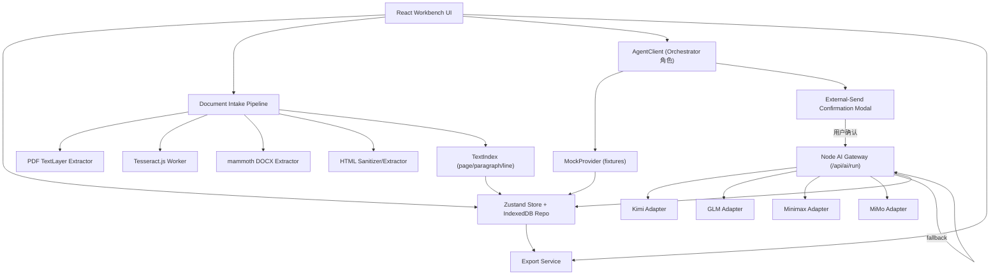
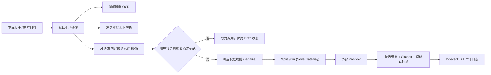
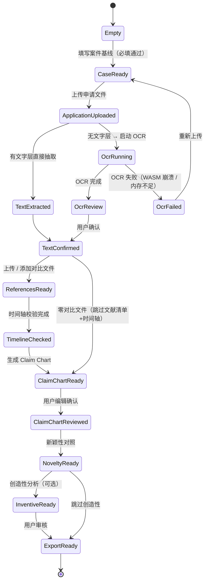
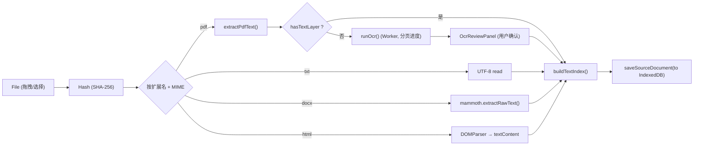

# 专利审查助手 v0.1.0 详细软件开发计划

<p align="right">2026-05-03（初稿由 GPT 编制）／ 2026-05-03 Review & 重写</p>

> 本文件是面向"后续执行 AI / 工程师"的 v0.1.0 实施蓝图。执行者应在**仅**读取本文件 + `PRD-v0.1.0.md` + 项目根级规则（若有）的条件下，能够从零搭出完整的本地 / 内网 Web App 并通过验收测试。
>
> 如与 `PRD-v0.1.0.md` 冲突，以 PRD 为准。执行过程中如发现本文件自相矛盾或无法落地，必须先发起澄清，不得自行推测。

---

## 目录（TOC）

0. 文档目的、阅读顺序与术语速查
1. v0.1.0 范围与非目标
2. 技术栈定稿 + 依赖清单 + package.json / tsconfig 草案
3. 仓库与运行形态（workspaces / 启动 / 端口 / 浏览器兼容矩阵）
4. 总体架构（逻辑 / 部署 / 安全）
5. 代码组织规划（到文件级职责）
6. 领域模型（+ IndexedDB schema + 反馈 + 两级配置）
7. High-Level Design（状态机 / 模式切换 / UI / data-testid）
8. Low-Level Design
9. 测试架构与测试计划
10. 详细测试用例（Setup / Inputs / Fixture / Assertions）
11. 实施里程碑（每个 Milestone 进入/离开门槛）
12. 可追溯矩阵（PRD ↔ 计划章节 ↔ 代码模块 ↔ 测试）
13. 质量门禁（可运行脚本）
14. 风险控制
15. 文档与 Change Log / Commit / PR / 命名规范
16. 验收清单

---

## 0. 文档目的、阅读顺序与术语速查

### 0.1 阅读顺序

1. `PRD-v0.1.0.md`（产品需求，是"做什么"的终审依据）。
2. 本文件第 1–4 节（范围、技术栈、仓库形态、总体架构）。
3. 本文件第 5–7 节（代码组织、领域模型、High-Level Design）。
4. 本文件第 8 节（Low-Level Design，按需查阅）。
5. 本文件第 9–10 节（测试架构与用例）。
6. 本文件第 11–16 节（执行、门禁、规范、验收）。

### 0.2 执行者硬性要求

- **禁止**在真实模式下绕过外发确认弹窗。
- **禁止**将 AI 输出措辞成"法律结论"。
- **禁止**通过 `test.skip` / 注释断言让测试通过。
- **禁止**在 `localStorage` 明文保存 API Key。
- **新增运行时依赖 / 跨模块重构 / 对外接口变更** 必须先列出用途、许可证、体积、替代方案，并得到用户确认。
- 行为 / 接口 / 架构 / 使用方式变更必须同步更新 `README.md`、`DESIGN.md` 并追加 `Change Log`（格式见 §15）。
- 每个 Milestone 完成时运行相关新测试与受影响既有测试，结果须全绿。

### 0.3 本文件与 PRD 的术语映射

| PRD 术语 | 本文件等价 / 实现对应 |
|---|---|
| Orchestrator Agent（PRD §5.4） | v0.1.0 落地为**前端 `AgentClient`（逻辑角色）** + 后端 `AI Gateway`，不做独立进程。见 §4.1。 |
| 文档解析 Agent | `features/documents` + `lib/pdfText.ts` + `lib/ocrWorker.ts`（§5/§8.1） |
| 创新点研读 Agent | `features/claims` + `features/novelty`（§8.5/§8.6） |
| 简述 Agent | `features/summary`（壳子，§8.7 末段） |
| 审查意见素材 Agent | `features/draft`（壳子，§8.7 末段） |
| HTML 格式转换 Agent | `features/export`（§8.13） |
| Claim Chart | `ClaimFeature[]`（§6.2） |
| Citation | `Citation`（§6.2） |
| 时间轴校验 | `dateRules.ts` + `TimelineStatus`（§6.2、§8.3） |

---

## 1. v0.1.0 范围与非目标

### 1.1 v0.1.0 必须端到端真实可用的闭环（来自 PRD 附录 B）

1. 新建 / 编辑案件基线，最少字段：申请号（可空）、发明名称、申请日、优先权日（可选）、目标权利要求编号（默认 1）。
2. 上传发明专利申请文件，支持 `.pdf` / `.docx` / `.txt` / `.html`。
3. PDF 有文字层 → 直接抽取；无文字层 → 自动启动浏览器端 OCR，显示进度并在完成后提供预览与质量提示；用户确认后进入分析。
4. 上传单个或多个对比文件，并支持手动添加文献条目；优先支持多文件选择，文件夹导入（File System Access API）作为增强。
5. 自动或半自动提取对比文件公开日，并按基准日（优先权日 ?? 申请日）进行时间轴校验。
6. 对目标权利要求生成可编辑 Claim Chart，包含特征编号、特征描述、说明书出处、备注。
7. 对一篇"可用"对比文件生成新颖性对照，输出每条特征的公开状态 + Citation + 区别特征候选 + 待检索问题清单。
8. 每个功能区提供独立 AI 对话入口（上下文隔离），可编辑 AI 输出。
9. 导出 HTML（必选）与 Markdown（可选），HTML 可直接打印。
10. Mock 演示模式默认开启，零 token、零联网、完整覆盖上述 1–9，内置 G1/G2/G3 案例。

### 1.2 v0.1.0 壳子功能（必须有入口、数据结构与占位 UI，不要求完整 AI 分析）

| 功能 | v0.1.0 要求 |
|---|---|
| 创造性三步法 | Mock G2 完整演示；真实模式允许输出 Step1/Step2/Step3 结构化骨架，所有结论标注"候选/待审查员确认" |
| 形式缺陷检查 | 提供手动标记入口；对 G3 的"参数范围支持不足"给出风险提示位 |
| 专利申请简述 | 可选实现；若实现必须基于已确认 Citation，禁止无出处内容进正文 |
| 审查意见素材草稿 | 壳子：正文草稿 / AI 备注 / 分析策略 / 待确认事项四分区 |
| 答复审查意见 | 仅入口与字段占位，不做自动分析 |
| RAG 本地向量库 | v0.1.0 不实现；保留数据模型与接口占位 |

### 1.3 明确不做（与 PRD §13 对齐）

1. 不接入 CNIPA 内部检索系统（CNABS / PAPS / EPOQUE）。
2. 不接管案件管理、期限管理、发文系统。
3. 不替审查员作出新颖性 / 创造性 / 授权 / 驳回的法律结论。
4. 不默认上传未公开申请文件到外部服务。
5. 不覆盖实用新型和外观设计审查。
6. 不做多模态图表/结构图识别（v0.3.0+）。
7. 不做 RAG 向量检索（v0.2.0）。

---

## 2. 技术栈定稿 + 依赖清单 + 配置草案

### 2.1 技术栈（已定稿，执行者直接采用）

| 层 | 选型 | 版本范围 | 理由（简述） |
|---|---|---|---|
| 包管理 | npm（workspaces） | Node ≥ 20.11 LTS，npm ≥ 10 | 内置 workspaces 足够，无需 pnpm / yarn 额外依赖 |
| 构建 | Vite | ^5.4 | 启动快、SSR 不需要、与 React/TS 生态成熟 |
| 语言 | TypeScript | ^5.5 | 端到端类型契约，减少运行期错误 |
| 前端框架 | React | ^18.3 | 状态复杂，表格/对话/异步任务强需可控渲染 |
| 前端状态 | Zustand | ^4.5 | 轻量、适合模块化 slice、无 boilerplate |
| 表单 | react-hook-form | ^7.52 | 非受控 + 校验；表单多字段性能好 |
| 样式 | 原生 CSS + CSS Modules | — | 朴素内网工具风格，避免 UI 库体积 |
| 路由 | react-router-dom | ^6.26 | 模块 Tab 切换 + 深链需要 |
| PDF 抽取 | pdfjs-dist | ^4.5 | 浏览器端抽取文字层、页分 |
| DOCX 抽取 | mammoth | ^1.8 | 浏览器端 / Node 端均可 |
| HTML 抽取 | DOMParser（原生） | — | 不加依赖 |
| OCR | tesseract.js | ^5.1 | 浏览器端中英文 OCR，数据不外发 |
| 本地持久化 | idb | ^8.0 | IndexedDB 友好封装 |
| 后端 | Express + TypeScript | Express ^4.19 | 轻量本地服务，代理 AI + 托管静态产物 |
| 后端打包 | tsx（开发）/ tsc（构建） | tsx ^4.17 / tsc ^5.5 | 无需 nest/next 等重型框架 |
| 日志 | pino | ^9.3 | 结构化，便于本地排查 |
| 加密 | Node `crypto`（内置） | — | AES-256-GCM + PBKDF2 |
| 校验 | zod | ^3.23 | 运行期 schema 校验 + 类型推导 |
| 测试 - 单元 | Vitest | ^2.0 | 与 Vite 一致 |
| 测试 - 组件 | @testing-library/react | ^16 | 标准做法 |
| 测试 - E2E | Playwright | ^1.47 | Chromium 内核够用，支持 fixture / trace |
| HTTP 拦截 | msw | ^2.4 | APP 真实模式 E2E / integration 测试不真联网；开发者提交前 `test:ai-smoke` 例外，见 §9.7 |
| 代码风格 | eslint + prettier | eslint ^9 / prettier ^3 | 统一风格，减少 code review 摩擦 |

**不引入**：任何 UI 组件库（Ant Design / MUI / Chakra 等）、任何动画库、任何 CSS-in-JS、任何状态机库（状态机用纯函数 reducer 描述）。

### 2.2 依赖清单（顶层 package.json，仅示意）

```jsonc
{
  "name": "patent-examiner",
  "version": "0.1.0",
  "private": true,
  "engines": { "node": ">=20.11", "npm": ">=10" },
  "workspaces": ["client", "server", "shared"],
  "scripts": {
    "dev": "npm run -ws --include-workspace-root --if-present dev",  // --if-present: shared 无 dev script 时静默跳过，不报错
    "dev:client": "npm run dev -w client",
    "dev:server": "npm run dev -w server",
    "build": "npm run build -w shared && npm run build -w client && npm run build -w server",
    "start": "node server/dist/index.js",
    "typecheck": "tsc -b",
    "lint": "eslint .",
    "format": "prettier -w .",
    "test": "vitest run",
    "test:watch": "vitest",
    "test:integration": "vitest run -c vitest.integration.config.ts",
    "test:e2e": "playwright test",
    "test:evaluation": "vitest run -c vitest.evaluation.config.ts",
    "test:ai-smoke": "node tests/developer-ai-smoke.mjs",
    "verify": "npm run typecheck && npm run lint && npm test && npm run test:integration && npm run test:e2e && npm run test:evaluation",
    "verify:precommit": "npm run verify && npm run test:ai-smoke"
  }
}
```

> 子包 `package.json` 的细节在 §3.2 中给出。

### 2.3 tsconfig 草案

根 `tsconfig.base.json` 要点：

```jsonc
{
  "compilerOptions": {
    "target": "ES2022",
    "module": "ESNext",
    "moduleResolution": "Bundler",
    "jsx": "react-jsx",
    "strict": true,
    "noUncheckedIndexedAccess": true,
    "noImplicitOverride": true,
    "exactOptionalPropertyTypes": true,
    "esModuleInterop": true,
    "skipLibCheck": true,
    "resolveJsonModule": true,
    "baseUrl": ".",
    "paths": {
      "@shared/*": ["shared/src/*"],
      "@client/*": ["client/src/*"],
      "@server/*": ["server/src/*"]
    }
  }
}
```

客户端需额外启用 `"lib": ["DOM", "DOM.Iterable", "ES2022", "WebWorker"]`；服务端加 `"types": ["node"]`。

### 2.4 依赖引入流程（硬性）

执行者在任何 Milestone 中若需引入本清单**未列出**的依赖，必须先按以下模板向用户说明并等待确认：

```
- 名称 / 版本：
- 用途（解决什么问题，是否可用已装依赖替代）：
- 许可证：
- 体积（min + gzip）：
- 维护度（最近一次发布、star、open issues）：
- 替代方案（至少 1 个）：
```

---

## 3. 仓库与运行形态

### 3.1 形态选择

采用 **npm workspaces**，三个 package：`client`（前端源码）、`server`（Node 服务）、`shared`（领域类型、schema、fixture）。**不**使用 pnpm / turborepo / nx。

### 3.2 子包 package.json 要点

- `client/package.json`：`dev` = `vite`，`build` = `vite build`，产物输出到 `client/dist`。
- `server/package.json`：`dev` = `tsx watch src/index.ts`，`build` = `tsc -p tsconfig.build.json`（输出到 `server/dist`）。服务端在运行时若 `NODE_ENV=production` 则把 `client/dist` 作为静态资源托管。
- `shared/package.json`：`build` = `tsc -p tsconfig.build.json`（输出 `shared/dist`），被 client / server 以路径别名消费；不发布到 npm。

### 3.3 端口与启动

| 场景 | 前端端口 | 后端端口 | 启动命令 | 访问入口 |
|---|---|---|---|---|
| 开发（双进程） | 5173 | 3000 | `npm run dev`（并发启动 client+server） | http://localhost:5173（Vite 代理 `/api/*` 到 3000） |
| 生产（单进程） | — | 3000 | `npm run build && npm start` | http://localhost:3000（server 托管静态产物 + API） |

Vite `server.proxy`：

```ts
{ "/api": { target: "http://localhost:3000", changeOrigin: true } }
```

### 3.4 浏览器兼容矩阵（v0.1.0）

| 浏览器 | 支持度 | 说明 |
|---|---|---|
| Chrome / Edge ≥ 116 | 一等公民 | File System Access API、OPFS、Tesseract.js 5 全部可用 |
| Firefox ≥ 128 | 次等 | 无 File System Access API → 文件夹导入降级为"多文件选择" |
| Safari ≥ 17 | 次等 | 同 Firefox；IndexedDB 配额较小，需提示用户 |
| 其他 | 不保证 | UI 给出"建议使用 Chrome/Edge"提示 |

**能力降级矩阵**：

| 特性 | 首选 | 降级 |
|---|---|---|
| 文件夹导入 | `showDirectoryPicker` | `<input type="file" multiple>` |
| 大量文本缓存 | IndexedDB（主） | localStorage 仅存偏好 |
| OCR Worker | `tesseract.js` Web Worker | 同步 fallback（仅小文件，加警告） |
| 复制到剪贴板 | `navigator.clipboard` | 文本区 + 手动 Ctrl/Cmd+C |

### 3.5 安装与首次启动（以 README 为准）

```bash
# 一次性安装
npm install

# 开发
npm run dev   # 访问 http://localhost:5173

# 生产
npm run build
npm start     # 访问 http://localhost:3000
```

默认启动即进入 Mock 模式，不需要任何 API Key；真实模式须在"设置 → 模型连接"中配置（见 §8.10）。

---

## 4. 总体架构

### 4.1 逻辑架构（Orchestrator 明确化）

PRD §5.4 提到 Orchestrator Agent。v0.1.0 **不**做独立 Orchestrator 进程，而是把其职责拆到两个位置：

- **前端 `AgentClient`**（逻辑角色 = Orchestrator 协调层）：负责任务分发、人工确认节点、状态提示、上下文隔离。
- **后端 `AI Gateway`**：负责 Provider 选择、fallback、计量、API Key 使用、脱敏拦截。



### 4.2 部署架构

**当前（本地验证阶段）：**

```text
内网 / 本地机器（单台）
  app/ (打包产物)
    ├── server/dist/index.js    Node Express HTTP 服务（端口 3000）
    │   ├── 静态托管：client/dist/*
    │   ├── POST /api/ai/run    外发前需前端确认
    │   ├── POST /api/export/save 可选：写入用户指定目录
    │   ├── GET  /api/health
    │   └── /api/settings/*     Provider 配置（加密文件）
    └── data/                    本地数据目录（server 进程可写）
         ├── keystore.enc        AES-256-GCM 加密的 Provider 密钥
         └── ocr-cache/          服务端 OCR fallback 的文本缓存（可选）
```

浏览器端 IndexedDB 保存所有案件 / 文档 / 文本 / 分析结果 / OCR 结果；不需要独立数据库。

**后续（国内云部署阶段，本地验证通过后启动）：**

```text
国内云服务器（阿里云/腾讯云/华为云 轻量 ECS）
  ├── nginx（反向代理，推荐）
  │    ├── HTTPS 终止 + 域名绑定（推荐，涉及 API Key 传输时应使用加密连接）
  │    ├── HTTP Basic Auth 或 IP 白名单认证（必选，防止未授权访问和 API Key 盗用）
  │    └── 代理 → localhost:3000
  └── app/ (同一打包产物，PM2 或 systemd 进程管理)
       ├── server/dist/index.js    Node Express HTTP 服务（端口 3000）
       │   ├── 静态托管：client/dist/*
       │   ├── POST /api/ai/run
       │   ├── POST /api/export/save
       │   ├── GET  /api/health
       │   └── /api/settings/*
       ├── OCR 服务（服务端 Tesseract，可选）
       └── data/
            ├── keystore.enc
            └── ocr-cache/
  域名：https://your-domain.cn（需 ICP 备案）
```

**关键决策：不采用 Vercel + Supabase 方案。** 原因：
- Vercel（`*.vercel.app`）和 Supabase 均为海外服务，在 PRD §7.1 "仅可访问国内 URL"的网络约束下不可用
- 当前架构（Node Express 静态托管 + API）本身就是自包含的，无需 Supabase 的 BaaS 能力（v0.1.0 无服务端数据库需求）
- 从 localhost 迁移到国内云服务器的成本低：应用代码无需改动（仅部署配置），前提是已完成认证需求

**多用户：** 云部署 v0.1.0 仍为单用户部署，每位审查员部署独立实例。多用户隔离（URL path 区分用户、`data/{userId}/` 隔离等）留到 v1.0.0。

**迁移步骤（本地验证通过后执行）：**
1. 购买国内轻量应用服务器（新用户首年约 50-100 元，2C2G 足够）
2. 完成 ICP 备案（需中国大陆身份证明，域名需实名认证；免费，约 1-2 周，以管局审核时间为准）
3. 服务器上安装 Node.js 20+，配置 PM2 或 systemd 进程管理：
   ```bash
   npm install && npm run build
   pm2 start server/dist/index.js --name patent-examiner
   pm2 save && pm2 startup
   ```
4. 推荐：配置 nginx 反向代理 + HTTPS（Let's Encrypt 免费证书）
5. 配置访问认证（HTTP Basic Auth 或 IP 白名单）
6. 绑定域名，对外提供 `https://your-domain.cn` 访问
7. 建议定期备份 `data/` 目录（含 keystore.enc）；可使用云服务商提供的快照功能

### 4.3 安全架构



硬性规则：

- **Mock 模式不得进行任何 network call**（执行者可用测试用 MSW 拦截与断言检测）。
- 真实模式每次调用前必须展示：调用模块、发送字段列表、估算 tokens、Provider、模型 ID、是否含敏感文本标记。
- API Key **不进 localStorage**；实现细节见 §8.10。
- 所有 AI 结论默认携带 `legalCaution` 字段，UI 标注"候选 / 待审查员确认"。

---

## 5. 代码组织规划（到文件级职责）

### 5.1 目录树（最终形态）

```text
.
├── README.md
├── DESIGN.md
├── PRD-v0.1.0.md
├── DEVELOPMENT_PLAN-v0.1.0.md
├── package.json
├── tsconfig.base.json
├── tsconfig.json                # 引用 -b 所有子工程
├── vitest.config.ts             # 单元测试（默认）
├── vitest.integration.config.ts # 集成测试
├── vitest.evaluation.config.ts  # 评测集
├── playwright.config.ts
├── .eslintrc.cjs
├── .prettierrc
├── client/
│   ├── package.json
│   ├── tsconfig.json
│   ├── vite.config.ts
│   ├── index.html
│   ├── public/                  # 静态资源（tesseract 语言包可放此）
│   └── src/
│       ├── main.tsx             # 入口：挂载 App，初始化 i18n / router / store
│       ├── App.tsx              # 顶层：ModeBanner + Router
│       ├── router.tsx           # react-router 配置
│       ├── styles/
│       │   ├── reset.css
│       │   └── app.css
│       ├── components/          # 纯展示组件（尽量无状态）
│       │   ├── AppShell.tsx
│       │   ├── ModeBanner.tsx
│       │   ├── ConfirmModal.tsx
│       │   ├── ExternalSendConfirm.tsx
│       │   ├── ProgressBar.tsx
│       │   ├── TimelineStatusBadge.tsx
│       │   ├── Table.tsx
│       │   ├── EditableCell.tsx
│       │   ├── FeedbackButtons.tsx      # like / dislike / comment
│       │   └── ShellPlaceholder.tsx
│       ├── features/            # 特性模块（each = UI + hooks + slice）
│       │   ├── case/
│       │   │   ├── CaseBaselineForm.tsx
│       │   │   ├── caseSlice.ts         # zustand slice
│       │   │   └── caseValidation.ts
│       │   ├── documents/
│       │   │   ├── DocumentUploadPanel.tsx
│       │   │   ├── OcrProgressPanel.tsx
│       │   │   ├── OcrReviewPanel.tsx
│       │   │   └── documentsSlice.ts
│       │   ├── references/
│       │   │   ├── ReferenceLibraryPanel.tsx
│       │   │   ├── ReferenceEditForm.tsx
│       │   │   └── referencesSlice.ts
│       │   ├── claims/
│       │   │   ├── ClaimChartTable.tsx
│       │   │   ├── ClaimChartActions.tsx
│       │   │   └── claimsSlice.ts
│       │   ├── novelty/
│       │   │   ├── NoveltyComparisonTable.tsx
│       │   │   ├── NoveltyAgentTrigger.tsx
│       │   │   └── noveltySlice.ts
│       │   ├── inventive/
│       │   │   ├── InventiveStepPanel.tsx
│       │   │   └── inventiveSlice.ts
│       │   ├── defects/
│       │   │   └── DefectPanel.tsx
│       │   ├── draft/
│       │   │   └── DraftMaterialPanel.tsx
│       │   ├── summary/
│       │   │   └── SummaryPanel.tsx
│       │   ├── export/
│       │   │   ├── ExportPanel.tsx
│       │   │   └── exportSlice.ts
│       │   ├── chat/
│       │   │   ├── AgentChatPanel.tsx   # 每模块独立上下文
│       │   │   └── chatSlice.ts
│       │   ├── settings/
│       │   │   ├── ProvidersConfigPanel.tsx
│       │   │   ├── AgentsAssignmentPanel.tsx
│       │   │   └── settingsSlice.ts
│       │   └── mock/
│       │       ├── MockProvider.ts
│       │       ├── mockRouter.ts        # agent+caseId → fixture key
│       │       └── index.ts
│       ├── agent/
│       │   ├── AgentClient.ts           # 调 Mock 或真实 Gateway
│       │   ├── contracts.ts             # AiRunRequest/Response
│       │   └── tokenEstimate.ts
│       ├── lib/
│       │   ├── indexedDb.ts             # idb 封装：open/migrate/repo
│       │   ├── repositories/
│       │   │   ├── caseRepo.ts
│       │   │   ├── documentRepo.ts
│       │   │   ├── referenceRepo.ts
│       │   │   ├── claimRepo.ts
│       │   │   ├── noveltyRepo.ts
│       │   │   ├── inventiveRepo.ts
│       │   │   ├── feedbackRepo.ts
│       │   │   ├── ocrCacheRepo.ts
│       │   │   └── settingsRepo.ts
│       │   ├── fileHash.ts              # Web Crypto SHA-256
│       │   ├── dateRules.ts             # 基准日 / TimelineStatus
│       │   ├── dateParse.ts             # 多格式日期解析 + confidence
│       │   ├── textIndex.ts             # 段落/页/行索引
│       │   ├── pdfText.ts               # pdfjs 抽取
│       │   ├── ocrWorker.ts             # tesseract web worker wrapper
│       │   ├── docxText.ts              # mammoth wrapper
│       │   ├── htmlText.ts              # DOMParser 抽取
│       │   ├── claimParser.ts           # 规则解析 + 引用链
│       │   ├── citationMatch.ts         # Citation ↔ TextIndex 映射
│       │   ├── exportHtml.ts
│       │   ├── exportMarkdown.ts
│       │   ├── fileNameSanitize.ts
│       │   ├── sanitizeSend.ts          # 外发前脱敏（可选层）
│       │   └── errors.ts
│       ├── store/
│       │   ├── index.ts                 # 聚合 slice
│       │   └── stateMachine.ts          # PRD Happy Path 状态机
│       └── test-utils/
│           ├── renderWithProviders.tsx
│           ├── fixtures.ts              # 映射 shared/fixtures
│           └── mswServer.ts
├── server/
│   ├── package.json
│   ├── tsconfig.json
│   ├── tsconfig.build.json
│   └── src/
│       ├── index.ts                     # Express app bootstrap
│       ├── routes/
│       │   ├── health.ts
│       │   ├── ai.ts                    # POST /api/ai/run
│       │   ├── settings.ts              # Provider 配置 CRUD
│       │   └── export.ts                # （可选）写入用户目录
│       ├── providers/
│       │   ├── ProviderAdapter.ts       # 抽象接口
│       │   ├── kimi.ts
│       │   ├── glm.ts
│       │   ├── minimax.ts
│       │   ├── mimo.ts
│       │   └── registry.ts              # provider 选择 + fallback
│       ├── security/
│       │   ├── keyStore.ts              # AES-256-GCM 文件加密
│       │   ├── pbkdf2.ts
│       │   └── sanitize.ts              # 服务端脱敏（可选）
│       ├── telemetry/
│       │   └── localMetrics.ts          # token usage 累计
│       └── lib/
│           ├── schemas.ts               # zod schemas for /api/*
│           └── logger.ts                # pino
├── shared/
│   ├── package.json
│   ├── tsconfig.json
│   ├── tsconfig.build.json
│   └── src/
│       ├── types/
│       │   ├── domain.ts                # PatentCase / SourceDocument / ...
│       │   ├── agents.ts                # Agent 入参 / 出参类型
│       │   ├── api.ts                   # REST 协议类型
│       │   └── feedback.ts
│       ├── schemas/                     # 运行期 zod schema
│       │   ├── claimChart.schema.ts
│       │   ├── novelty.schema.ts
│       │   ├── inventive.schema.ts
│       │   ├── summary.schema.ts
│       │   ├── draft.schema.ts
│       │   └── export.schema.ts
│       ├── fixtures/
│       │   ├── g1-led.json
│       │   ├── g2-battery.json
│       │   ├── g3-sensor.json
│       │   ├── a1-functional.json
│       │   ├── a2-boundary-date.json
│       │   ├── a3-pct-priority.json
│       │   ├── e1-no-reference.json
│       │   ├── e2-scanned-pdf.json
│       │   └── e3-multi-independent.json
│       └── prompts/
│           ├── claimChart.prompt.md
│           ├── novelty.prompt.md
│           ├── inventive.prompt.md
│           └── summary.prompt.md
└── tests/
    ├── unit/
    ├── integration/
    ├── e2e/
    └── evaluation/
```

### 5.2 文件级职责说明（节选重点文件）

| 文件 | 职责 | 关键导出 |
|---|---|---|
| `client/src/lib/dateRules.ts` | 基准日与 TimelineStatus 判定，无 UI 依赖 | `computeBaselineDate`, `classifyReferenceDate` |
| `client/src/lib/dateParse.ts` | `YYYY-MM-DD` / `YYYY年M月D日` / `YYYY.M.D` 等解析 + confidence | `parseDate(raw) -> { iso, confidence }` |
| `client/src/lib/textIndex.ts` | 段落号识别、页映射、行号切分；提供 Citation 查询 | `buildTextIndex`, `findParagraph`, `findQuote` |
| `client/src/lib/pdfText.ts` | pdfjs 抽取文字层；给出 "无文字层"判定 | `extractPdfText`, `hasTextLayer` |
| `client/src/lib/ocrWorker.ts` | Tesseract Worker 包装，分页回调进度 | `runOcr(file, { onProgress, lang })` |
| `client/src/lib/claimParser.ts` | 识别权利要求区域、独权/从权、引用链 | `parseClaims(text) -> ClaimNode[]` |
| `client/src/lib/citationMatch.ts` | AI 输出 Citation ↔ TextIndex 映射 | `matchCitation(citation, index) -> MatchResult` |
| `client/src/lib/exportHtml.ts` | 基于模板生成可打印 HTML | `renderCaseHtml(viewModel) -> string` |
| `client/src/lib/fileNameSanitize.ts` | 清理文件名、长度限制 | `sanitizeFileName(raw, maxLen=40)` |
| `client/src/lib/sanitizeSend.ts` | 外发前可选脱敏规则 | `applySanitizeRules(text, rules)` |
| `client/src/agent/AgentClient.ts` | 统一调用入口；Mock 模式走 MockProvider，真实模式走 `/api/ai/run` | `runAgent<T>(req: AiRunRequest): Promise<AiRunResponse>` |
| `client/src/features/mock/MockProvider.ts` | 读 fixtures 返回预置结果；模拟延迟 | `mockRunAgent(req)` |
| `client/src/features/mock/mockRouter.ts` | 路由规则：`agent + caseId` → fixture 路径 | `resolveFixture(agent, caseId)` |
| `server/src/routes/ai.ts` | 校验请求 → 调 Provider → 规范化响应；fallback；token 汇总 | `aiRouter` |
| `server/src/providers/ProviderAdapter.ts` | Provider 抽象；统一 chat.completions 形态 | `interface ProviderAdapter` |
| `server/src/security/keyStore.ts` | 读写 `data/keystore.enc` | `readKeys`, `writeKeys` |

### 5.3 文件命名约定

- React 组件：`PascalCase.tsx`。
- 其他 TS 模块：`camelCase.ts`。
- Zustand slice：`<feature>Slice.ts`，导出 `create<Feature>Slice(set, get)` 与 `use<Feature>Store`。
- zod schema：`<name>.schema.ts`，导出 `<name>Schema` 和 `type <Name> = z.infer<...>`。
- fixture：`<evalId>-<slug>.json`（如 `g1-led.json`、`a2-boundary-date.json`）。
- prompt 模版：`<agent>.prompt.md`，变量用 `{{name}}`。
- 测试文件：`*.test.ts` / `*.spec.ts`，E2E 一律用 `.spec.ts`。

### 5.4 依赖方向（禁止反向依赖）

```
shared  ← client
shared  ← server
client  ↛ server  （仅通过 /api/* HTTP）
server  ↛ client
```

- `shared` 不得导入 React / DOM / Express 等实现细节。
- `client` 不得 import `server/*`；反之亦然。
- 组件层 (`components/`) 不得依赖 `features/*`；反之允许。

---

## 6. 领域模型

### 6.1 ID / 时间规范

- 所有主键 `id` 使用 **ULID**（`crypto.randomUUID` 改 ULID 可选；若引入 `ulid` 需走 §2.4 依赖确认；v0.1.0 可先用 `crypto.randomUUID()` 生成 UUIDv4）。
- 时间统一使用 ISO8601 字符串：
  - 日期：`YYYY-MM-DD`（`ISODateString`）。
  - 日期时间：`YYYY-MM-DDTHH:mm:ss.sssZ`（`ISODateTimeString`）。
- 本地日期比较不做时区偏移；同日判定按"字面相等"。

### 6.2 核心领域类型（TypeScript，位于 `shared/src/types/domain.ts`）

```ts
export type ISODateString = string;
export type ISODateTimeString = string;
export type AppMode = "mock" | "real";

export type CaseWorkflowState =
  | "empty"
  | "case-ready"
  | "application-uploaded"
  | "text-extracted"
  | "ocr-running"
  | "ocr-failed"
  | "ocr-review"
  | "text-confirmed"
  | "references-ready"
  | "timeline-checked"
  | "claim-chart-ready"
  | "claim-chart-reviewed"
  | "novelty-ready"
  | "inventive-ready"
  | "export-ready";

export interface PatentCase {
  id: string;
  applicationNumber: string | null;
  title: string;
  applicant?: string;
  applicationDate: ISODateString;
  priorityDate?: ISODateString;
  patentType: "invention";
  textVersion: "original" | `amended-${number}`;
  targetClaimNumber: number;
  guidelineVersion: string;           // 默认 "2023"
  examinerNotes?: string;
  workflowState: CaseWorkflowState;
  createdAt: ISODateTimeString;
  updatedAt: ISODateTimeString;
}

export interface SourceDocument {
  id: string;
  caseId: string;
  role: "application" | "reference" | "office-action-response";
  fileName: string;
  fileType: "pdf" | "docx" | "txt" | "html" | "manual";
  fileHash?: string;                  // 去重 + OCR 缓存键
  textLayerStatus?: "present" | "absent" | "unknown";
  ocrStatus?: "not-needed" | "pending" | "running" | "completed" | "failed";
  textStatus: "empty" | "extracted" | "confirmed" | "needs-review";
  extractedText: string;
  textIndex: TextIndex;
  createdAt: ISODateTimeString;
}

export interface ReferenceDocument extends SourceDocument {
  title?: string;
  publicationNumber?: string;
  publicationDate?: ISODateString;
  publicationDateConfidence: "high" | "medium" | "low" | "manual";
  timelineStatus: TimelineStatus;
  technicalField?: string;
  summary?: string;
  relevanceNotes?: string;
}

export type TimelineStatus =
  | "available"
  | "unavailable-same-day"
  | "unavailable-later"
  | "needs-publication-date"
  | "needs-baseline-date";

export interface TextIndex {
  pages: TextPage[];
  paragraphs: TextParagraph[];
  lineMap: TextLine[];
}
export interface TextPage { pageNumber: number; startOffset: number; endOffset: number; }
export interface TextParagraph {
  id: string;                         // "p-0001"
  page?: number;
  paragraphNumber?: string;           // "0023" 或自动编号 "p5"
  text: string;
  startOffset: number;
  endOffset: number;
}
export interface TextLine { line: number; startOffset: number; endOffset: number; }

export interface ClaimNode {
  id: string;
  claimNumber: number;
  type: "independent" | "dependent" | "unknown";
  dependsOn: number[];
  rawText: string;
}

export interface ClaimFeature {
  id: string;
  claimNumber: number;
  featureCode: string;                // A, B, C...
  description: string;
  specificationCitations: Citation[];
  citationStatus: "confirmed" | "needs-review" | "not-found";
  userNotes?: string;
  source: "ai" | "user" | "mock";
}

export interface NoveltyComparison {
  id: string;
  caseId: string;
  referenceId: string;
  claimNumber: number;
  rows: NoveltyComparisonRow[];
  differenceFeatureCodes: string[];
  pendingSearchQuestions: string[];
  status: "draft" | "user-reviewed" | "stale";
  legalCaution: string;               // UI 顶部提示
}
export interface NoveltyComparisonRow {
  featureCode: string;
  disclosureStatus: "clearly-disclosed" | "possibly-disclosed" | "not-found" | "not-applicable";
  citations: Citation[];
  mismatchNotes?: string;
  reviewerNotes?: string;
}

export interface InventiveStepAnalysis {
  id: string;
  caseId: string;
  closestPriorArtId?: string;
  sharedFeatureCodes: string[];
  distinguishingFeatureCodes: string[];
  status: "draft" | "user-reviewed" | "stale";
  objectiveTechnicalProblem?: string;
  motivationEvidence: Citation[];
  candidateAssessment:
    | "possibly-lacks-inventiveness"
    | "possibly-inventive"
    | "insufficient-evidence"
    | "not-analyzed";
  cautions: string[];
  legalCaution: string;        // schema 中有默认值，映射时注入
}

export interface Citation {
  documentId: string;
  label: string;                      // "D1 §0023" / "说明书第003段第2行"
  page?: number;
  paragraph?: string;                 // 段落号（规范后）
  lineStart?: number;
  lineEnd?: number;
  quote?: string;                     // 引文片段
  confidence: "high" | "medium" | "low";
}

export interface FeedbackItem {
  id: string;
  caseId: string;
  subjectType: "claim-chart" | "novelty" | "inventive" | "summary" | "draft" | "chat-message";
  subjectId: string;
  verdict: "like" | "dislike";
  comment?: string;
  createdAt: ISODateTimeString;
}
```

### 6.3 两级配置模型（对应 PRD §7.5）

位于 `shared/src/types/agents.ts`：

```ts
export type ProviderId = "kimi" | "glm" | "minimax" | "mimo";

export interface ProviderConnection {
  providerId: ProviderId;
  baseUrl?: string;                   // 可覆盖默认
  protocol?: "openai-compatible" | "anthropic-compatible"; // MiMo / Token Plan 默认 openai-compatible
  apiKeyRef: string;                  // 指向 keystore 中的别名，前端不直接拿 key
  modelIds: string[];
  enabled: boolean;
}

export interface AgentAssignment {
  agent: "claim-chart" | "novelty" | "inventive" | "summary" | "draft" | "chat";
  providerOrder: ProviderId[];        // fallback 顺序
  modelId: string;
  modelFallbacks?: string[];          // MiMo 默认见 §8.9.3；按顺序覆盖 modelId
  reasoningLevel?: "low" | "medium" | "high";
  maxTokens: number;
}

export interface AppSettings {
  mode: AppMode;
  guidelineVersion: string;
  providers: ProviderConnection[];
  agents: AgentAssignment[];
  sanitizeRules?: Array<{ pattern: string; replace: string; note?: string }>;
  persistKeysInSession: boolean;      // v0.1.0 默认 false = 仅内存
}
```

### 6.4 IndexedDB Schema（数据库版本 1）

数据库名：`patent-examiner-v1`；实现于 `client/src/lib/indexedDb.ts`（基于 `idb`）。

| Object Store | keyPath | 主要索引 | 说明 |
|---|---|---|---|
| `cases` | `id` | `updatedAt` | `PatentCase` |
| `documents` | `id` | `caseId`, `role`, `fileHash` | 申请文件 & 对比文件基础记录（继承的引用文献字段放这里） |
| `textIndex` | `documentId` | — | `TextIndex` 拆分出大对象，按需载入 |
| `claimNodes` | `id` | `caseId` | `ClaimNode` |
| `claimCharts` | `id` | `caseId`, `claimNumber` | `ClaimFeature`（一条 = 一个特征，利于局部编辑） |
| `novelty` | `id` | `caseId`, `referenceId` | `NoveltyComparison` |
| `inventive` | `id` | `caseId` | `InventiveStepAnalysis` |
| `ocrCache` | `cacheKey` | — | key=`sha256(file)+lang+pageCount` |
| `chatMessages` | `id` | `caseId`, `moduleScope`, `createdAt` | 每模块独立会话 |
| `feedback` | `id` | `caseId`, `subjectType`, `subjectId` | like/dislike/comment |
| `settings` | `id`=`"app"` | — | 单例，存 `AppSettings`（不含 API Key 明文） |

**迁移策略**：`open(db, version, { upgrade(db, oldV, newV, tx) { ... } })`；v0.1.0 初版 = v1，升级时按 `oldV → v` 分支处理；禁止破坏性清库（除非版本 major 变更并在 UI 提示）。

**QuotaExceededError 处理**：所有写入 IndexedDB 的操作（特别是 `extractedText`、`ocrCache`、`textIndex` 等大对象）必须 catch `QuotaExceededError`，提示用户"存储空间不足，请导出并清理旧案件"。Safari quota 较小，需特别关注。

### 6.5 日期与时间轴规则（明确表）

- 基准日：`baselineDate = priorityDate ?? applicationDate`。
- 比较以日为单位，字面比较（不做时区换算）。

| 条件 | TimelineStatus | 可进入对照队列 |
|---|---|---|
| 无 `baselineDate` | `needs-baseline-date` | 否 |
| 无 `publicationDate` | `needs-publication-date` | 否 |
| `publicationDate < baselineDate` | `available` | 是 |
| `publicationDate == baselineDate` | `unavailable-same-day` | 否 |
| `publicationDate > baselineDate` | `unavailable-later` | 否 |
| `publicationDateConfidence == "low"` 且状态为 `available` | UI 再加"待人工确认"黄条；不自动排除 | 是（需人工确认） |

**低置信判定**：`dateParse.ts` 返回的 `confidence`：
- `high`：原始输入已是 `YYYY-MM-DD`，或文本中明确"公开日 YYYY-MM-DD"。
- `medium`：`YYYY年M月D日` / `YYYY.M.D` / `YYYY/M/D` 等合法等价形式。
- `low`：仅识别出年 / 年+月，或多处候选冲突。
- `manual`：用户手填。

---

## 7. High-Level Design

### 7.1 工作台布局

```text
┌─────────────────────────────────────────────────────────────┐
│ 顶部栏：Logo | 模式横幅(Mock/真实) | 当前案件名 | 设置 | 导出   │
├──────────────┬────────────────────────────────┬─────────────┤
│ 左侧导航      │ 中央工作区                       │ 右侧 AI 对话 │
│ - 案件基线    │ 当前模块表单 / 表格 / 预览         │ 独立上下文   │
│ - 申请文件    │                                │             │
│ - 文献清单    │                                │             │
│ - Claim Chart │                                │             │
│ - 新颖性对照  │                                │             │
│ - 创造性分析  │                                │             │
│ - 形式缺陷    │                                │             │
│ - 素材草稿    │                                │             │
│ - 答复审查    │                                │             │
└──────────────┴────────────────────────────────┴─────────────┘
```

UI 风格硬约束：
- 中文、朴素、办公工具风格；禁止装饰性动画。
- 状态色仅限：`available=绿`，`warning=黄`，`error=红`，`pending=灰`，`user-edit=蓝`。
- 可编辑表格双击进入编辑；失焦 / Enter 提交，Esc 取消。
- 长任务：显示进度条与预计剩余；运行中禁用相同触发按钮（`disabled + aria-busy`）。
- 每个模块右上角有 `FeedbackButtons`（like/dislike + 可选评论）。

### 7.2 主流程状态机（`client/src/store/stateMachine.ts`）



状态机实现为 reducer，纯函数 + 严格联合类型；状态持久化到 IndexedDB（`cases` store 附字段 `workflowState`）。

**硬约束（门禁）：**

- `canRunNovelty(selector)`：仅当 `ClaimChartReviewed` 状态且目标权要的所有特征 `citationStatus !== "not-found"` 时返回 `true`，否则 Novelty 触发按钮 `disabled`。
- `citationStatus` 自动提升规则：当 ClaimFeature 的某条 `Citation.confidence === "high"` 时，自动将 `citationStatus` 提升为 `"confirmed"`。`"confirmed"` / `"high"` 是不同层级的值——`citationStatus` 只接受 `"confirmed" | "needs-review" | "not-found"`，`Citation.confidence` 只接受 `"high" | "medium" | "low"`。
- `canRunInventive(selector)`：仅当 `NoveltyReady` 状态且对应 NoveltyComparison `status === "user-reviewed"` 时返回 `true`。

### 7.3 模式切换

Mock 模式（默认）：
- 启动即进入；顶部横幅文案：`演示模式：所有 AI 输出为预置示例，不消耗 Token，不联网`。
- 任何"AI 生成"按钮走 `MockProvider`，返回与真实 Agent 完全一致的 schema。
- 延迟范围 `800–2000ms`，E2E 测试中可通过 query param `?mockDelay=0` 关闭延迟。

真实模式：
- 切换时弹出"安全提示"确认框（文案见 §8.10.3）。
- 未配置至少 1 个 `ProviderConnection` 时，禁用切换按钮并提示"请先在设置中配置模型连接"。
- 每次 AI 调用前必经 `ExternalSendConfirm` 弹窗（文案见 §8.10.4）。

### 7.4 data-testid 约定

所有 E2E 需要定位的元素必须提供 `data-testid`：

| 模式 | 示例 | 说明 |
|---|---|---|
| `page-<featureId>` | `page-claim-chart` | 顶层页面容器 |
| `btn-<action>` | `btn-run-claim-chart`, `btn-confirm-send` | 动作按钮 |
| `input-<field>` | `input-application-date` | 表单字段 |
| `row-<featureCode>` | `row-feature-A` | 表格行 |
| `cell-<field>-<rowKey>` | `cell-citation-A` | 表格单元格 |
| `banner-mode` | — | 顶部模式横幅（`aria-label="演示模式"` / `"真实模式"`） |
| `modal-external-send` | — | 外发确认弹窗 |
| `modal-mode-switch` | — | 切换真实/演示模式弹窗 |
| `badge-timeline-<refId>` | — | 时间轴状态徽标 |
| `chat-<moduleScope>` | `chat-claim-chart` | 对话面板 |
| `feedback-<subjectType>-<subjectId>` | — | 反馈按钮容器 |

`grep data-testid` 数量与 Playwright 用例数量应成比例增长。

---

## 8. Low-Level Design

### 8.1 文档导入与解析

#### 8.1.1 Pipeline 顺序



#### 8.1.2 PDF 文字层检测（`pdfText.ts`）

伪码：

```ts
async function hasTextLayer(pdf: PDFDocumentProxy): Promise<boolean> {
  const samplePages = Math.min(pdf.numPages, 5);
  let totalChars = 0;
  for (let i = 1; i <= samplePages; i++) {
    const page = await pdf.getPage(i);
    const content = await page.getTextContent();
    totalChars += content.items
      .map(it => ("str" in it ? it.str : ""))
      .join("").replace(/\s+/g, "").length;
  }
  const avg = totalChars / samplePages;
  return avg >= 40; // 平均每页 ≥ 40 个有效字符视为有文字层
}
```

阈值可在 `AppSettings` 中暴露（`pdfMinCharsPerPage`，默认 40）。

#### 8.1.3 OCR（`ocrWorker.ts`）

- 使用 `tesseract.js` 的 Web Worker；语言包 `chi_sim+eng`；语言包文件位于 `client/public/tessdata/`，启动时 `createWorker({ langPath: "/tessdata" })`。
- 分页 OCR：先用 pdfjs 把每页渲染到 OffscreenCanvas（DPR 2.0），再把 ImageData 送入 Tesseract。
- 进度回调：
  ```ts
  onProgress({
    page: number;
    totalPages: number;
    percent: number;  // 0..1
    phase: "rendering" | "recognizing";
  })
  ```
- 结果拼接：页间以 `\n\n[page:N]\n` 分隔，便于 `TextIndex` 保持页号。

#### 8.1.4 OCR 质量评分（用于"质量较低"提示）

对 OCR 文本计算：

```
effectiveChars = 去除空白后字符数
cjkRatio = 中日韩字符 / effectiveChars
asciiRatio = 可打印 ASCII / effectiveChars
junkRatio = (非可打印 - 空白 - 换行 - 常见标点) / effectiveChars
shortPageRatio = 有效字符 < 50 的页数 / 总页数
quality = clamp(1 - (junkRatio * 2) - (shortPageRatio * 0.5), 0, 1)
```

UI 映射：

| quality | 展示 | 行为 |
|---|---|---|
| ≥ 0.70 | "识别质量：良好" | 绿色通过，可直接确认 |
| 0.40 – 0.70 | "识别质量：一般，请核对" | 黄色警告，仍可确认 |
| < 0.40 | "识别质量：较差，建议提供含文字层 PDF 或手动粘贴" | 红色，需用户二次确认 |

（具体阈值配置放 `AppSettings.ocrQualityThresholds`，方便调参。）

#### 8.1.5 OCR 缓存

`ocrCache.cacheKey = sha256(file) + "::" + lang + "::" + pageCount`。命中时提示"检测到该文件的 OCR 结果，已复用"；用户可一键重新识别。

#### 8.1.6 文本索引（`textIndex.ts`）

段落号识别优先级（高 → 低）：

1. `§\s*(\d{4})` → paragraphNumber = 匹配组，例：`§0023`
2. `\[(\d{3,4})\]` → 例 `[0023]`
3. `【(\d{3,4})】` → 例 `【0023】`
4. `(?:第)?\s*(\d{1,4})\s*段` → 例 `第3段`、`003段`；`paragraphStyle = "第N段"`

若同一文本多种共存，按首次出现的模式作为主样式；其它模式记录为 `paragraphNumberAlt`（仅调试）。

无段落号文本：按连续空行或句末标点 + 长度切分为自动段落，`paragraphNumber = "p{n}"`。

行号：每段内部按 `\n` 拆分，每段从 1 开始编号；Citation 中 `lineStart/lineEnd` 相对段内。

#### 8.1.7 Citation ↔ TextIndex 映射（`citationMatch.ts`）

匹配算法（按顺序尝试）：

1. **段落号精确匹配**：若 `citation.paragraph` 存在且归一化后（去前导 0、去空白）能在 `paragraphs[].paragraphNumber` 找到 → `confidence: "high"`。
2. **段落号近邻容错**：`±1` 段落号窗口内命中 → `confidence: "medium"`，UI 标"请确认"。
3. **引文片段搜索**：`citation.quote` 非空，在全文中做最长公共子串查找（阈值 ≥ 10 字符且唯一）→ `confidence: "medium"`。
4. **以上都失败**：返回 `not-found`，`citationStatus` 置为 `needs-review`，**禁止**丢失 citation（保留用户可见的标签 `label`）。

### 8.2 案件基线模块

#### 8.2.1 字段与校验

| 字段 | 必填 | 校验规则 | 备注 |
|---|---|---|---|
| `applicationNumber` | 否 | `^CN\d{9,12}[A-Z]?$` / `^\d{9,12}$` | 自动提取若匹配则预填，置信度低标"待确认" |
| `title` | 是 | 1–120 字 | — |
| `applicant` | 否 | 0–120 字 | — |
| `applicationDate` | 是 | `YYYY-MM-DD`，不晚于今日 | — |
| `priorityDate` | 否 | `YYYY-MM-DD`，若填写必须 ≤ `applicationDate` | 填错给出 inline 错误（T-DATE-007） |
| `patentType` | — | 固定 `"invention"` | 不在 UI 暴露其它选项 |
| `textVersion` | 是 | 默认 `"original"` | 下拉：original / amended-1 / amended-2 ... |
| `targetClaimNumber` | 是 | 正整数，默认 1 | 上传申请文件后，下拉列出所有解析到的独权编号 |
| `guidelineVersion` | 否 | 默认 `"2023"` | 仅壳子显示 |
| `examinerNotes` | 否 | 0–2000 字 | 多行文本 |

#### 8.2.2 自动提取字段

在上传申请文件 + OCR 完成后，运行 `extractCaseHints(text)`（扫描前 3 页，覆盖 OCR PDF 扉页信息常见位置）：

- 申请号：正则 `CN\s*\d{4,12}[A-Z]?` / 扉页"申请号"附近文字。
- 发明名称：扉页"发明名称"行 / 大号标题启发式。
- 申请人：扉页"申请人"行。
- 申请日：扉页"申请日"行（`YYYY-MM-DD` / `YYYY年M月D日`）。

**置信度规则**：
- 精确匹配关键字 + 紧邻值 → `high`，自动填入 `{field}` 并标绿。
- 仅模式匹配（无关键字）→ `low`，预填但标黄"待确认"，不覆盖用户已填写值。
- 无匹配 → 不填。

#### 8.2.3 保存策略

- 防抖 400ms 保存到 `cases` store。
- 变更 `applicationDate` / `priorityDate` 后触发所有 `ReferenceDocument` 的 `timelineStatus` 重算（通过 `referencesSlice.recomputeAll()`）。

### 8.3 资源 / 文献清单模块

#### 8.3.1 导入方式实现顺序

1. 单文件 `<input type="file" accept=".pdf,.docx,.txt,.html">`。
2. 多文件 `<input type="file" multiple>`。
3. 文件夹 `window.showDirectoryPicker()`（能力检测失败时降级为 2）。
4. 手动添加：弹窗表单，字段 = 标题 / 文献号 / 公开日 / 摘要 / 关联案件。

#### 8.3.2 自动字段提取（不走 AI）

- **文献号**：先从文件名匹配（`CN\d+`、`US\d+`、`EP\d+`、`WO\d+`、`JP\d+`），再扫描文本前 30 行。
- **标题**：抓取首个长度 8–120 的中文/英文标题候选。
- **公开日**：调用 `dateParse.ts`，合并以下关键字附近的匹配：`公开日`、`公告日`、`Publication Date`、`Date of publication`、`公開日`。多个候选冲突时选最早日期，并把 `confidence` 降级为 `low`。

#### 8.3.3 日期解析规则（`dateParse.ts`）

支持输入格式（大小写不敏感）：

| 模式 | 示例 | confidence |
|---|---|---|
| `YYYY-MM-DD` | `2023-03-15` | high |
| `YYYY/MM/DD` | `2023/03/15` | medium |
| `YYYY.MM.DD` | `2023.03.15` | medium |
| `YYYY年M月D日` | `2023年3月15日` | medium |
| `Month D, YYYY` | `March 15, 2023` | medium |
| 仅年月 | `2023-03` / `2023年3月` | low |
| 仅年 | `2023` | low |

若文本中多处候选且结果不一致（差异 > 0 天）→ `confidence = low`，并把所有候选写入 `ReferenceDocument.relevanceNotes` 供人工复核。

#### 8.3.4 时间轴校验

按 §6.5 表驱动；实现为纯函数 `classifyReferenceDate(baselineDate, pubDate, pubConfidence) -> TimelineStatus`。批量运行 O(n)。

UI：`TimelineStatusBadge` + tooltip，对 `unavailable-same-day` / `unavailable-later` 额外显示法律依据片段（引用《审查指南》二·三章 3.1）。

### 8.4 Claim 解析（`claimParser.ts`）

#### 8.4.1 区域定位

按顺序尝试：

1. 匹配 `权利\s*要求\s*书`、`权利要求书` 之后到下一个章节标题（`说明书`、`说明书附图`、`摘要`）之间。
2. 若上述失败，在全文搜索"权利要求 1."、"1. 一种"等起始模式。

#### 8.4.2 拆分

拆分器：

```ts
const CLAIM_HEAD = /(?:^|\n)\s*(?:权利要求)?\s*(\d{1,3})\s*[\.\．、。:：]\s*/g;
```

每两个起始位置之间的文本 = 一条 claim 原文；捕获组 = `claimNumber`。

#### 8.4.3 独权 / 从权判定

- 若正文开头是"一种 / 一个 / 一套"等名词起始 → 倾向 `independent`。
- 若正文含"根据权利要求 N 所述(的)" / "如权利要求 N 所述" / "权利要求 N 中"等引用 → `dependent`，`dependsOn = [N...]`。
- 同一条 claim 可引用多条：`根据权利要求 1 或 2 所述` → `dependsOn = [1, 2]`。
- 同时匹配独权特征和从权引用 → 以引用优先判定为 `dependent`。
- 无法判定 → `type = "unknown"`，给 warning `ambiguous-claim-type`。

#### 8.4.4 验证

对解析结果做一致性检查：

- 编号连续性（1..N），缺失编号 → warning。
- 引用号范围（`dependsOn` 必须 < 当前 claim 号）。
- 至少 1 个 `independent`，否则 warning `no-independent-claim`。

### 8.5 Claim Chart Agent

#### 8.5.1 输入

```ts
interface ClaimChartInput {
  caseId: string;
  claimNumber: number;
  claimText: string;                        // 目标权利要求全文
  dependentClaims: Array<{                  // 从属链（可选，默认不注入）
    claimNumber: number;
    text: string;
  }>;
  specificationExcerpt: string;             // 相关说明书片段，按 token 预算裁剪
  textIndexDigest: {                        // 供 AI 理解段落号
    paragraphStyle: "§0023" | "[0023]" | "【0023】" | "第N段" | "auto";
    samplePairs: Array<{ paragraphNumber: string; firstWords: string }>;
  };
}
```

#### 8.5.2 Prompt 模板（`shared/src/prompts/claimChart.prompt.md`）

```md
你是协助发明专利实质审查员的助理，任务是对权利要求 {{claimNumber}} 进行"技术特征拆解"。

约束：
- 只能基于给定的权利要求文本与说明书片段；不得编造。
- 每个技术特征必须给出**可映射到说明书段落号**的 Citation；若无法定位，必须将 citationStatus 标为 "needs-review"，不得随意写入段落号。
- 不得输出任何"新颖 / 不新颖 / 具备创造性"等法律结论。
- 严格按 JSON schema 输出，禁止自由文本说明。

权利要求 {{claimNumber}} 文本：
{{claimText}}

说明书片段（含段落号）：
{{specificationExcerpt}}

JSON schema（输出必须精确匹配字段名）：
{{schemaJson}}
```

#### 8.5.3 输出 Schema（zod，摘要）

```ts
export const claimChartSchema = z.object({
  claimNumber: z.number().int().positive(),
  features: z.array(z.object({
    featureCode: z.string().regex(/^[A-Z]{1,2}$/),
    description: z.string().min(1),
    specificationCitations: z.array(z.object({
      label: z.string(),
      paragraph: z.string().optional(),
      lineStart: z.number().int().optional(),
      lineEnd: z.number().int().optional(),
      quote: z.string().optional(),
      confidence: z.enum(["high", "medium", "low"])
    })),
    citationStatus: z.enum(["confirmed", "needs-review", "not-found"]),
    userNotes: z.string().optional()  // 映射到 ClaimFeature.userNotes
  })).min(1),
  warnings: z.array(z.object({
    type: z.enum(["functional-language", "ambiguous-claim-type",
                  "unsupported-feature", "other"]),
    message: z.string()
  })).default([]),
  legalCaution: z.string().default("以上为候选事实整理，不构成法律结论。")
});
```

#### 8.5.4 错误处理

| 情况 | 行为 |
|---|---|
| Schema 校验失败 | 先尝试一次"修复为 JSON"的补救调用；再失败则将原文显示在 `AgentChatPanel` 并提示用户；不落盘到 `claimCharts` |
| Citation 映射全部失败 | 仍保存特征与描述，`citationStatus = "not-found"` 并高亮提示 |
| 超时（> 60s） | 取消请求，显示重试按钮 |

### 8.6 新颖性对照 Agent

#### 8.6.1 输入

```ts
interface NoveltyInput {
  caseId: string;
  claimNumber: number;
  features: Array<{ featureCode: string; description: string }>;
  reference: {
    referenceId: string;
    label: string;                  // D1
    text: string;                   // 已按 token 预算裁剪；必须含段落号
    textIndexDigest: {...};
  };
}
```

**硬约束**：前端在构造请求前校验 `reference.timelineStatus === "available"`；不可用文件的按钮应 disabled。若用户绕过（开发环境），后端再校验一次并返回 400。

#### 8.6.2 Prompt 模板要点

- 明确"绝对新颖性"语境：同日或晚于基准日的对比文件不得用。
- 明确只能用**这一篇**对比文件；不接受跨篇证据组合。
- 明确"公开状态"四档语义，禁止输出"新颖 / 不新颖"等结论。
- 要求对每条特征分别给出 `disclosureStatus` 与 `citations`。
- 要求输出 `differenceFeatureCodes`（`not-found` 与 `possibly-disclosed` 中审查员仍需确认的 featureCode 集合）和 `pendingSearchQuestions`（最多 5 条）。

#### 8.6.3 输出 Schema（zod，摘要）

```ts
export const noveltySchema = z.object({
  referenceId: z.string(),
  claimNumber: z.number().int().positive(),
  rows: z.array(z.object({
    featureCode: z.string(),
    disclosureStatus: z.enum([
      "clearly-disclosed", "possibly-disclosed", "not-found", "not-applicable"
    ]),
    citations: z.array(z.object({
      label: z.string(),
      paragraph: z.string().optional(),
      lineStart: z.number().int().optional(),
      lineEnd: z.number().int().optional(),
      quote: z.string().optional(),
      confidence: z.enum(["high", "medium", "low"])
    })),
    mismatchNotes: z.string().optional(),
    reviewerNotes: z.string().optional()
  })).min(1),
  differenceFeatureCodes: z.array(z.string()),
  pendingSearchQuestions: z.array(z.string()).max(5),
  legalCaution: z.string().default("以上为候选事实整理，不构成新颖性法律结论。")
});
```

#### 8.6.4 UI 交互

- 选择对比文件下拉 **仅列出** `timelineStatus === "available"` 的文献；不可用文献在旁列以灰色展示，hover 显示原因。
- 触发按钮文案：`对 D{n} 进行新颖性对照`；运行中显示 spinner + 禁用。
- 结果表每行展示：`featureCode / description / disclosureStatus / citations / mismatchNotes / reviewerNotes（可编辑）`。
- 底部两区：`区别特征候选`（从 `differenceFeatureCodes` 渲染） + `待检索问题清单`。
- 顶部固定显示 `legalCaution`。
- 用户编辑 `reviewerNotes` 防抖保存。

### 8.7 创造性三步法壳子（含简述 / 素材草稿）

#### 8.7.1 v0.1.0 范围

- UI 必须呈现 **Step 1 / Step 2 / Step 3** 三段结构，并允许用户手动选择"最接近现有技术"。
- Mock 模式：G2 完整演示（结论："可能缺乏创造性（待确认）"）。
- 真实模式：允许输出结构化骨架；所有结论字段必须以"候选 / 待确认"措辞，禁止"具备创造性 / 不具备创造性"等法律结论措辞。

#### 8.7.2 输入

```ts
interface InventiveInput {
  caseId: string;
  claimNumber: number;
  features: Array<{ featureCode: string; description: string }>;
  availableReferences: Array<{
    referenceId: string;
    label: string;       // D1, D2...
    timelineStatus: "available"; // 前端已过滤
    excerpt: string;     // token 裁剪后
  }>;
  closestPriorArtId?: string;   // 若用户手动指定
}
```

#### 8.7.3 输出 Schema（zod）

```ts
export const inventiveSchema = z.object({
  claimNumber: z.number().int().positive(),
  closestPriorArtId: z.string().optional(),
  sharedFeatureCodes: z.array(z.string()),
  distinguishingFeatureCodes: z.array(z.string()),
  objectiveTechnicalProblem: z.string().optional(),
  // documentId 由业务层从 InventiveInput.availableReferences 注入，referenceId 为同义字段
  motivationEvidence: z.array(z.object({
    referenceId: z.string(),
    label: z.string(),
    paragraph: z.string().optional(),
    quote: z.string().optional(),
    confidence: z.enum(["high", "medium", "low"])
  })).default([]),
  candidateAssessment: z.enum([
    "possibly-lacks-inventiveness",
    "possibly-inventive",
    "insufficient-evidence",
    "not-analyzed"
  ]).default("not-analyzed"),
  cautions: z.array(z.string()).default([]),
  legalCaution: z.string().default("以上为候选事实整理，不构成创造性法律结论。")
});
```

#### 8.7.4 UI

- 页面分 3 列：Step 1（最接近现有技术选择） / Step 2（区别特征 + 技术问题） / Step 3（技术启示证据）。
- Step 1：下拉选择某篇可用对比文件，或点击"由 AI 候选推荐"。
- Step 2：读 Claim Chart 特征列表 + 用户选择区别特征（复选框）；`objectiveTechnicalProblem` 可编辑文本区。
- Step 3：列出每篇可用对比文件的 `motivationEvidence`，支持用户"采纳 / 忽略"。
- 页面顶部固定 `legalCaution` 横条，使用黄色背景。

#### 8.7.5 简述（`features/summary/`）与素材草稿（`features/draft/`）壳子

- **简述 Agent**：若实现，输入仅来自"已被用户确认的" Claim Chart + 已 `confirmed` 的 Citation；prompt 硬约束"每条事实必须附 Citation，无出处不进正文只进 AI 备注"。
- **素材草稿**：不做 AI 生成，直接由以下片段拼装：
  - 案件基线摘要
  - Claim Chart（仅 `citationStatus != "not-found"` 的特征）
  - 新颖性对照（仅 `NoveltyComparison.status === "user-reviewed"` 的记录）
  - 区别特征候选 + 待检索问题清单
  - 四分区模板：`正文草稿 / AI 备注 / 分析策略 / 待确认事项`
- **答复审查** (`features/office-action-response/` 视作 `documents.role = "office-action-response"`)：仅提供"上传 + 展示"占位，不做分析。

### 8.8 AI 对话框（每模块独立上下文）

#### 8.8.1 消息模型

```ts
export interface ChatMessage {
  id: string;
  caseId: string;
  moduleScope:
    | "claim-chart"
    | "novelty"
    | "inventive"
    | "summary"
    | "draft"
    | "defects"
    | "case"
    | "documents";
  role: "user" | "assistant" | "system";
  content: string;
  attachedContextSnapshot?: {          // 发送时的上下文摘要（便于回溯）
    digestHash: string;
    summary: string;
  };
  externalSendMeta?: {                 // 真实模式有效
    provider: string;
    modelId: string;
    tokenInput: number;
    tokenOutput: number;
  };
  createdAt: ISODateTimeString;
}
```

#### 8.8.2 上下文隔离规则

- 每个 `moduleScope` 的消息列表互不共享；禁止在提示词里偷偷拼接其它 scope 的消息。
- 每次发送前构造"当前 scope 的基础上下文摘要"，见下表：

| scope | 注入上下文 |
|---|---|
| `case` | 案件基线字段 |
| `documents` | 申请文件摘要（首段 + 段落号样式） |
| `claim-chart` | 目标权利要求 + 从属链 + 说明书摘要 + 当前 ClaimChart JSON |
| `novelty` | Claim Chart（已确认部分） + 选中对比文件 + 当前 NoveltyComparison JSON |
| `inventive` | Claim Chart + 所有可用对比文件摘要 + 当前 Inventive 草稿 |
| `summary` | 已确认 ClaimChart + Citation 片段 |
| `draft` | 四分区当前内容 |
| `defects` | 用户标记的缺陷项 |

- 每次发送必展示"即将发送的内容摘要 + 完整明细（可展开）"，用户确认后才发送（真实模式）。

#### 8.8.3 持久化

- 写入 `chatMessages` store，按 `caseId + moduleScope + createdAt` 查询。
- 支持"清空本模块对话"；清空需二次确认。

#### 8.8.4 操作类型

用户在 AI 对话框中可执行两种操作：

| 操作 | 行为 | Prompt 构建 |
|------|------|------------|
| **追问** | 基于当前上下文继续提问 | 拼接本 scope 消息历史 + 上下文快照 + 用户新输入 |
| **请求重新分析** | 用编辑后的数据重新触发 Agent | 清空本 scope 消息历史；以当前模块最新数据快照作为输入重新构建 prompt；结果替换原有分析 |

UI 上提供两个按钮："发送问题"（追问）和"重新分析"（用最新数据重跑）。"重新分析"需二次确认（因会消耗额外 Token）。

### 8.9 AI Gateway & Provider Adapter

#### 8.9.1 REST 协议（`shared/src/types/api.ts`）

```ts
export interface AiRunRequest {
  agent: "claim-chart" | "novelty" | "inventive" | "summary" | "draft" | "chat";
  providerPreference: ProviderId[];   // 优先级顺序
  modelId: string;
  reasoningLevel?: "low" | "medium" | "high";
  prompt: string;                     // 已展开的完整 prompt
  expectedSchemaName?: string;        // 与 shared/schemas 对应
  sanitized: boolean;
  metadata: {
    caseId: string;
    moduleScope: string;
    tokenEstimate: number;
  };
}

export interface AiRunResponse {
  ok: boolean;
  provider?: ProviderId;
  modelId?: string;
  outputJson?: unknown;
  rawText?: string;
  tokenUsage?: { input: number; output: number; total: number };
  durationMs?: number;
  error?: { code: string; message: string; retryable: boolean; providerId?: ProviderId };
  attempts?: Array<{ providerId: ProviderId; ok: boolean; errorCode?: string }>;
}
```

#### 8.9.2 Provider Adapter 抽象（`server/src/providers/ProviderAdapter.ts`）

```ts
export interface ProviderAdapter {
  id: ProviderId;
  defaultBaseUrl: string;
  supportedModels(): string[];
  chat(req: {
    modelId: string;
    messages: Array<{ role: "system" | "user" | "assistant"; content: string }>;
    temperature?: number;
    maxTokens?: number;
    reasoningLevel?: "low" | "medium" | "high";
    apiKey: string;
    signal?: AbortSignal;
  }): Promise<{
    text: string;
    tokenUsage?: { input: number; output: number; total: number };
    rawResponse: unknown;
  }>;
}
```

v0.1.0 实现四家的**非流式** chat completions：

| Provider | Base URL（默认） | 协议兼容 |
|---|---|---|
| Kimi（Moonshot） | `https://api.moonshot.cn/v1` | OpenAI-like |
| GLM（智谱） | `https://open.bigmodel.cn/api/paas/v4` | OpenAI-like |
| Minimax | `https://api.minimax.chat/v1` | 自有 schema，在 adapter 内转换 |
| MiMo（Token Plan 默认） | `https://token-plan-cn.xiaomimimo.com/v1` | OpenAI-compatible |

Token Plan 兼容协议是 v0.1.0 真实模式测试的默认 usage method：

| 协议 | Base URL | 用途 |
|---|---|---|
| OpenAI Compatibility Protocol | `https://token-plan-cn.xiaomimimo.com/v1` | MiMo 默认 chat completions 通道；adapter 追加 `/chat/completions` |
| Anthropic Compatibility Protocol | `https://token-plan-cn.xiaomimimo.com/anthropic` | Anthropic-like adapter / 开发者兼容性 smoke；adapter 追加 `/messages` |

API Key 格式必须为 `tp-xxxxx`。APP 用户真实模式测试与开发者提交前自动测试都默认走 Token Plan，但两类 Key 来源必须隔离：APP 用户 Key 只由用户在 APP 设置页配置；开发者自动测试 Key 只来自环境变量或仓库根目录 `.env`（见 §8.10.5 / §9.7）。

实现要点：
- 所有 adapter 返回统一 `{ text, tokenUsage }`；不暴露 Provider 特有字段。
- adapter 不感知 fallback；fallback 由 `providers/registry.ts` 按 `providerPreference` 依次尝试。

#### 8.9.3 Fallback 规则

| 错误类别 | 行为 |
|---|---|
| `429 / quota` | 非 MiMo Provider 立即切换下一个 Provider；MiMo / Token Plan 先执行本节模型级 fallback；记录 `attempts` |
| `5xx / 网络错误` | 指数退避 `[500ms, 1500ms, 3000ms]`，最多 2 次；仍失败 → 下一个 Provider |
| `401 / 鉴权失败` | **不**重试，不切换；返回 `retryable=false`，提示用户检查 API Key |
| `400 / schema 校验失败（Provider 拒绝）` | 尝试一次"修复为 JSON"调用（附带上次输出）；仍失败 → 原错误返回 |
| 超时（> 60s） | AbortController 取消；按网络错误处理 |

MiMo / Token Plan 的模型级 fallback 在单个 Provider 内先执行，顺序固定为：

1. `MiMo-V2.5-Pro`（最高优先级）
2. `MiMo-V2.5`
3. `MiMo-V2-Pro`
4. `MiMo-V2-Omni`（最低优先级）

当错误为 `429 / quota`、`5xx / 网络错误`、超时时，先按上述模型顺序切换；所有模型失败后才进入 `providerPreference` 的下一个 Provider。`401 / 鉴权失败` 不做模型 fallback，直接返回并提示检查 `tp-` Key。

#### 8.9.4 Token 估算（`client/src/agent/tokenEstimate.ts`）

- 粗估公式：
  ```
  zhChars = 中文（含全角标点）字符数
  latinChars = 其余字符数
  approxTokens = ceil(zhChars * 0.6 + latinChars * 0.3)
  ```
- 发送确认框显示：`估算 Token ≈ {input} + maxTokens {output}`；发送后用实际 usage 覆盖并累计到 `localMetrics`。

#### 8.9.5 `maxTokens` 路由校准（对应 PRD §7.6）

按 agent 设默认 `maxTokens`：

| Agent | 默认 maxTokens | 说明 |
|---|---|---|
| claim-chart | 1500 | 结构化输出，一般够用 |
| novelty | 2000 | 多特征 + Citation |
| inventive | 2000 | 三步法结构 |
| summary | 800 | 300–600 字简述 |
| draft | 1500 | 四分区文本 |
| chat | 1200 | 对话 |

用户可在"设置 → Agent 分配"修改；系统运行中不得超出上限。

### 8.10 安全与 API Key 存储

#### 8.10.1 v0.1.0 终稿（已定）

- **默认**：API Key 仅保存在 **server 进程内存**；进程重启后需要用户重新输入（由 UI `设置 → 模型连接 → 输入 Key` 触发 `PUT /api/settings/keys`，存入内存 `Map`）。
- **可选持久化**：用户在 UI 中勾选"持久保存"时，走 server 端：
  1. 首次启用时要求用户设置**主密码**（不入库，仅用于派生密钥）。
  2. `PBKDF2(password, salt, 200_000, 32)` → 派生 `key`。
  3. 用 `AES-256-GCM(key)` 加密后写入 `data/keystore.enc`；salt 单独存放于 `data/keystore.salt`。
  4. 启动后需要用户输入主密码解密至内存。
- 浏览器端 **不** 持久保存任何 API Key 明文 / 密文。`AppSettings.providers[].apiKeyRef` 只保存"别名"用于后端查找，`apiKey` 字段不存在前端 state。

#### 8.10.2 路由

- `GET /api/settings/providers` → `{ providers: ProviderConnection[] (无 apiKey) }`
- `PUT /api/settings/providers` → 更新 Provider 列表（不含 apiKey）。
- `PUT /api/settings/keys` → body: `{ apiKeyRef, apiKey, persist: boolean }`；`persist=true` 时调用主密码流程。
- `DELETE /api/settings/keys/:apiKeyRef` → 清除指定 key。
- `POST /api/settings/unlock` → body: `{ password }`，用于进程启动后解锁持久 keystore。

#### 8.10.3 切换真实模式安全提示（ModalConfirm）

- 标题：`切换到真实模式前请确认以下风险`
- 正文要点：
  - 真实模式会将你确认的内容通过本机 Gateway 发送至外部 AI Provider。
  - 申请文件为未公开内容，外发有合规风险。
  - 每次调用前 APP 会再次要求你确认。
- 二次确认按钮：`我已理解风险，继续`；另一按钮：`保持演示模式`。

#### 8.10.4 外发确认弹窗（`ExternalSendConfirm`）

必须展示：

1. 目标 Agent / 模块。
2. Provider 与 Model ID。
3. 估算 Token 数。
4. 发送字段摘要表：`字段 / 字段类别（公开可见 / 内部敏感） / 长度`。
5. 完整明细（折叠展开）。
6. 可选：应用脱敏规则 checkbox（显示哪些规则会生效）。
7. 底部按钮：`取消` / `确认发送`；`确认发送` 需 checkbox "我确认已审阅上述内容"勾选后才可点击。

#### 8.10.5 Token Plan Key 来源边界

- **APP 用户真实模式 / APP 用户测试**：默认 usage method 为 Token Plan。用户在 APP `设置 → 模型连接` 中自行配置 `tp-xxxxx` Key；该 Key 只进入 §8.10.1 的 server 内存 / 可选加密 keystore，不读取 `.env`。
- **开发者提交前自动测试**：默认 usage method 同样为 Token Plan，但 Key 只由 `TOKEN_PLAN_API_KEY` 环境变量或仓库根目录 `.env` 注入。该脚本不得读取 APP 设置、IndexedDB、`data/keystore.enc` 或浏览器状态。
- `.env` 仅允许本地开发使用，必须被 `.gitignore` 忽略；可提交 `.env.example`，但不得包含真实 Key。
- 日志只允许输出脱敏后的 Key 标识（例如 `tp-...abcd`），不得打印完整 Key、Authorization header 或请求体中的敏感文本。

### 8.11 Mock 演示模式

#### 8.11.1 Fixture 格式

`shared/src/fixtures/<eval-id>.json`：

```jsonc
{
  "$schema": "./fixtures.schema.json",
  "evalId": "g1",
  "case": { /* PatentCase */ },
  "applicationText": "...（含段落号的纯文本）...",
  "applicationTextIndex": { /* TextIndex 预生成 */ },
  "claimNodes": [ /* ClaimNode[] */ ],
  "references": [
    {
      "id": "ref-d1",
      "label": "D1",
      "doc": { /* ReferenceDocument */ },
      "text": "...（含段落号）..."
    }
  ],
  "agentResponses": {
    "claim-chart:1": { /* claimChartSchema 输出 */ },
    "novelty:ref-d1:1": { /* noveltySchema 输出 */ },
    "inventive:1": { /* inventiveSchema 输出 */ },
    "summary:1": { /* summarySchema 输出 */ }
  },
  "defectHints": ["参数范围支持不足风险"]
}
```

#### 8.11.2 MockProvider 路由规则（`mockRouter.ts`）

```
resolveFixture(req: AiRunRequest) -> string
  1. 从 req.metadata.caseId → 找对应 fixture（caseId 与 fixture.case.id 对齐）
  2. 根据 req.agent 拼接 key：
     - claim-chart     → "claim-chart:{claimNumber}"
     - novelty         → "novelty:{referenceId}:{claimNumber}"
     - inventive       → "inventive:{claimNumber}"
     - summary         → "summary:{claimNumber}"
     - draft           → "draft:{claimNumber}"
     - chat            → "chat:{moduleScope}"  // 若无匹配则返回 "这是演示模式对话占位" 文本
  3. 命中 → 返回 JSON 字符串；不命中 → 返回符合 schema 的默认空结构 + warning
```

#### 8.11.3 延迟注入

- 默认 `Math.random() * 1200 + 800` ms。
- 测试钩子：`window.__PATENT_MOCK_DELAY__ = 0` 或 URL 参数 `?mockDelay=0` 时跳过延迟。
- Playwright 测试默认设置 `mockDelay=0` 以缩短耗时。

#### 8.11.4 网络隔离断言

- Mock 模式下 `fetch` / `XMLHttpRequest` 不得被调用；若被调用，AgentClient 抛错 `MockModeBrokenError` 并上报。
- 单元测试：在 Vitest 中对 `fetch` spy 断言 `calls.length === 0`。
- E2E 测试：通过 `page.on('request')` 捕获；对除 `localhost` 同源静态资源 / `/api/health`（可放行）外的任何请求 → `expect(...).toHaveLength(0)`。

#### 8.11.5 预置案例覆盖（与 PRD 附录 C 对齐）

| 预置案例 | 覆盖 | Agent 响应 |
|---|---|---|
| G1 LED | 案件基线、申请文件、D1/D2、Claim Chart、新颖性对照、导出 | ✅ 全套 |
| G2 锂电池 | 三步法 Step1–3 | ✅ 全套 |
| G3 温控传感器 | 多从权、零对比文件、形式缺陷 | ✅ Claim Chart；novelty 返回"无可用对比文件"；defects 提示占位 |

A1–A3、E1–E3 也提供 fixture（case + application + references），但 Mock 模式中不默认显示在"载入预置案例"入口；用于 Evaluation Set 测试。

### 8.12 反馈系统（对应 PRD §8 like/dislike/comment）

#### 8.12.1 数据模型

见 §6.2 `FeedbackItem`。

#### 8.12.2 入口组件 `FeedbackButtons`

- 放置在每个 AI 产物/消息附近：Claim Chart 顶部、每条 Novelty Row 右侧、每条 ChatMessage 底部。
- 行为：
  - 点击 👍 / 👎 → 立即保存（toggle 切换）。
  - 点击"评论"→ 展开 textarea，输入完成按"保存"；保存为 `comment` 字段。
- 导出 HTML / Markdown 时附"审查员反馈摘要"分节（选填）。

### 8.13 导出模块

#### 8.13.1 导出模板（HTML）

文件名：`buildExportFilename({ applicationNumber, title, type, date })`，拼接后总字符数 ≤ `TOTAL_FILENAME_LIMIT`（默认 200，UTF-8 编码 ≤ 255 字节，适配 ext4/HFS+/NTFS）。

清理函数 `fileNameSanitize(raw, maxLen)`：

```ts
const TOTAL_FILENAME_LIMIT = 200; // 字符数上限，UTF-8 ≤ 255 字节

function fileNameSanitize(raw: string, maxLen = 40): string {
  const illegal = /[\/\\:\*\?"<>\|\u0000-\u001F]/g;
  const trimmed = raw.replace(illegal, "_").replace(/\s+/g, "_").trim();
  if (countCjkAwareLength(trimmed) <= maxLen) return trimmed;
  return truncateCjkAware(trimmed, maxLen - 1) + "…";
}

/** 组装导出文件名，超出 TOTAL_FILENAME_LIMIT 时从末尾截断 title 段 */
function buildExportFilename(parts: {
  applicationNumber: string;
  title: string;
  type: string;
  date: string; // YYYYMMDD
}): string {
  const base = fileNameSanitize(parts.applicationNumber || "NA");
  let titlePart = fileNameSanitize(parts.title, 40);
  const suffix = `_${parts.type}_${parts.date}.html`;
  let name = `${base}_${titlePart}${suffix}`;
  if (name.length > TOTAL_FILENAME_LIMIT) {
    const overflow = name.length - TOTAL_FILENAME_LIMIT;
    titlePart = truncateCjkAware(titlePart, Math.max(1, titlePart.length - overflow - 1)) + "…";
    name = `${base}_${titlePart}${suffix}`;
  }
  return name;
}
```

- 中文字符计 2 宽度或按字符数均可，**本项目按字符数**；`maxLen` 默认 40。
- 非法字符替换为 `_`；空白折叠为 `_`。
- 总长度超限时优先缩短 `titlePart`（信息量最低），保留 `applicationNumber` 和 `date` 可辨识。

#### 8.13.2 HTML 模板骨架

```html
<!doctype html><html lang="zh-CN"><head>
  <meta charset="utf-8">
  <title>{{applicationNumber}} {{title}} {{type}} {{date}}</title>
  <style>
    body { font-family: -apple-system, "Microsoft YaHei", sans-serif; color:#222; }
    h1,h2,h3 { margin:1em 0 .4em; }
    table { border-collapse: collapse; width: 100%; margin: .5em 0; }
    th,td { border: 1px solid #888; padding: 6px 8px; vertical-align: top; }
    .legal { background:#FFFBE6; border:1px solid #F5D76E; padding:8px; }
    .status-available { color:#1a7f37; }
    .status-warning { color:#9a6700; }
    .status-unavailable { color:#a10000; }
    @media print { .no-print { display:none; } }
  </style>
</head><body>
  <h1>{{title}}（{{applicationNumber}}）{{type}}</h1>
  <p class="legal">本文件为审查辅助素材，不构成法律结论。</p>
  <!-- 案件基线 -->
  <!-- 文件清单 & 时间轴 -->
  <!-- Claim Chart -->
  <!-- 新颖性对照 -->
  <!-- 区别特征候选 + 待检索问题 -->
  <!-- 审查员反馈（可选）-->
</body></html>
```

#### 8.13.3 Markdown 模板

- 表格用标准 `|---|---|` 语法；
- 每节下附 `> 本文件为审查辅助素材，不构成法律结论。`；
- 章节顺序与 HTML 对齐。

#### 8.13.4 保存路径

- 浏览器默认走 `<a download>` 下载到浏览器默认目录。
- 若用户启用 File System Access API：优先 `showSaveFilePicker`，成功后记住 `FileSystemFileHandle` 于 session（不持久化）。
- **不**经过 server 写盘；server 的 `/api/export/save` 仅保留占位（v0.1.0 不启用）。

---

## 9. 测试架构与测试计划

### 9.1 测试分层

| 层 | 工具 | 入口 | 目的 |
|---|---|---|---|
| Unit | Vitest + @testing-library/react | `tests/unit/**`、`*/*.test.ts` | 纯函数、组件渲染、slice reducer |
| Integration | Vitest（不同 config） + msw | `tests/integration/**` | 跨模块行为（documentPipeline、aiGateway、repository） |
| E2E | Playwright（Chromium） | `tests/e2e/**` | 浏览器端真实用户路径 |
| Evaluation | Vitest（evaluation config） | `tests/evaluation/**` | 对 9 条评测集自动评分 |

### 9.2 目录结构

```text
tests/
├── developer-ai-smoke.mjs             # 提交前 Token Plan 真实 API smoke（非 APP 用户测试）
├── unit/
│   ├── dateRules.test.ts
│   ├── dateParse.test.ts
│   ├── textIndex.test.ts
│   ├── claimParser.test.ts
│   ├── citationMatch.test.ts
│   ├── fileNameSanitize.test.ts
│   ├── exportHtml.test.ts
│   ├── exportMarkdown.test.ts
│   ├── tokenEstimate.test.ts
│   ├── mockRouter.test.ts
│   ├── sanitizeSend.test.ts
│   ├── claimChartSchema.test.ts
│   ├── noveltySchema.test.ts
│   └── inventiveSchema.test.ts
├── integration/
│   ├── documentPipeline.test.ts       # PDF 文字层 / OCR 分支 / 缓存
│   ├── referencesTimeline.test.ts     # 批量时间轴
│   ├── claimChartFlow.test.ts         # MockProvider + slice + repo
│   ├── noveltyFlow.test.ts
│   ├── aiGatewayFallback.test.ts      # Express 内进程 + msw
│   ├── keystoreRoundtrip.test.ts      # 加密文件读写
│   └── evaluationAutoScore.test.ts    # 自动评分实现的单元
├── e2e/
│   ├── fixtures/                      # Playwright 使用的 evaluator PDF/DOCX
│   ├── happy-path-g1.spec.ts
│   ├── g2-inventive-mock.spec.ts
│   ├── g3-no-reference.spec.ts
│   ├── a1-functional.spec.ts
│   ├── a2-boundary-date.spec.ts
│   ├── a3-pct-priority.spec.ts
│   ├── e1-no-reference.spec.ts
│   ├── e2-scanned-pdf.spec.ts
│   ├── e3-multi-independent.spec.ts
│   ├── mode-switch-security.spec.ts
│   ├── real-mode-confirmation.spec.ts # msw 拦截 provider
│   └── export.spec.ts
└── evaluation/
    ├── runner.ts                      # 载入 fixture + 调 mockProvider + 评分
    ├── metrics.ts                     # 计算公式
    └── cases/*.test.ts                # 每条评测一个文件
```

### 9.3 data-testid & selectors 约定

- 只用 `data-testid` + 可达文本（`getByText`）两类 selector；禁止 CSS class / nth-child 定位。
- Playwright `expect(locator).toHaveText(...)` 使用中文字面量，必须与 UI 文案完全一致。
- 每新增 E2E 用例，相关 UI 未添加 `data-testid` 时禁止用 workaround（例如 `page.locator('div >> nth=3')`）。

### 9.4 MSW 真实模式测试拦截

- 位置：`client/src/test-utils/mswServer.ts`，全局 `setupServer(...handlers)`。
- 默认 handler：对 `/api/ai/run` 返回确定性 JSON（按 `req.body.agent` 选用 fixture）。
- Provider 端点（Kimi/GLM/Minimax/MiMo）被 server 端 `AI Gateway` 调用；在 integration / e2e 中用 msw 拦截 **外部** URL；验证：
  - 请求 header 含预期 `Authorization: Bearer ...`；
  - 请求 body 结构符合 adapter 的转换；
  - 401 / 429 / 500 的 fallback 行为。

### 9.5 Evaluation Set 自动评分公式

所有评分仅对 `0..1` 归一化后的三个维度加权求和，权重记录在 `tests/evaluation/metrics.ts`：

#### 9.5.1 Claim Feature Coverage（特征覆盖率）

- 期望集 `E = {featureCode...}`，实际集 `A = {featureCode...}`。
- `coverage = |A ∩ E| / |E|`。
- 阈值：`≥ 0.8` 视为通过（每条评测单独记录）。

#### 9.5.2 Citation Accuracy（Citation 准确率）

- 对期望的每个 `(featureCode → paragraphNumber)` 对，若实际输出 `Citation` 中任一 `paragraph` 归一化后等于期望，则命中。
- `citationAccuracy = 命中数 / 期望 citation 总数`。
- 阈值：`≥ 0.8` 通过。

#### 9.5.3 Difference Candidate Correctness

- 期望区别特征集 `D_exp`，实际 `D_act`。
- `differenceAccuracy = 1 - (|D_exp △ D_act| / max(|D_exp ∪ D_act|, 1))`。
- 阈值：`≥ 0.9` 通过（G1 最严格）。

#### 9.5.4 Timeline Check

- 二元断言：对每篇对比文件的 `timelineStatus` 与期望完全一致 → `timelineScore = 1`，否则 `0`。
- 阈值：`= 1.0` 必须通过。

#### 9.5.5 汇总

| 评测 | 可自动项 | 需人工项 | 通过门槛 |
|---|---|---|---|
| G1 | Timeline / Coverage / Citation / Difference | — | 全自动通过 |
| G2 | Timeline / closestPriorArt / distinguishingFeatures | 三步法语言合规需人工抽检 | 自动 ≥ 阈值 + 人工复核 |
| G3 | Coverage（多从权识别） / 无对比文件提示 | 形式缺陷壳子 | 自动通过 |
| A1 | warning 触发 | 其余人工 | 自动 warning 必须触发 |
| A2 | Timeline 精确 | — | 自动 = 1.0 |
| A3 | Timeline 精确 + baseline 选用优先权日 | — | 自动 = 1.0 |
| E1 | 空文件列表提示 + Claim Chart 可生成 | — | 自动通过 |
| E2 | OCR 分支触发 + quality 提示 | 人工验证 OCR 文本质量 | 自动 + 人工 |
| E3 | 多独权识别 + "只分析权1"路径 | — | 自动通过 |

### 9.6 CI / Pre-commit（本地）

v0.1.0 不强制 GitHub Actions。执行者必须：

- 提交前运行 `npm run verify:precommit`，结果全绿才能 commit。
- `npm run verify` 保持本地 / MSW / Mock 路径，不调用真实外部 AI API；`npm run test:ai-smoke` 是唯一默认允许真实调用 Token Plan 的提交前自动测试入口。
- 可选启用 `husky + lint-staged`（若引入需走 §2.4 依赖确认）。

### 9.7 开发者提交前真实 AI API Smoke（非 APP 用户测试）

参考 `/Users/wukun/Documents/tmp/resumeTailor/vscCCOpus/test-e2e.mjs` 的 `loadEnvFile()`、fallback 模型列表、限速等待、`RESULTS` 汇总与 exit code 设计，新增 `tests/developer-ai-smoke.mjs`。该脚本只验证开发者提交前的 Provider / 协议 / fallback / schema 基线，不模拟 APP 用户操作，也不读取 APP 用户配置。

#### 9.7.1 脚本结构与入口

```js
// tests/developer-ai-smoke.mjs
// 运行: TOKEN_PLAN_API_KEY=tp-xxxxx node tests/developer-ai-smoke.mjs
// 或:   npm run test:ai-smoke  (需先配置 .env)

import fs from 'fs';
import path from 'path';
import { fileURLToPath } from 'url';

const __filename = fileURLToPath(import.meta.url);
const __dirname = path.dirname(__filename);
const PROJECT_ROOT = path.join(__dirname, '..');
const RESULTS = [];

function log(test, pass, detail = '') {
  const icon = pass ? 'PASS' : 'FAIL';
  console.log(`[${icon}] ${test}${detail ? ' - ' + detail : ''}`);
  RESULTS.push({ test, pass, detail });
}

function delay(ms) {
  return new Promise(resolve => setTimeout(resolve, ms));
}
```

#### 9.7.2 环境变量加载（`loadEnvFile`）

沿用参考脚本的模式：先查环境变量，不存在再读 `.env`，不引入 `dotenv`。

```js
function loadEnvFile() {
  if (process.env.TOKEN_PLAN_API_KEY) return; // 已设置

  try {
    const envPath = path.join(PROJECT_ROOT, '.env');
    const envContent = fs.readFileSync(envPath, 'utf-8');
    for (const line of envContent.split('\n')) {
      const trimmed = line.trim();
      if (!trimmed || trimmed.startsWith('#')) continue;
      const [key, ...valueParts] = trimmed.split('=');
      let value = valueParts.join('=');
      // 去除单双引号
      if ((value.startsWith('”') && value.endsWith('”')) ||
          (value.startsWith(“'”) && value.endsWith(“'”))) {
        value = value.slice(1, -1);
      }
      if (key === 'TOKEN_PLAN_API_KEY') process.env.TOKEN_PLAN_API_KEY = value;
      if (key === 'TOKEN_PLAN_OPENAI_BASE_URL') process.env.TOKEN_PLAN_OPENAI_BASE_URL = value;
      if (key === 'TOKEN_PLAN_ANTHROPIC_BASE_URL') process.env.TOKEN_PLAN_ANTHROPIC_BASE_URL = value;
      if (key === 'TOKEN_PLAN_RATE_LIMIT_DELAY_MS') process.env.TOKEN_PLAN_RATE_LIMIT_DELAY_MS = value;
      if (key === 'TOKEN_PLAN_MODEL_FALLBACKS') process.env.TOKEN_PLAN_MODEL_FALLBACKS = value;
    }
  } catch { /* .env 不存在，继续用现有环境变量 */ }
}
loadEnvFile();
```

#### 9.7.3 配置与 Key 校验

```js
const API_KEY = process.env.TOKEN_PLAN_API_KEY;
const OPENAI_BASE = process.env.TOKEN_PLAN_OPENAI_BASE_URL
  || 'https://token-plan-cn.xiaomimimo.com/v1';
const ANTHROPIC_BASE = process.env.TOKEN_PLAN_ANTHROPIC_BASE_URL
  || 'https://token-plan-cn.xiaomimimo.com/anthropic';
const RATE_LIMIT_DELAY = Number(process.env.TOKEN_PLAN_RATE_LIMIT_DELAY_MS) || 8000;

// MiMo 模型 fallback 顺序（优先级从高到低）
const FALLBACK_MODELS = process.env.TOKEN_PLAN_MODEL_FALLBACKS
  ? process.env.TOKEN_PLAN_MODEL_FALLBACKS.split(',').map(s => s.trim())
  : ['MiMo-V2.5-Pro', 'MiMo-V2.5', 'MiMo-V2-Pro', 'MiMo-V2-Omni'];

const KEY_PATTERN = /^tp-[A-Za-z0-9_-]+$/;

function validateKey() {
  if (!API_KEY) {
    log('TOKEN_PLAN_API_KEY 存在', false, '请设置环境变量 TOKEN_PLAN_API_KEY 或在 .env 中配置');
    return false;
  }
  if (!KEY_PATTERN.test(API_KEY)) {
    log('TOKEN_PLAN_API_KEY 格式', false, `期望 tp-xxxxx，实际 ${API_KEY.slice(0, 6)}...`);
    return false;
  }
  log('TOKEN_PLAN_API_KEY 格式', true, `tp-...${API_KEY.slice(-4)}`);
  return true;
}

// 脱敏日志：只显示末 4 位
function maskKey(key) {
  return key ? `...${key.slice(-4)}` : '(empty)';
}
```

#### 9.7.4 Fallback 模型选择器

沿用参考脚本的 `getFallbackModel()` + `currentModelIndex` 模式。

```js
let currentModelIndex = 0;

function getFallbackModel() {
  if (currentModelIndex >= FALLBACK_MODELS.length) {
    throw new Error('所有 MiMo fallback 模型均失败');
  }
  const model = FALLBACK_MODELS[currentModelIndex];
  console.log(`  [Fallback] 模型: ${model} (${currentModelIndex + 1}/${FALLBACK_MODELS.length})`);
  return model;
}

function isRetryableError(status, text = '') {
  const lower = String(text).toLowerCase();
  return status === 429
    || status === 503
    || lower.includes('quota')
    || lower.includes('unavailable')
    || lower.includes('timeout')
    || lower.includes('rate limit');
}

function isAuthError(status) {
  return status === 401 || status === 403;
}
```

#### 9.7.5 OpenAI-Compatible Smoke 测试

```js
async function testOpenAICompatible() {
  console.log('\n--- OpenAI-Compatible Smoke ---');
  const url = `${OPENAI_BASE}/chat/completions`;

  for (let attempt = 0; attempt < FALLBACK_MODELS.length; attempt++) {
    const model = getFallbackModel();
    try {
      const res = await fetch(url, {
        method: 'POST',
        headers: {
          'Content-Type': 'application/json',
          'Authorization': `Bearer ${API_KEY}`,
        },
        body: JSON.stringify({
          model,
          temperature: 0,
          max_tokens: 64,
          messages: [
            {
              role: 'user',
              content: '请返回 JSON：{“ok”:true,”purpose”:”developer-ai-smoke”}',
            },
          ],
        }),
      });

      if (isAuthError(res.status)) {
        log('OpenAI auth (401)', false, `检查 ${maskKey(API_KEY)} 是否有效`);
        return; // 不 fallback，直接退出
      }

      if (isRetryableError(res.status, await res.text().catch(() => ''))) {
        currentModelIndex++;
        console.log(`  [429/503] 切换到下一个模型...`);
        if (currentModelIndex < FALLBACK_MODELS.length) {
          await delay(5000);
          continue;
        }
        log('OpenAI fallback 全部失败', false, '所有模型 quota/unavailable');
        return;
      }

      if (!res.ok) {
        log(`OpenAI HTTP ${res.status}`, false, `model=${model}`);
        return;
      }

      const data = await res.json();
      const text = data.choices?.[0]?.message?.content || '';

      // 断言：返回文本包含约定 JSON
      let parsed;
      try {
        // 尝试从文本中提取 JSON
        const jsonMatch = text.match(/\{[\s\S]*\}/);
        parsed = jsonMatch ? JSON.parse(jsonMatch[0]) : JSON.parse(text);
      } catch {
        log('OpenAI 返回可解析 JSON', false, `原始: ${text.slice(0, 80)}`);
        return;
      }

      log('OpenAI HTTP 200', true, `model=${model}`);
      log('OpenAI JSON 含 ok=true', parsed.ok === true, JSON.stringify(parsed));
      log('OpenAI usage 有 token 统计',
        typeof data.usage?.total_tokens === 'number',
        `total_tokens=${data.usage?.total_tokens ?? 'N/A'}`);
      return;
    } catch (err) {
      if (attempt < FALLBACK_MODELS.length - 1) {
        currentModelIndex++;
        console.log(`  [Exception] ${err.message}，重试下一个模型...`);
        await delay(5000);
        continue;
      }
      log('OpenAI 请求异常', false, err.message);
    }
  }
}
```

#### 9.7.6 Anthropic-Compatible Smoke 测试

```js
async function testAnthropicCompatible() {
  console.log('\n--- Anthropic-Compatible Smoke ---');
  const url = `${ANTHROPIC_BASE}/messages`;
  currentModelIndex = 0; // 重置 fallback

  for (let attempt = 0; attempt < FALLBACK_MODELS.length; attempt++) {
    const model = getFallbackModel();
    try {
      const res = await fetch(url, {
        method: 'POST',
        headers: {
          'Content-Type': 'application/json',
          'x-api-key': API_KEY,
          'anthropic-version': '2023-06-01',
        },
        body: JSON.stringify({
          model,
          max_tokens: 64,
          messages: [
            {
              role: 'user',
              content: '请返回 JSON：{“ok”:true,”purpose”:”developer-ai-smoke”}',
            },
          ],
        }),
      });

      if (isAuthError(res.status)) {
        log('Anthropic auth (401)', false, `检查 ${maskKey(API_KEY)} 是否有效`);
        return;
      }

      if (isRetryableError(res.status, await res.text().catch(() => ''))) {
        currentModelIndex++;
        console.log(`  [429/503] 切换到下一个模型...`);
        if (currentModelIndex < FALLBACK_MODELS.length) {
          await delay(5000);
          continue;
        }
        log('Anthropic fallback 全部失败', false, '所有模型 quota/unavailable');
        return;
      }

      if (!res.ok) {
        log(`Anthropic HTTP ${res.status}`, false, `model=${model}`);
        return;
      }

      const data = await res.json();

      // 归一化为统一格式 { text, model, usage? }
      const text = data.content?.map(b => b.text).join('') || '';
      const normalized = {
        text,
        model: data.model || model,
        usage: data.usage
          ? { input: data.usage.input_tokens, output: data.usage.output_tokens }
          : undefined,
      };

      log('Anthropic HTTP 200', true, `model=${model}`);
      log('Anthropic 返回非空内容', text.length > 0, `length=${text.length}`);
      log('Anthropic 归一化 usage 有 input_tokens',
        typeof normalized.usage?.input === 'number',
        `input=${normalized.usage?.input ?? 'N/A'}`);
      return;
    } catch (err) {
      if (attempt < FALLBACK_MODELS.length - 1) {
        currentModelIndex++;
        console.log(`  [Exception] ${err.message}，重试下一个模型...`);
        await delay(5000);
        continue;
      }
      log('Anthropic 请求异常', false, err.message);
    }
  }
}
```

#### 9.7.7 汇总与退出码（`main`）

沿用参考脚本的 `RESULTS` 数组 + `process.exit(failed > 0 ? 1 : 0)` 模式。

```js
async function main() {
  console.log('\n=== Developer AI Smoke Tests ===');
  console.log(`OpenAI base: ${OPENAI_BASE}`);
  console.log(`Anthropic base: ${ANTHROPIC_BASE}`);
  console.log(`Fallback: ${FALLBACK_MODELS.join(' → ')}`);
  console.log(`Rate limit: ${RATE_LIMIT_DELAY}ms between tests\n`);

  if (!validateKey()) {
    process.exit(1);
  }

  try {
    await testOpenAICompatible();
    await delay(RATE_LIMIT_DELAY);
    await testAnthropicCompatible();
  } catch (err) {
    console.error('\nFATAL:', err.message);
    RESULTS.push({ test: 'FATAL', pass: false, detail: err.message });
  }

  console.log('\n=== Summary ===');
  const passed = RESULTS.filter(r => r.pass).length;
  const failed = RESULTS.filter(r => !r.pass).length;
  console.log(`Total: ${RESULTS.length} | Passed: ${passed} | Failed: ${failed}`);

  if (failed > 0) {
    console.log('\nFailed tests:');
    for (const r of RESULTS.filter(r => !r.pass)) {
      console.log(`  - ${r.test}: ${r.detail}`);
    }
  }

  process.exit(failed > 0 ? 1 : 0);
}

main();
```

#### 9.7.8 实现要求汇总

- 启动时先读环境变量；若 `TOKEN_PLAN_API_KEY` 不存在，再读取仓库根目录 `.env`。`.env` 解析用 Node 内置 `fs` 实现，只支持 `KEY=value` 与单双引号，不引入 `dotenv` 依赖。
- 必填变量：`TOKEN_PLAN_API_KEY=tp-xxxxx`。格式不匹配 `^tp-[A-Za-z0-9_-]+$` 时立即失败。
- 可选变量：
  - `TOKEN_PLAN_OPENAI_BASE_URL`，默认 `https://token-plan-cn.xiaomimimo.com/v1`。
  - `TOKEN_PLAN_ANTHROPIC_BASE_URL`，默认 `https://token-plan-cn.xiaomimimo.com/anthropic`。
  - `TOKEN_PLAN_RATE_LIMIT_DELAY_MS`，默认 `8000`，每个真实 API 用例之间等待，避免误伤额度。
  - `TOKEN_PLAN_MODEL_FALLBACKS`，逗号分隔；未设置时使用 §8.9.3 的 MiMo 顺序。
- OpenAI-compatible smoke：`POST {base}/chat/completions`，`Authorization: Bearer ${TOKEN_PLAN_API_KEY}`，使用 fallback 当前模型、`temperature=0`、小 `max_tokens`、确定性 JSON 输出 prompt；断言 HTTP 2xx、返回文本可解析为 JSON，且包含约定字段。
- Anthropic-compatible smoke：`POST {base}/messages`，使用 `x-api-key` 与 `anthropic-version` header，复用同一 fallback 模型和小 token 预算；断言返回内容非空，并能归一化为统一 `{ text, model, usage? }`。
- fallback 逻辑：按 `MiMo-V2.5-Pro` → `MiMo-V2.5` → `MiMo-V2-Pro` → `MiMo-V2-Omni` 依次尝试；`429 / quota`、`503 / unavailable`、网络超时进入下一个模型；`401` 立即失败；每次尝试记录脱敏摘要（Key 只显示末 4 位）。
- 结果汇总沿用参考脚本风格：`RESULTS.push({ test, pass, detail })`，最后输出 `Total / Passed / Failed`；任一失败 `process.exit(1)`。
- 该脚本不得发送真实申请文件、用户上传文档或 APP 状态，只使用内置最小 fixture，例如”请返回 JSON：`{\”ok\”:true,\”purpose\”:\”developer-ai-smoke\”}`”。
- 该脚本**不得**读取 APP 的 IndexedDB、`data/keystore.enc`、浏览器状态或 APP 设置页配置；Key 只来源于 `TOKEN_PLAN_API_KEY` 环境变量或 `.env`。
- 日志只允许输出脱敏后的 Key 标识（例如 `tp-...abcd`），不得打印完整 Key 或 Authorization header。

#### 9.7.9 .env.example（提交到仓库）

```env
# 开发者提交前 AI Smoke 测试配置
# 复制为 .env 并填入真实 Key（.env 已被 .gitignore 忽略）

# 必填：Token Plan API Key（tp- 前缀）
TOKEN_PLAN_API_KEY=tp-your-key-here

# 可选：自定义 base URL（不设置则使用默认值）
# TOKEN_PLAN_OPENAI_BASE_URL=https://token-plan-cn.xiaomimimo.com/v1
# TOKEN_PLAN_ANTHROPIC_BASE_URL=https://token-plan-cn.xiaomimimo.com/anthropic

# 可选：API 调用间限速延迟（毫秒），默认 8000
# TOKEN_PLAN_RATE_LIMIT_DELAY_MS=8000

# 可选：自定义 fallback 模型顺序（逗号分隔），默认 MiMo-V2.5-Pro → MiMo-V2.5 → MiMo-V2-Pro → MiMo-V2-Omni
# TOKEN_PLAN_MODEL_FALLBACKS=MiMo-V2.5-Pro,MiMo-V2.5,MiMo-V2-Pro,MiMo-V2-Omni
```

---

## 10. 详细测试用例（Setup / Inputs / Fixture / Assertions）

> 本节用例编号与 §9 目录一一对应；每条用例给出最小可运行细节，执行者应将其映射为 `describe + it`。

### 10.1 日期与时间轴（`tests/unit/dateRules.test.ts`、`dateParse.test.ts`）

| 编号 | Setup | Inputs | Fixture | Assertions |
|---|---|---|---|---|
| T-DATE-001 | `computeBaselineDate({ applicationDate:"2023-03-15" })` | pub=`2023-03-14`, conf=`high` | 无 | 返回 `available` |
| T-DATE-002 | 同上 | pub=`2023-03-15` | 无 | 返回 `unavailable-same-day` |
| T-DATE-003 | 同上 | pub=`2023-03-16` | 无 | `unavailable-later` |
| T-DATE-004 | `baselineDate` 取 `priorityDate` | app=`2023-07-20`, prio=`2021-07-20`, pub=`2022-05-01` | 无 | `unavailable-later`，基准 = `2021-07-20` |
| T-DATE-005 | pub 缺失 | pub=`undefined` | 无 | `needs-publication-date` |
| T-DATE-006 | app + prio 均缺失 | 无 baseline | 无 | `needs-baseline-date` |
| T-DATE-007 | 表单校验 `caseValidation.ts` | prio=`2023-08-01`, app=`2023-07-20` | 无 | 抛出 `priority-after-application` 校验错 |
| T-PARSE-001 | `parseDate` | `"2023-03-15"` | 无 | `{ iso:"2023-03-15", confidence:"high" }` |
| T-PARSE-002 | 同上 | `"2023年3月15日"` | 无 | `{ iso:"2023-03-15", confidence:"medium" }` |
| T-PARSE-003 | 同上 | `"2023/03/15"` | 无 | `{ iso:"2023-03-15", confidence:"medium" }` |
| T-PARSE-004 | 同上 | `"March 15, 2023"` | 无 | `{ iso:"2023-03-15", confidence:"medium" }` |
| T-PARSE-005 | 同上 | `"2023-03"` | 无 | `{ iso:"2023-03-01", confidence:"low" }` 或 `undefined`（按实现任选其一，需在文档中选定） |

### 10.2 文档解析（`tests/integration/documentPipeline.test.ts`）

| 编号 | Setup | Inputs | Fixture | Assertions |
|---|---|---|---|---|
| T-DOC-001 | `documentPipeline.run(file)` | 上传 `sample.txt`（UTF-8，含"§0001"段号） | `tests/fixtures/docs/sample.txt` | `textStatus="extracted"`；TextIndex 段数 = 5 |
| T-DOC-002 | 同上 | `sample.html`（含 `<p>` + inline 样式） | `sample.html` | `textContent` 去标签，段数 > 0 |
| T-DOC-003 | 同上 | `sample.docx` | `sample.docx` | 抽取文字非空；pipeline 不抛错 |
| T-DOC-004 | 同上，PDF 含文字层 | `text-layer.pdf` | `text-layer.pdf` | `textLayerStatus="present"`；`ocrStatus="not-needed"` |
| T-DOC-005 | 同上，PDF 无文字层 | `scanned.pdf`（扫描件） | `scanned.pdf` | `textLayerStatus="absent"`；`ocrStatus` 经过 `"pending"→"running"→"completed"` |
| T-DOC-006 | 同上，OCR 低质量 | `noisy-scan.pdf` | `noisy-scan.pdf` | `quality < 0.4`；UI 返回 red 警告；文本非空 |
| T-DOC-007 | 同一文件第二次上传 | 同 `scanned.pdf` | 含 ocrCache 命中记录 | 不再触发 OCR；`ocrCache.cacheKey` 命中断言 |

### 10.3 Claim 解析（`tests/unit/claimParser.test.ts`）

| 编号 | Inputs | Fixture | Assertions |
|---|---|---|---|
| T-CLAIM-001 | 标准"权利要求1. 一种…" 单条 | `g1.applicationText` | 返回 1 条 `independent`，`claimNumber=1` |
| T-CLAIM-002 | 含"根据权利要求1所述的…" | `g3.applicationText` | 识别出从属链 `dependsOn=[1]` |
| T-CLAIM-003 | E3 多独权 | `e3.applicationText` | 识别出 `claimNumber ∈ {1,4,8}` 为 `independent` |
| T-CLAIM-004 | 目标权 = 1 | `e3.applicationText` + `targetClaimNumber=1` | 可视分析集合 = `{1,2,3}`，不含 4–10 |
| T-CLAIM-005 | A1 功能性限定 | `a1.applicationText` | 产出 `warnings` 含 `functional-language` |

### 10.4 Claim Chart（Schema + Mock 流 `tests/unit/claimChartSchema.test.ts` + `tests/integration/claimChartFlow.test.ts`）

| 编号 | Inputs | Fixture | Assertions |
|---|---|---|---|
| T-CHART-001 | G1 fixture 调 MockProvider | `g1-led.json` | 特征 A/B/C 全部出现；`featureCode` 与 PRD 期望一致 |
| T-CHART-002 | 对 G1 输出逐条跑 `citationMatch` | 同上 | 所有 citation `confidence ∈ {"high","medium"}`；无 `"not-found"` |
| T-CHART-003 | 篡改 fixture 使 `paragraph` 为不存在编号 | 定制 fixture | `citationMatch` 返回 `not-found`，`citationStatus` 置 `needs-review` |
| T-CHART-004 | 组件测试：用户编辑特征 B 描述 | `renderWithProviders(<ClaimChartTable />)` | 点击 edit → 输入 → 保存 → store 中该特征 `source="user"` |
| T-CHART-005 | 注入非法 schema JSON | 构造缺字段 JSON | `claimChartSchema.safeParse` 失败；UI 不落盘；显示错误提示 |

### 10.5 新颖性对照（`tests/integration/noveltyFlow.test.ts`）

| 编号 | Inputs | Fixture | Assertions |
|---|---|---|---|
| T-NOV-001 | G1，选择 D1 | `g1-led.json` | 表行 A=`clearly-disclosed`，B=`not-found`，C=`not-found`；`differenceFeatureCodes=["B","C"]` |
| T-NOV-002 | G1，尝试选择同日公开 D2（pub=`2023-03-15`） | 同上（把 D2 改为 `unavailable-same-day`） | `<button>` 对 D2 `disabled=true`；点击 trigger 不触发 `runAgent` |
| T-NOV-003 | E1 零对比文件 | `e1-no-reference.json` | UI 显示"未上传对比文件"；无 runAgent 调用 |
| T-NOV-004 | G1 但 fixture 把 D1 paragraph 改成缺失 | 定制 | rows 仍存在；citations 标 `needs-review` |
| T-NOV-005 | G1 输出 `differenceFeatureCodes` | `g1-led.json` | 等于 `["B","C"]`（严格） |

### 10.6 Mock 模式 E2E（`tests/e2e/happy-path-g1.spec.ts` 等）

所有 E2E 默认 `?mockDelay=0`。

| 编号 | 步骤 | 断言 |
|---|---|---|
| E2E-G1-001 | 访问 `/` | `banner-mode` 文案含 "演示模式" |
| E2E-G1-002 | 点击"载入预置案例 G1" | `input-application-date` 值 = `2023-03-15`；`input-title` 含 "LED" |
| E2E-G1-003 | 点击 `btn-run-claim-chart` | 1s 内 `row-feature-A/B/C` 存在 |
| E2E-G1-004 | 选择 D1 → 点击 `btn-run-novelty-D1` | `cell-status-A` 含"已明确公开"；`cell-status-B/C` 含"未找到" |
| E2E-G1-005 | 在 `cell-reviewer-notes-B` 输入"已核" → 刷新 | 值仍为"已核" |
| E2E-G1-006 | 点击 `btn-export-html` | 触发下载；下载文件名匹配 `CN202310001001A_*_新颖性对照_*\.html`；包含 "本文件为审查辅助素材，不构成法律结论" |

| 编号 | 场景 | 关键断言 |
|---|---|---|
| E2E-G2-001 | 载入 G2，运行三步法 | 顶部 `legalCaution` 可见；Step 1 选中 D1；Step 2 区别特征 `B`；Step 3 列出 D2 启示 |
| E2E-G3-001 | 载入 G3（零对比文件） | Claim Chart 仍能生成；`page-novelty` 显示"未上传对比文件，跳过对照"；形式缺陷面板显示"参数范围支持不足风险" |
| E2E-A1-001 | 载入 A1，生成 Claim Chart | `warnings` 中出现 `functional-language` 徽标；chat 面板提示 §26.4 风险 |
| E2E-A2-001 | 载入 A2（申请日 2022-11-08） | D1 徽标绿、D2 `unavailable-same-day`、D3 `unavailable-later`；D2 对照按钮禁用并显示法律依据 |
| E2E-A3-001 | 载入 A3（PCT，优先权日 2021-07-20） | D1 绿、D2/D3 `unavailable-later`；baselineDate 显示 `2021-07-20` |
| E2E-E1-001 | 载入 E1（零对比） | novelty 面板文案含"跳过对照"；不报错 |
| E2E-E2-001 | 上传 `e2-scanned.pdf` | OCR 进度条出现；完成后 `OcrReviewPanel` 显示质量分；用户点确认后可继续 |
| E2E-E3-001 | 载入 E3（多独权），在 `CaseBaselineForm` `targetClaimNumber` 下拉仅可选 1/4/8 | 选 1 后 Claim Chart 仅含权 1/2/3 |

### 10.7 真实模式安全（`tests/e2e/mode-switch-security.spec.ts`、`real-mode-confirmation.spec.ts`）

| 编号 | 场景 | 断言 |
|---|---|---|
| T-SEC-001 | 点"切换真实模式"按钮 | 弹 `modal-mode-switch`；文案含"合规风险"；未勾选同意时确认按钮禁用 |
| T-SEC-002 | 无 Provider 配置时切换 | 切换按钮 `disabled`，hint 含"请先配置模型连接" |
| T-SEC-003 | 已配置 Provider，点击 `btn-run-claim-chart` | 弹 `modal-external-send`；显示 Provider/Model/Token 估算/字段摘要 |
| T-SEC-004 | 在 `modal-external-send` 点取消 | `/api/ai/run` 不被调用（MSW 捕获断言） |
| T-SEC-005 | 切到真实模式后在 G1 上触发 `claim-chart` | MSW 捕获的外部 Provider URL 恰好 = `providerPreference[0]` |
| T-SEC-006 | Mock 模式触发任意分析 | 所有 `/api/*` 外发捕获器 calls=0；浏览器 `fetch` 非同源请求 = 0 |
| T-SEC-007 | `PUT /api/settings/keys` `{persist:false}` | `data/keystore.enc` 不生成 |
| T-SEC-008 | `PUT /api/settings/keys` `{persist:true, password}` | 生成 `keystore.enc`；`pbkdf2` 使用 200000 次迭代 |
| T-SEC-009 | 浏览器 `localStorage` 任意 key | 不含 `apiKey` / `sk-` / `Bearer` 等字样（正则断言） |

### 10.8 Provider Fallback（`tests/integration/aiGatewayFallback.test.ts`）

| 编号 | Setup | Inputs | Assertions |
|---|---|---|---|
| T-GW-001 | MSW：Kimi 返回 429，GLM 正常 | `providerPreference=["kimi","glm"]` | `attempts=[{kimi, 429}, {glm, ok}]`；最终 `provider="glm"` |
| T-GW-002 | MSW：Kimi 500 × 3，GLM 正常 | 同上 | 重试至少 2 次；时间间隔 ≥ 500ms；最终切到 GLM |
| T-GW-003 | MSW：Kimi 401 | 同上 | 立即返回 401；**不**切换到 GLM；`retryable=false` |
| T-GW-004 | MSW：所有 Provider 全部失败 | `["kimi","glm"]` | `AiRunResponse.ok=false`；`error.code` 为最后一个错误 |
| T-GW-005 | MSW：Kimi 返回 JSON 解析失败 | 同上 | 触发"修复为 JSON"重试一次；若仍失败 → 返回 `schema-invalid` |
| T-GW-006 | MSW：MiMo Token Plan 模型 429 → 下一模型正常 | `["MiMo-V2.5-Pro","MiMo-V2.5"]` | 先尝试 Pro，记录 429；再尝试 V2.5；最终 `modelId="MiMo-V2.5"` |

#### 10.8.1 开发者真实 AI Smoke（`tests/developer-ai-smoke.mjs`）

| 编号 | Setup | Inputs | Assertions |
|---|---|---|---|
| T-DAI-001 | `TOKEN_PLAN_API_KEY=tp-xxxxx` | `.env` 或环境变量 | 脚本能读取 Key；日志不出现完整 Key |
| T-DAI-002 | Key 缺失或不是 `tp-` 前缀 | 无 | 立即失败，提示设置 `TOKEN_PLAN_API_KEY`，不得 silent skip |
| T-DAI-003 | OpenAI-compatible endpoint 可用 | 最小 JSON prompt | 返回 HTTP 2xx；输出 JSON 可解析；含 `ok=true` |
| T-DAI-004 | Anthropic-compatible endpoint 可用 | 最小 messages 请求 | 返回内容非空；可归一化为统一文本 |
| T-DAI-005 | 高优先级模型返回 429 / 503 | mock fetch 或真实错误 | 按 MiMo fallback 顺序切换并记录 attempts |
| T-DAI-006 | 任一 smoke 失败 | 无 | Summary 标记 failed，进程 exit 1，阻断 `verify:precommit` |

### 10.9 导出（`tests/unit/fileNameSanitize.test.ts`、`tests/integration/exportHtml.test.ts`）

| 编号 | Inputs | Assertions |
|---|---|---|
| T-EXPORT-001 | G1 ViewModel → `renderCaseHtml` | HTML 含：案件基线、Claim Chart 表、新颖性表、legal 提示；`<title>` 含申请号 |
| T-EXPORT-002 | 文件名含 `/`、`\`、`:` 等非法字符 | 清理后仅含字母数字下划线和 `_` |
| T-EXPORT-003 | 标题长度 100 字符 | 文件名长度 ≤ 40（不含后缀） |
| T-EXPORT-004 | G1 ViewModel → `renderCaseMarkdown` | 所有表格为 GitHub MD 表格；每节带免责声明引文 |

### 10.10 Evaluation Set（`tests/evaluation/cases/*.test.ts`）

每条评测执行：

1. 加载 `shared/src/fixtures/<id>.json`。
2. 用 `MockProvider` 跑 Claim Chart / Novelty / Inventive / Timeline。
3. 用 `metrics.ts` 的函数计算 `coverage / citationAccuracy / differenceAccuracy / timelineScore`。
4. 断言达到 §9.5 阈值；若任一未达到 → 测试失败并打印诊断摘要。
5. 记录到 `tests/evaluation/report.json`，便于人工复核（不提交，加入 `.gitignore`）。

---

## 11. 实施里程碑

> 每个 Milestone 给出：**产出物 / 进入门槛 / 离开门槛 / 预估工期（人日，单人全职估算，仅供参考） / 依赖 Milestone**。
> 执行者在每个 Milestone 结束时必须跑本 Milestone 新增测试 + 受影响的既有测试，结果全绿才能推进到下一个 Milestone；任何 Milestone 失败 → 先修复再推进，**不得并行跳跃**。

### 11.1 里程碑总览

| 编号 | 名称 | 依赖 | 预估 |
|---|---|---|---|
| M0 | 工程骨架 & 基线配置 | — | 1.0 人日 |
| M1 | 领域模型 + IndexedDB Repo | M0 | 1.5 人日 |
| M2 | 案件基线模块 + 日期规则 | M1 | 1.5 人日 |
| M3 | 文档导入 Pipeline（含 OCR） | M1 | 3.0 人日 |
| M4 | 文献清单 + 时间轴校验 | M2, M3 | 1.5 人日 |
| M5 | Claim 解析 + Claim Chart（Mock） | M3 | 2.5 人日 |
| M6 | 新颖性对照（Mock） | M4, M5 | 2.0 人日 |
| M7 | 创造性三步法壳子 + 简述 + 素材草稿 + 形式缺陷 | M5, M6 | 2.0 人日 |
| M8 | AI Gateway + Provider Adapter + 安全确认 + 设置面板 | M5 | 2.5 人日 |
| M9 | 导出 + 反馈 + Mock 完整覆盖 | M6, M7 | 1.5 人日 |
| M10 | 评测集全量通过 + 验收 + 文档定稿 | M8, M9 | 1.0 人日 |

> 合计 ≈ **20 人日**。若并行执行，优先级：M0 → M1 → （M2 ‖ M3）→ M4 → M5 → （M6 ‖ M8）→ M7 → M9 → M10。

### 11.2 M0 工程骨架 & 基线配置

- **产出物**：
  - 仓库目录（§5.1）完整落位（空文件可用 `// TODO` 占位）。
  - `package.json`（§2.2）+ `tsconfig.base.json`（§2.3）+ `eslint` / `prettier` 配置 + 4 个 Vitest config（unit / integration / e2e / evaluation）+ `playwright.config.ts`。
  - `client` / `server` / `shared` 各自的 `package.json` + `tsconfig.json`（含 `tsconfig.build.json`）。
  - 根级 `README.md` 最小骨架（"如何 `npm install` / `npm run dev` / `npm start`" 即可）。
- **进入门槛**：无。
- **离开门槛**：
  - `npm install` 成功；
  - `npm run typecheck` / `npm run lint` / `npm test` 全部返回 exit 0（允许测试集为空）。
  - `npm run dev` 可同时启动 Vite (5173) + Express (3000)；浏览器访问 `/` 能看到一个占位页面 + 顶部 `banner-mode`（演示模式）。
  - `npm run build && npm start` 可访问 `http://localhost:3000/`，看到相同占位页面。

### 11.3 M1 领域模型 + IndexedDB Repo

- **产出物**：
  - `shared/src/types/domain.ts` / `agents.ts` / `api.ts` / `feedback.ts`（§6.2、§6.3、§8.9.1）。
  - `shared/src/schemas/*.schema.ts`（claimChart / novelty / inventive / summary / draft / export）。
  - `client/src/lib/indexedDb.ts` + `repositories/*Repo.ts`（§6.4）。
  - `client/src/store/index.ts` + 空 slice 骨架（case / documents / references / claims / novelty / inventive / chat / settings）。
  - 单元测试：repo CRUD（每个 store 至少 1 条 happy path）+ schema parse/reject（每个 schema 至少 1 条非法样本）。
- **进入门槛**：M0 完成。
- **离开门槛**：
  - `npm run test -- tests/unit/claimChartSchema noveltySchema inventiveSchema` 全绿。
  - 新增 `tests/integration/repositories.test.ts`：能对每个 store 完整 `create → readAll → update → delete`，全绿。
  - IndexedDB schema 与 §6.4 表格**逐字对齐**（store 名、keyPath、索引、字段），审查时用 `grep` 对照无漏项。

### 11.4 M2 案件基线模块 + 日期规则

- **产出物**：
  - `lib/dateRules.ts` / `dateParse.ts`（§8.2）+ 对应单元测试（§10.1 T-DATE-001..T-DATE-007、T-PARSE-001..T-PARSE-005）。
  - `features/case/CaseBaselineForm.tsx` + `caseSlice.ts` + `caseValidation.ts`。
  - 保存防抖 400ms；`applicationDate` / `priorityDate` 变更联动占位函数 `recomputeAllReferenceTimeline()`（此时 references 尚未上线，函数可为 noop + 标记 TODO）。
- **进入门槛**：M1 完成。
- **离开门槛**：
  - §10.1 全部用例通过；
  - E2E 用例：在空状态下填 `input-application-date = 2023-03-15` / `input-title = 测试发明名称`，刷新后值仍保留（验证 IndexedDB 持久化）。

### 11.5 M3 文档导入 Pipeline（含 OCR）

- **产出物**：
  - `lib/pdfText.ts` / `ocrWorker.ts` / `docxText.ts` / `htmlText.ts` / `textIndex.ts` / `citationMatch.ts` / `fileHash.ts`（§8.1）。
  - `features/documents/DocumentUploadPanel.tsx` / `OcrProgressPanel.tsx` / `OcrReviewPanel.tsx` / `documentsSlice.ts`。
  - `tests/integration/documentPipeline.test.ts` 覆盖 §10.2 T-DOC-001..T-DOC-007，Fixture 放 `tests/fixtures/docs/`（含 3 份 PDF：有文字层 / 无文字层 / 噪声扫描）。
  - Tesseract 语言包托管路径：`client/public/tessdata/chi_sim.traineddata` + `eng.traineddata`；**必须**写到 `README.md` 首次安装清单。
- **进入门槛**：M1 完成。
- **离开门槛**：
  - §10.2 / §10.3（claimParser 前置需要段落 index，可在此轮附带实现 §8.4 的骨架）全部用例通过。
  - OCR 缓存命中测试 T-DOC-007 通过：第二次上传同文件触发 0 次 Tesseract 调用（通过 spy 断言）。

### 11.6 M4 文献清单 + 时间轴校验

- **产出物**：
  - `features/references/ReferenceLibraryPanel.tsx` / `ReferenceEditForm.tsx` / `referencesSlice.ts`。
  - `components/TimelineStatusBadge.tsx`（绿 / 黄 / 红 / 灰映射见 §7.1）。
  - `recomputeAllReferenceTimeline()` 在 `caseSlice` 联动完成闭环。
  - `tests/integration/referencesTimeline.test.ts`：批量 50 条对比文件的重算性能断言（≤ 50ms）。
- **进入门槛**：M2 + M3 完成。
- **离开门槛**：
  - 改变 `applicationDate` 后所有已上传文献的 `TimelineStatusBadge` 在 1 frame 内刷新到正确颜色（E2E 断言）。
  - 文件夹导入降级路径：在 Playwright 中禁用 `showDirectoryPicker`，UI 应自动回落到多文件选择并在 `info` 区显示"当前浏览器不支持文件夹导入"。

### 11.7 M5 Claim 解析 + Claim Chart（Mock）

- **产出物**：
  - `lib/claimParser.ts`（§8.4）+ 用例 §10.3 T-CLAIM-001..T-CLAIM-005。
  - `features/claims/ClaimChartTable.tsx` / `ClaimChartActions.tsx` / `claimsSlice.ts`。
  - `features/mock/MockProvider.ts` / `mockRouter.ts` + `shared/src/fixtures/g1-led.json` / `g2-battery.json` / `g3-sensor.json`（M5 先把 G1/G3 的 claim-chart 响应写完整，G2 留空可在 M7 补齐）。
  - `agent/AgentClient.ts` + `agent/contracts.ts` + `agent/tokenEstimate.ts`（此时真实模式分支返回 `throw new Error("real-mode-not-ready")`，留 TODO；M8 接入真实 Gateway）。
  - `shared/src/prompts/claimChart.prompt.md` 写完整，变量 `{{claimNumber}}` / `{{claimText}}` / `{{specificationExcerpt}}` / `{{schemaJson}}`。
- **进入门槛**：M3 完成。
- **离开门槛**：
  - §10.4 T-CHART-001..T-CHART-005 全绿。
  - E2E：`happy-path-g1.spec.ts` 前 3 步（载入 G1 → 填基线 → 生成 Claim Chart）通过。

### 11.8 M6 新颖性对照（Mock）

- **产出物**：
  - `features/novelty/NoveltyComparisonTable.tsx` / `NoveltyAgentTrigger.tsx` / `noveltySlice.ts`。
  - fixture 填充：G1 的 `novelty:ref-d1:1`。
  - `shared/src/prompts/novelty.prompt.md`。
  - `tests/integration/noveltyFlow.test.ts` 覆盖 §10.5 T-NOV-001..T-NOV-005。
- **进入门槛**：M4 + M5 完成。
- **离开门槛**：
  - §10.5 全绿；`happy-path-g1.spec.ts` 至 E2E-G1-006 全绿。
  - UI：不可用文献的"对照"按钮 `aria-disabled` / `disabled` 均正确，且 hover 文案包含时间轴原因（Playwright 断言）。

### 11.9 M7 创造性三步法壳子 + 简述 + 素材草稿 + 形式缺陷

- **产出物**：
  - `features/inventive/InventiveStepPanel.tsx` / `inventiveSlice.ts` + fixture `g2-battery.json` 的 `inventive:1`。
  - `features/summary/SummaryPanel.tsx` + fixture `summary:1`（仅 G1）。
  - `features/draft/DraftMaterialPanel.tsx`（四分区拼装，不走 AI）。
  - `features/defects/DefectPanel.tsx`（G3 给出"参数范围支持不足风险"占位）。
  - `shared/src/prompts/inventive.prompt.md` + `summary.prompt.md`。
- **进入门槛**：M5 + M6 完成。
- **离开门槛**：
  - E2E：`g2-inventive-mock.spec.ts`（E2E-G2-001）+ `g3-no-reference.spec.ts`（E2E-G3-001）通过。
  - 所有 AI 结论字段在 UI 上**必然**带"候选 / 待审查员确认"措辞（E2E 用 `page.locator('body')` + 正则断言，扫描 `/新颖|不新颖|具备创造性|不具备创造性/` 出现次数为 0 除非在说明文案里）。

### 11.10 M8 AI Gateway + Provider Adapter + 安全确认 + 设置面板

- **产出物**：
  - `server/src/routes/ai.ts` / `settings.ts` / `health.ts`。
  - `server/src/providers/ProviderAdapter.ts` + 四家 adapter + `registry.ts`（§8.9）。
  - `server/src/security/keyStore.ts` / `pbkdf2.ts` / `sanitize.ts`（§8.10）。
  - `features/settings/ProvidersConfigPanel.tsx` / `AgentsAssignmentPanel.tsx` / `settingsSlice.ts`。
  - `components/ExternalSendConfirm.tsx` + `ConfirmModal.tsx`。
  - MSW handlers：`tests/integration/aiGatewayFallback.test.ts`（§10.8 T-GW-001..T-GW-005）+ `tests/e2e/mode-switch-security.spec.ts`、`real-mode-confirmation.spec.ts`（§10.7 T-SEC-001..T-SEC-009）。
- **进入门槛**：M5 完成（Claim Chart 有 Mock 路径，接入真实 Gateway 验证"Mock → Real 零改造"）。
- **离开门槛**：
  - §10.7 / §10.8 全绿。
  - 在真实模式下绕过 `ExternalSendConfirm` 直接调用 `runAgent`（通过注入一个 test-only 按钮）→ `/api/ai/run` 返回 428 或前端 `AgentClient` 抛错，确保不可绕过。该 test-only 按钮在生产构建（`NODE_ENV=production`）不得出现（E2E 在 `npm start` 产物中断言不存在）。
  - `localStorage` 中任意值都不含 API Key（T-SEC-009 断言）。

### 11.11 M9 导出 + 反馈 + Mock 完整覆盖

- **产出物**：
  - `lib/exportHtml.ts` / `exportMarkdown.ts` / `fileNameSanitize.ts` + `features/export/ExportPanel.tsx` / `exportSlice.ts`。
  - `components/FeedbackButtons.tsx` + `feedbackRepo.ts` 联动；挂载到 ClaimChart / NoveltyRow / ChatMessage。
  - 补齐 A1/A2/A3/E1/E2/E3 fixture（§5.1 `shared/src/fixtures/`）。
  - `tests/e2e/export.spec.ts`、`a1-functional.spec.ts`、`a2-boundary-date.spec.ts`、`a3-pct-priority.spec.ts`、`e1-no-reference.spec.ts`、`e2-scanned-pdf.spec.ts`、`e3-multi-independent.spec.ts`。
- **进入门槛**：M6 + M7 完成。
- **离开门槛**：
  - §10.9 T-EXPORT-001..T-EXPORT-004 全绿。
  - §10.6 E2E-G1 / E2E-G2 / E2E-G3 / E2E-A1..A3 / E2E-E1..E3 全绿。
  - 反馈 like/dislike/comment 可持久化，刷新页面后保留（E2E 断言）。

### 11.12 M10 评测集全量通过 + 验收 + 文档定稿

- **产出物**：
  - `tests/evaluation/runner.ts` / `metrics.ts` / `cases/*.test.ts`（9 条评测，§10.10）。
  - `README.md`（完整）+ `DESIGN.md`（架构 + 关键决策）+ `CHANGELOG.md` 初始条目 `0.1.0 (YYYY-MM-DD)`（§15）。
  - 运行 `npm run verify` 全绿，输出 `tests/evaluation/report.json`。
- **进入门槛**：M8 + M9 完成。
- **离开门槛**：
  - `npm run verify` 全绿，耗时记录在 `DESIGN.md` "测试耗时基线"小节。
  - `tests/evaluation/report.json` 中 G1/G2/G3/A2/A3/E1/E3 的自动评分全部达到 §9.5 阈值；A1/E2 的自动部分达标 + 人工复核 checklist 签字（`CHANGELOG` 中记录复核人）。
  - §16 验收清单逐项勾选完成。

### 11.13 每 Milestone 收尾产物固定格式

每个 Milestone 结束时，执行者必须在 `DESIGN.md` 追加一节：

```md
## Mx 收尾记录 (YYYY-MM-DD)
- 主要文件增删：
- 新增依赖（若有，含版本 / 许可证 / 体积，引用 §2.4 问卷）：
- 测试矩阵：本 Milestone 新增 N 条单元、M 条集成、K 条 E2E，全绿
- 风险 / 待办（流入下一个 Milestone）：
```

---

## 12. 可追溯矩阵（PRD ↔ 计划章节 ↔ 代码模块 ↔ 测试用例）

> 执行者在每个 Milestone 完成后，**必须**补齐本表对应行的"实现状态"列（✅ / 🟡 / ❌），放入 `DESIGN.md` 附录。任何 PRD 条目状态停留在 ❌ 且被 MVP 闭环依赖，则不得发布 v0.1.0。

### 12.1 PRD §6 功能需求

| PRD 条 | 需求要点 | 计划章节 | 主要代码模块 | 测试用例 |
|---|---|---|---|---|
| §6.1 | 案件基线字段（含申请号 / 申请日 / 优先权日 / 目标权 / 备注） | §6.2 / §8.2 | `features/case/*`、`lib/dateRules.ts`、`lib/dateParse.ts` | T-DATE-001..007 / T-PARSE-001..005 / E2E-G1-002 |
| §6.2 | 文献清单导入 + 自动提取 + 时间轴 | §6.2 / §8.3 / §6.5 | `features/references/*`、`lib/dateParse.ts`、`lib/dateRules.ts`、`components/TimelineStatusBadge.tsx` | T-DATE-* / E2E-A2-001 / E2E-A3-001 |
| §6.3 | OCR 解析（扫描 PDF） | §8.1.2–8.1.5 | `lib/pdfText.ts` / `lib/ocrWorker.ts` / `features/documents/OcrReviewPanel.tsx` | T-DOC-004..007 / E2E-E2-001 |
| §6.4 | 权利要求特征拆解（Claim Chart） | §8.4 / §8.5 | `lib/claimParser.ts`、`features/claims/*`、`shared/schemas/claimChart.schema.ts`、`prompts/claimChart.prompt.md` | T-CLAIM-001..005 / T-CHART-001..005 / E2E-G1-003 |
| §6.5.1 | 新颖性对照（单篇 / 绝对公开） | §8.6 | `features/novelty/*`、`shared/schemas/novelty.schema.ts`、`prompts/novelty.prompt.md` | T-NOV-001..005 / E2E-G1-004 |
| §6.5.2 | 创造性三步法（壳子） | §8.7 | `features/inventive/*`、`shared/schemas/inventive.schema.ts`、`prompts/inventive.prompt.md` | E2E-G2-001 |
| §6.6 | 形式缺陷（壳子 + 手动标记） | §8.7.5 / §1.2 | `features/defects/DefectPanel.tsx` | E2E-G3-001 |
| §6.7 | 申请简述（可选） | §8.7.5 | `features/summary/*`、`prompts/summary.prompt.md` | 通过 E2E-G1 / 评测 G1 间接覆盖 |
| §6.8 | 审查意见素材草稿（壳子） | §8.7.5 | `features/draft/DraftMaterialPanel.tsx` | 通过 E2E-G1 间接覆盖（四分区渲染） |
| §6.9 | 答复审查意见（壳子 / 入口） | §1.2 | `documents.role="office-action-response"`（复用 `features/documents/*`） | E2E 冒烟覆盖（入口存在） |
| §6.10 | 导出 HTML / Markdown | §8.13 | `lib/exportHtml.ts`、`lib/exportMarkdown.ts`、`lib/fileNameSanitize.ts`、`features/export/*` | T-EXPORT-001..004 / E2E-G1-006 |
| §6.11 | Mock 演示模式（默认开启） | §8.11 | `features/mock/*`、`shared/src/fixtures/*` | T-SEC-006（Mock 无外发） / E2E-G1..E3 / Evaluation |

### 12.2 PRD §7 非功能需求

| PRD 条 | 需求要点 | 计划章节 | 主要代码模块 | 测试用例 |
|---|---|---|---|---|
| §7.1 安全 | 外发确认 / AES-256-GCM 加密 / OCR 本地 | §4.3 / §8.10 | `components/ExternalSendConfirm.tsx`、`server/src/security/keyStore.ts`、`server/src/security/pbkdf2.ts` | T-SEC-001..009 / T-DOC-005..006 |
| §7.2 性能 | 进度提示 / 禁并发 / OCR 缓存 | §7.1 / §8.1.5 | `components/ProgressBar.tsx`、`features/documents/OcrProgressPanel.tsx`、`ocrCacheRepo` | T-DOC-007 |
| §7.3 部署 | 本地单机 / 内网 / `npm start` 一键 | §3 | `server/src/index.ts` 托管 `client/dist` | M0 离开门槛（手工） |
| §7.4 UI | 中文朴素 / 各模块独立对话 / Token 预估 | §7.1 / §8.8 / §8.9.4 | `features/chat/*`、`agent/tokenEstimate.ts`、`components/ModeBanner.tsx` | §10.7 相关 E2E |
| §7.5 两级配置 | Provider + Agent 分配 + Fallback | §6.3 / §8.9 | `features/settings/*`、`server/src/providers/*` | T-GW-001..006 / T-DAI-001..006 |
| §7.6 资源库优化 | MD5 去重 / maxTokens 路由 | §8.1.5 / §8.9.5 | `lib/fileHash.ts`、`agent/contracts.ts` | T-DOC-007 / Mock 中 maxTokens 校验（单元） |

### 12.3 PRD §8 成功指标

| 指标 | 实现方式 | 验证用例 |
|---|---|---|
| Time-To-First-Innovation-Map | Playwright `test.step` 计时（载入 G1 → Claim Chart 首版） | E2E-G1-003 |
| Claim Feature Coverage | `metrics.coverage` | Evaluation G1/G3 |
| Citation Accuracy | `metrics.citationAccuracy` | Evaluation G1/G2 |
| Time-Axis Check Rate | `metrics.timelineScore` | Evaluation A2/A3 |
| OCR Accuracy | OCR quality score（§8.1.4）+ 人工 | T-DOC-006 / E2E-E2-001 |
| Difference Candidate Usefulness | `metrics.differenceAccuracy` | Evaluation G1 |
| Human Correction Rate | `feedback` store 累计（v0.1.0 记录，不做报表） | T-CHART-004 |
| 用户满意度（like/dislike/comment） | `feedbackRepo` | M9 离开门槛 |

### 12.4 PRD 附录 B MVP 闭环 8 步

| PRD 附录 B 步骤 | 对应 E2E |
|---|---|
| 1. 上传申请文件（含扫描 PDF） | E2E-G1-002 / E2E-E2-001 |
| 2. 扫描 PDF 自动 OCR + 用户确认 | E2E-E2-001 |
| 3. 填写申请号 / 申请日 / 优先权日 | E2E-G1-002 |
| 4. 上传对比文件 + 时间轴校验 | E2E-A2-001 / E2E-A3-001 |
| 5. 生成 Claim Chart | E2E-G1-003 |
| 6. 新颖性对照 + Citation | E2E-G1-004 |
| 7. 编辑 + 独立对话框追问 | E2E-G1-005 |
| 8. 导出 HTML | E2E-G1-006 |

### 12.5 PRD 附录 C 评测集 9 条

见 §10.10 与 §9.5；每条评测对应 `tests/evaluation/cases/<id>.test.ts`，与 `shared/src/fixtures/<id>.json` 一一对齐，**不得**漏写任何一条。

---

## 13. 质量门禁（可运行脚本）

### 13.1 顶层 `verify` 脚本组成

```bash
npm run verify
# = typecheck + lint + test(unit) + test:integration + test:e2e + test:evaluation

npm run verify:precommit
# = verify + test:ai-smoke（Token Plan 真实 API smoke）
```

各子命令在 §2.2 已定义。推荐本地跑全量之前先跑快速闭环：

```bash
npm run typecheck && npm run lint && npm test
```

### 13.2 提交前必满足的 14 条（Pre-commit Checklist）

执行者（或后续 AI）在 `git commit` 之前必须**逐条自检**；任一未满足 → 不得提交。

1. **类型安全**：`npm run typecheck` exit 0，无 `any` 新增（允许 `unknown` + `z.infer`），禁止 `// @ts-ignore`（`// @ts-expect-error` 仅在有 issue 链接时允许）。
2. **Lint 零错误**：`npm run lint` exit 0；warning 数量不超过本次改动涉及文件的 `5 × 文件数`。
3. **单元测试**：`npm test` 全绿；覆盖本次所有新增 / 修改的纯函数、reducer、组件。
4. **集成测试**：`npm run test:integration` 全绿；如改动 pipeline / gateway / keystore → 对应 integration 用例必须更新。
5. **E2E 测试**：改动触达 UI / Router / Agent → `npm run test:e2e` 全绿，至少跑受影响的 spec。
6. **评测集**：改动触达 MockProvider / fixture / schema / 评分公式 → `npm run test:evaluation` 全绿。
7. **开发者真实 AI Smoke**：`npm run test:ai-smoke` 全绿；使用 `TOKEN_PLAN_API_KEY` / `.env` 注入 `tp-` Key，不读取 APP 用户 Key；缺 Key 或 smoke 失败不得 silent skip。
8. **Mock 零外发**：本次改动不破坏 Mock 模式网络隔离（T-SEC-006 + 单元层 `fetch` spy 断言）。
9. **API Key 零明文落盘**：本次改动不向 `localStorage` / 明文文件写入任何可能是 key 的字符串（T-SEC-009 + 人工 `grep -RE 'localStorage\.setItem.*(apiKey|Bearer|sk-|tp-)' client/src server/src tests` 结果为空，`.env.example` 中占位符除外）。
10. **法律结论零泄漏**：本次改动不在 UI / 模板 / prompt 出现 "不具备新颖性" / "具备创造性" 等法律结论措辞（`grep -RE '不具备创造性|具备创造性|不具有新颖性|具有新颖性' client/src shared/src` 结果为空，除非明确在"禁用词"说明中引用）。
11. **依赖控制**：本次改动未新增未经 §2.4 流程确认的运行时依赖（`git diff package.json` 与 §2.1 清单核对）。
12. **文档同步**：行为 / 接口 / 架构 / 使用方式变更 → `README.md` / `DESIGN.md` / `CHANGELOG.md` 已同步（§15）。
13. **测试未跳过**：`grep -RE '\b(test|it|describe)\.(skip|todo)\b' tests client/src server/src shared/src` 结果为空；E2E `test.fixme` 仅在有 issue 链接的注释下允许。
14. **脚手架干净**：`git status` 不含 `.env`、`tests/evaluation/report.json`、`data/keystore.enc`、`data/keystore.salt`、`client/public/tessdata/*.traineddata`、`client/public/tesseract/*.js`、`client/public/tesseract/*.wasm.js` 等需忽略文件（`.gitignore` 必须列入，见 §15.4）。

### 13.3 关键自检脚本示例

附录参考命令（执行者可封装进 `scripts/precommit.sh`，可选）：

```bash
# 1. 法律结论扫描
! grep -RInE '不具备创造性|具备创造性|不具有新颖性|具有新颖性' client/src shared/src \
  --include="*.ts" --include="*.tsx" --include="*.md"

# 2. API Key 明文扫描
! grep -RInE 'localStorage\.setItem\([^)]*(apiKey|Bearer|sk-[A-Za-z0-9]{6}|tp-[A-Za-z0-9_-]{6})' client/src server/src tests

# 3. 跳过测试扫描
! grep -RInE '\b(test|it|describe)\.(skip|todo)\b' tests client/src server/src shared/src

# 4. Mock 模式外发扫描（基于 spy 机制，在单元测试内断言；这里仅做源代码层面的安全网）
! grep -RInE 'fetch\(.*http' client/src/features/mock

# 5. 开发者 Token Plan 真实 API smoke（使用环境变量或本地 .env 注入 Key）
npm run test:ai-smoke
```

### 13.4 CI（可选）

v0.1.0 **不强制** GitHub Actions。若后续开启：

- workflow：`on: [push, pull_request]` → `npm ci && npm run verify`；
- `verify` 失败则阻断合并；
- `tests/evaluation/report.json` 作为 artifact 上传，便于人工复核。

---

## 14. 风险控制

> 本节与 PRD §10 的 7 项风险对齐，并追加 v0.1.0 实施过程的 3 项工程风险，共 10 项。每项给出**控制措施**（在哪个代码 / 文档 / 流程落地）与**验证方式**（测试或自检）。

### 14.1 AI 幻觉导致错误 Citation（PRD §10 风险 1）

- **控制措施**：
  - Schema 硬约束：`Citation.confidence` 为必填（§8.5.3、§8.6.3）。
  - `citationMatch.ts` 的 4 级容错（§8.1.7）；映射失败 → `citationStatus = "not-found"`，UI 高亮黄条提示。
  - Prompt 硬约束：每个 `claimChart.prompt.md` / `novelty.prompt.md` 开头"若无法定位段落号，必须设 `citationStatus = needs-review`，禁止编造段落号"。
  - "无出处内容只进入 AI 备注区"：`SummaryPanel` / `DraftMaterialPanel` 明确把无 Citation 的事实隔离在"AI 备注"分区。
- **验证方式**：T-CHART-003 / T-NOV-004 / Evaluation G1 citationAccuracy ≥ 0.8。

### 14.2 未公开文件意外外发（PRD §10 风险 2）

- **控制措施**：
  - Mock 模式默认开启（§7.3）；切换真实模式二次确认（§8.10.3）。
  - 每次真实调用走 `ExternalSendConfirm`，无法绕过（§8.10.4、M8 离开门槛）。
  - API Key 不进浏览器（§8.10.1）；server 持久化走 AES-256-GCM + PBKDF2 200k（§8.10）。
  - `sanitizeSend.ts` + 服务端 `sanitize.ts` 可选脱敏层（§5.1）。
  - 默认本地 / 内网部署，`/api/ai/run` 只由本机 Gateway 发起（§4.2）。
- **验证方式**：T-SEC-001..T-SEC-009 全绿；T-SEC-006 严格断言 Mock 模式零外发；`grep` 正则扫描 localStorage 写入。

### 14.3 时间轴校验误判（PRD §10 风险 3）

- **控制措施**：
  - `dateRules.ts` + `dateParse.ts` 由纯函数驱动，`confidence` 分级；低置信仅降级提示不自动排除（§6.5）。
  - 多候选冲突 → `confidence=low` + 写入 `relevanceNotes`（§8.3.3）。
  - UI 显示法律依据片段，审查员必须主动"采纳/忽略"。
- **验证方式**：T-DATE-001..007 / T-PARSE-001..005 全绿；Evaluation A2 / A3 `timelineScore = 1.0`。

### 14.4 用户过度依赖 AI 候选判断（PRD §10 风险 4）

- **控制措施**：
  - 每个 Agent schema 的 `legalCaution` 字段必填（§8.5.3 / §8.6.3 / §8.7.3）。
  - UI 顶部固定显示 `legalCaution` 横幅（§8.6.4、§8.7.4）。
  - 措辞白名单：禁止输出 "新颖 / 不新颖 / 具备创造性 / 不具备创造性"；只允许 "候选 / 待审查员确认 / 可能 / 建议核对"（§8.7.1、M7 离开门槛）。
  - 素材草稿 `四分区模板` 明确区分"正文草稿 / AI 备注 / 分析策略 / 待确认事项"（§8.7.5），不让 AI 产出直接进入正文草稿区。
- **验证方式**：M7 离开门槛的正则扫描；§13.2 第 10 条 Pre-commit 检查。

### 14.5 新颖性 / 创造性维度混淆（PRD §10 风险 5）

- **控制措施**：
  - `NoveltyAgentTrigger` 严格校验 `timelineStatus === "available"`，按钮级 disable；后端 400 再校验（§8.6.1）。
  - 新颖性只接受**单篇**对比文件（Prompt 明确声明 + 请求体 `reference` 为单对象而非数组）。
  - 创造性三步法 Step 3 多篇证据允许，但仍只接受 `available` 文件（§8.7.2）。
  - 两个模块在 UI 上走独立页面 + 独立 AgentChatPanel，不共享上下文（§8.8.2 表格）。
- **验证方式**：T-NOV-002（同日不可用）；E2E-G2-001（三步法）；`grep` 审查 `novelty.prompt.md` / `inventive.prompt.md` 是否出现错误术语交叉。

### 14.6 OCR 识别质量差（PRD §10 风险 6）

- **控制措施**：
  - 质量评分公式（§8.1.4）+ 三档 UI 映射；<0.4 需二次确认。
  - `OcrReviewPanel` 强制审查员点击"确认"或"重新识别"才能进入下一步。
  - OCR 缓存（§8.1.5）避免重复卡顿。
  - 语言包随产物本地托管（§11.5），离线可用。
- **验证方式**：T-DOC-005 / T-DOC-006 / E2E-E2-001。

### 14.7 内网机器性能不足导致卡死（PRD §10 风险 7）

- **控制措施**：
  - OCR 走 Web Worker（§8.1.3）；UI 线程不阻塞。
  - 长任务期间 trigger 按钮 `disabled + aria-busy`（§7.1）；防并发。
  - `referencesTimeline.test.ts` 性能断言（§11.6 离开门槛 ≤ 50ms / 50 条）。
  - TextIndex 拆分到独立 store（§6.4），避免一次性读入 IndexedDB 中大对象。
- **验证方式**：Playwright trace + `performance.now()` 记录；M4 / M6 离开门槛手工核对。

### 14.8 工程风险 1：Mock → Real 迁移时 schema 漂移

- **场景**：真实 Provider 返回的 JSON 与 `claimChartSchema` / `noveltySchema` 不完全一致，Mock 通过的代码在真实模式下炸掉。
- **控制措施**：
  - Mock fixture 由 `tests/evaluation/runner.ts` 验证过 `safeParse(...).success === true`（M1 schema 落地时即强制，§11.3）。
  - `registry.ts` 返回前统一跑 `expectedSchemaName` 对应的 `safeParse`，失败走"修复为 JSON"一次重试（§8.9.3 / §8.5.4）。
  - M8 离开门槛明确跑 T-GW-005（schema 校验失败回退）。
- **验证方式**：T-CHART-005 / T-GW-005；评测集 G1/G2 在 Mock 路径上的 parse 成功率 = 100%。

### 14.9 工程风险 2：IndexedDB 数据迁移不兼容

- **场景**：v0.1.0 schema 变动未走 `upgrade` 导致现有案件数据丢失。
- **控制措施**：
  - `open(db, version, { upgrade(db, oldV, newV, tx) })` 必须按 `oldV → newV` 分支处理（§6.4）。
  - 版本升级必须伴随 `CHANGELOG` 条目 + `DESIGN.md` 迁移章节（§15.1）。
  - 破坏性清库前 UI 弹窗提示并允许导出（v0.1.0 未出现，预留接口）。
- **验证方式**：新增集成测试 `dbMigration.test.ts`（从 v0 → v1 的升级路径，哪怕目前只是初版）在 M1 建立；后续版本 PR 必须追加迁移用例。

### 14.10 工程风险 3：Tesseract 语言包 / pdfjs worker 路径错误

- **场景**：生产构建把语言包路径改成 CDN / 远程，违反"OCR 本地"承诺；或 pdfjs worker 未正确打包导致 PDF 抽取失败。
- **控制措施**：
  - 语言包必须放在 `client/public/tessdata/`，代码 `langPath: "/tessdata"`（§8.1.3）。
  - pdfjs worker 走 `?url` 导入 + `GlobalWorkerOptions.workerSrc`，打包后路径为本地相对路径。
  - E2E 运行时监听网络请求，任何向 `*.cdn.*` / `unpkg.com` / `jsdelivr` 的请求 → 测试失败（扩展 T-SEC-006）。
- **验证方式**：T-SEC-006 增强版；`tests/e2e/mode-switch-security.spec.ts` 附加 OCR 触发时的网络白名单断言。

### 14.11 风险汇总表

| 风险 | 等级（PRD 或评估） | 主控制点 | 主验证用例 |
|---|---|---|---|
| AI 幻觉错 Citation | 中 / 高 | `citationMatch.ts`、schema `confidence` 必填 | T-CHART-003 / T-NOV-004 / Eval G1 |
| 未公开文件外发 | 低 / 极高 | Mock 默认 + ExternalSendConfirm + KeyStore | T-SEC-001..009 |
| 时间轴误判 | 中 / 高 | `dateRules.ts` + 低置信降级 | T-DATE-* / Eval A2/A3 |
| 过度依赖 AI | 中 / 高 | legalCaution + 措辞白名单 + 四分区 | M7 离开门槛 / §13.2 第 10 条 |
| 新颖性 / 创造性混淆 | 低 / 高 | 独立页面 + 单篇/多篇约束 | T-NOV-002 / E2E-G2-001 |
| OCR 质量差 | 中 / 中 | 质量评分 + 确认门 | T-DOC-005/006 / E2E-E2-001 |
| 机器性能不足 | 中 / 中 | Worker + 禁并发 + TextIndex 拆分 | M4 / M6 离开门槛 |
| Schema 漂移 | 中 / 高 | 统一 parse + 修复重试 | T-CHART-005 / T-GW-005 |
| DB 迁移不兼容 | 低 / 高 | upgrade 分支 + CHANGELOG | `dbMigration.test.ts` |
| 本地资源外链 | 低 / 极高 | 本地 `public/tessdata` + 网络白名单 | 扩展 T-SEC-006 |

---

## 15. 文档、Change Log、Commit、PR 与命名规范

### 15.1 README.md 必写内容

`README.md` 必须覆盖下列小节，缺任意一节视为违反 §0.2 硬性要求：

1. **产品简介**（1 段话 + 指向 `PRD-v0.1.0.md`）。
2. **系统要求**：Node ≥ 20.11 LTS / npm ≥ 10 / 建议 Chrome ≥ 116。
3. **首次安装**：
   - `npm install`
   - 下载并放置 Tesseract 语言包至 `client/public/tessdata/`（`chi_sim.traineddata` + `eng.traineddata`）。
   - 可选：首次使用真实模式前，在设置中配置至少一个 Provider（见 §8.10）。
4. **启动**：开发 `npm run dev`；生产 `npm run build && npm start`。
5. **默认模式**：Mock，零联网；如何切换真实模式。
6. **目录总览**：贴 §5.1 顶层目录（缩略版）。
7. **测试**：`npm run verify`、`npm run verify:precommit`、`npm run test:ai-smoke` 说明 + 子命令（§2.2、§13.1）；明确开发者 Token Plan Key 通过 `TOKEN_PLAN_API_KEY` / `.env` 注入。
8. **安全声明**：引用 §4.3 与 §8.10 要点；强调 API Key 不进浏览器、申请文件不默认外发。
9. **常见问题（FAQ）**：至少覆盖 "OCR 语言包从哪下载？" / "如何配置 Provider？" / "误切真实模式如何回退？" / "APP 用户 Key 与开发者 `.env` Key 有何区别？"。
10. **Change Log 指向**：`CHANGELOG.md`。

### 15.2 DESIGN.md 必写内容

`DESIGN.md` 面向后续维护者，必须覆盖：

1. **总体架构图**（复用 §4.1）。
2. **关键决策记录（ADR-lite）**：每个重大决策一小节，格式固定：
   ```md
   ### ADR-NNN: <决策标题>
   - 背景 / 问题：
   - 备选方案：
   - 决策：
   - 影响：
   - 关联章节：DEVELOPMENT_PLAN §X.Y
   ```
   v0.1.0 至少登记：ADR-001 Orchestrator 落地为 `AgentClient`+`Gateway`；ADR-002 包管理选 npm workspaces；ADR-003 API Key 默认仅内存；ADR-004 Mock 模式默认开启；ADR-005 Provider fallback 策略；ADR-006 OCR 本地执行（不上云）；ADR-007 Token Plan 作为默认真实模式测试 usage method，且 APP 用户 Key 与开发者 `.env` Key 隔离。
3. **领域模型一览**（引用 §6）。
4. **IndexedDB schema 版本表**：当前 v1；迁移记录。
5. **测试耗时基线**：`npm run verify` 在参考机器（如 MBP M2 Pro）上的耗时。
6. **Milestone 收尾记录**（§11.13 模板）。
7. **可追溯矩阵实现状态**（§12 表格 + ✅/🟡/❌ 列）。

### 15.3 CHANGELOG.md 格式

采用 **Keep a Changelog** 1.1 + **SemVer**。文件头：

```md
# Changelog

本项目遵循 [Keep a Changelog](https://keepachangelog.com/zh-CN/1.1.0/) 与 [SemVer](https://semver.org/lang/zh-CN/)。

## [Unreleased]

## [0.1.0] - YYYY-MM-DD
### Added
- 案件基线、文档导入、OCR、Claim Chart、新颖性对照、Mock 演示、导出 HTML/Markdown。
- 真实模式 Provider Gateway（Kimi / GLM / Minimax / MiMo Token Plan）+ provider fallback / MiMo 模型 fallback。
- 开发者提交前 `test:ai-smoke`：Token Plan OpenAI / Anthropic compatibility smoke。
- 安全模块：外发确认、AES-256-GCM KeyStore。
- Evaluation Set 9 条自动评测。

### Security
- API Key 仅 server 内存 / 可选加密文件，浏览器不可触达。
- Mock 模式强制零外发。
```

分节必须使用 `Added / Changed / Deprecated / Removed / Fixed / Security` 六个标准条目；每条必须可被单一 commit 或 PR 定位。

### 15.4 .gitignore（必含项）

```
# 依赖与构建产物
node_modules/
client/dist/
server/dist/
shared/dist/
*.tsbuildinfo

# 数据与本地运行文件
.env
.env.*
!.env.example
data/keystore.enc
data/keystore.salt
data/ocr-cache/

# 测试输出
tests/evaluation/report.json
playwright-report/
test-results/
coverage/

# 大体积本地资源
client/public/tessdata/*.traineddata
client/public/tesseract/*.js
client/public/tesseract/*.wasm.js

# 操作系统
.DS_Store
Thumbs.db

# IDE
.vscode/settings.json
.idea/
```

### 15.5 Commit 规范（Conventional Commits）

格式：`<type>(<scope>): <subject>`

- `type` ∈ `feat` / `fix` / `refactor` / `docs` / `test` / `chore` / `perf` / `build` / `style` / `security`。
- `scope` 建议与 Milestone / feature 对齐：`case` / `documents` / `ocr` / `claims` / `novelty` / `inventive` / `export` / `gateway` / `settings` / `mock` / `eval` / `schema` / `infra`。
- `subject` 中文 / 英文皆可，≤ 72 字符，祈使语气。
- Body（可选）解释"为什么"，引用 `DEVELOPMENT_PLAN-v0.1.0.md §X.Y` 或 `PRD-v0.1.0.md §X.Y`。
- Footer（可选）`BREAKING CHANGE:` / `Refs: #issue`。

示例：

```
feat(novelty): 实现 NoveltyComparisonTable Mock 路径

- 对应 DEVELOPMENT_PLAN §8.6.4 / §10.5 T-NOV-001
- fixture: g1-led.json novelty:ref-d1:1
- legalCaution 横条固定置顶
```

### 15.6 分支命名

- `main`：始终可发布；任何直推 main 必须经 PR。
- `feat/<milestone>-<slug>`：功能分支，例 `feat/m5-claim-chart-mock`。
- `fix/<issue-slug>`：修复分支。
- `chore/<slug>`：工程杂项。
- `release/v0.1.0`：发布准备；仅允许 cherry-pick。

### 15.7 PR 描述模板

PR 描述必须包含以下小节，缺失视为不可合并：

```md
## 背景
- 关联 Milestone：Mx
- 关联 PRD：§x.y
- 关联 DEV PLAN：§x.y

## 变更摘要
- （3–10 条 bullet，每条一个变更点）

## 测试
- [ ] `npm run typecheck`
- [ ] `npm run lint`
- [ ] `npm test`（新增 / 修改：...）
- [ ] `npm run test:integration`
- [ ] `npm run test:e2e`（新增 / 修改：...）
- [ ] `npm run test:evaluation`（若触达 fixture / schema）
- [ ] `npm run test:ai-smoke`（开发者提交前 Token Plan 真实 API smoke；不得使用 APP 用户 Key）

## 文档
- [ ] `README.md` 已同步（若行为 / 接口变更）
- [ ] `DESIGN.md` 已同步（若架构 / 决策变更）
- [ ] `CHANGELOG.md` 已追加条目

## Pre-commit Checklist（§13.2）
- [ ] 类型安全 / Lint / 开发者 AI smoke / 测试未跳过 / 无 API Key 明文 / 无法律结论措辞 / 依赖受控 / .gitignore 干净
```

### 15.8 文件 / 标识符 / data-testid 命名统一表

| 类别 | 规则 | 示例 |
|---|---|---|
| React 组件 | `PascalCase.tsx`，文件名 = 默认导出名 | `ClaimChartTable.tsx` |
| Zustand slice | `<feature>Slice.ts`，导出 `create<Feature>Slice` + `use<Feature>Store` | `noveltySlice.ts` |
| zod schema | `<name>.schema.ts`，导出 `<name>Schema` + `type <Name>` | `novelty.schema.ts` |
| fixture | `<evalId>-<slug>.json` | `a2-boundary-date.json` |
| prompt | `<agent>.prompt.md`，变量 `{{var}}` | `claimChart.prompt.md` |
| 测试 | 单元 `*.test.ts`，E2E `*.spec.ts` | `dateRules.test.ts` / `happy-path-g1.spec.ts` |
| data-testid | `<type>-<domain>[-<key>]` 全小写短横 | `btn-run-claim-chart` / `cell-citation-A` |
| 路由路径 | 全小写短横 | `/cases/:caseId/claim-chart` |

---

## 16. 验收清单

> 本节为 **v0.1.0 发布门槛**。**每一项**必须打勾（在 `DESIGN.md` 附录"v0.1.0 验收记录"中逐项勾选，并记录勾选人 / 日期），任一未完成 → 不得发布。

### 16.1 产品维度（对齐 PRD 附录 B + 附录 C）

**A. MVP 闭环 8 步（PRD 附录 B）**

- [ ] A1 上传发明专利申请文件，支持 `.pdf` / `.docx` / `.txt` / `.html`。
- [ ] A2 扫描 PDF 自动 OCR + 用户确认质量。
- [ ] A3 填写申请号 / 发明名称 / 申请日 / 优先权日（可选） / 目标权利要求编号。
- [ ] A4 上传对比文件 + 自动提取公开日 + 时间轴校验（按 §6.5 规则表）。
- [ ] A5 生成目标权利要求 Claim Chart（特征编号 / 描述 / Citation / 备注）。
- [ ] A6 选择一篇 `available` 对比文件生成新颖性对照（公开状态 + Citation + 区别特征候选 + 待检索问题）。
- [ ] A7 各模块提供独立 AI 对话入口（上下文隔离），可编辑 AI 输出；刷新后持久化。
- [ ] A8 导出 HTML（必选）与 Markdown（可选）；文件名符合 §8.13.1 规则；HTML 可打印且含 `legalCaution` 免责声明。

**B. Mock 演示模式（PRD §6.11）**

- [ ] B1 默认启动进入 Mock 模式，顶部横幅文案与 §7.3 一致。
- [ ] B2 G1 / G2 / G3 "载入预置案例"可用，完整演示 A1–A8。
- [ ] B3 Mock 模式无任何 network 外发（自动化断言通过，T-SEC-006）。

**C. 真实模式安全（PRD §7.1 / §10 风险 2）**

- [ ] C1 切换真实模式弹出 §8.10.3 安全确认；未配置 Provider 时切换按钮禁用。
- [ ] C2 每次 AI 调用前弹 `ExternalSendConfirm`；取消按钮立即中止调用。
- [ ] C3 API Key 不进 `localStorage`（T-SEC-009 通过）。
- [ ] C4 Provider fallback（429 / 5xx / 401）符合 §8.9.3（T-GW-001..006 通过）。
- [ ] C5 APP 用户真实模式默认 Token Plan；用户 Key 只从 APP 设置配置，不读取开发者 `.env`。

**D. 壳子模块（PRD §1.2 / §6.6–6.9）**

- [ ] D1 创造性三步法页面具备 Step 1/2/3 三段结构 + `legalCaution`；Mock G2 完整演示；真实模式可输出结构化骨架。
- [ ] D2 形式缺陷页面有手动标记入口；G3 展示"参数范围支持不足风险"。
- [ ] D3 专利申请简述（若实现）只含已 `confirmed` 的 Citation；无出处内容只进 AI 备注区。
- [ ] D4 审查意见素材草稿四分区（正文草稿 / AI 备注 / 分析策略 / 待确认事项）拼装正确。
- [ ] D5 答复审查意见入口存在，可上传并展示。

**E. 9 条评测集（PRD 附录 C）**

- [ ] E-G1 Evaluation G1：`coverage ≥ 0.8` / `citationAccuracy ≥ 0.8` / `differenceAccuracy ≥ 0.9` / `timelineScore = 1.0`。
- [ ] E-G2 Evaluation G2：`timelineScore = 1.0` + Step 1 最接近现有技术 = D1 + 区别特征 = {B}；语言合规人工复核签字。
- [ ] E-G3 Evaluation G3：多从权识别正确；无对比文件提示触发；形式缺陷占位显示。
- [ ] E-A1 Evaluation A1：Claim Chart `warnings` 含 `functional-language`。
- [ ] E-A2 Evaluation A2：D1 available / D2 unavailable-same-day / D3 unavailable-later（`timelineScore = 1.0`）。
- [ ] E-A3 Evaluation A3：baselineDate = 2021-07-20；D1 available / D2/D3 unavailable-later（`timelineScore = 1.0`）。
- [ ] E-E1 Evaluation E1：零对比文件不报错；novelty 面板文案"跳过对照"。
- [ ] E-E2 Evaluation E2：OCR 分支触发；quality 阈值提示符合 §8.1.4；人工复核 OCR 文本质量签字。
- [ ] E-E3 Evaluation E3：权 1/4/8 为 `independent`；目标权=1 时仅分析 1/2/3。

### 16.2 工程维度

**F. 顶层验证**

- [ ] F1 `npm install` 在干净环境下成功（Node 20.11+ / npm 10+）。
- [ ] F2 `npm run dev` 并发启动 Vite + Express，浏览器 `http://localhost:5173/` 正常。
- [ ] F3 `npm run build && npm start` 生产模式可用，浏览器 `http://localhost:3000/` 正常。
- [ ] F4 `npm run verify` 全绿；耗时记录写入 `DESIGN.md`。
- [ ] F5 `TOKEN_PLAN_API_KEY=tp-xxxxx npm run test:ai-smoke` 全绿；验证 OpenAI / Anthropic compatibility 与 MiMo 模型 fallback，不使用 APP 用户 Key。

**G. 代码质量**

- [ ] G1 TypeScript 严格模式无 error（`tsc -b` exit 0）；无新增 `any`；无 `// @ts-ignore`。
- [ ] G2 Lint 零 error；warning 数符合 §13.2 第 2 条。
- [ ] G3 `grep` 扫描（§13.3）：法律结论零泄漏 / API Key 零明文 / 跳过测试为空 / Mock 文件无外链。
- [ ] G4 `.gitignore` 覆盖 §15.4 必含项；`git status` 不含应忽略文件。

**H. 测试覆盖**

- [ ] H1 单元测试：§10.1 / §10.3 / §10.4（schema 部分）/ §10.9 全绿。
- [ ] H2 集成测试：§10.2 / §10.4（flow）/ §10.5 / §10.8 全绿。
- [ ] H3 E2E：§10.6 / §10.7 全绿；`data-testid` 覆盖所有 E2E 定位点。
- [ ] H4 评测集：§10.10 全绿；`tests/evaluation/report.json` 生成且达阈值。

**I. 文档交付**

- [ ] I1 `README.md` 覆盖 §15.1 十节。
- [ ] I2 `DESIGN.md` 覆盖 §15.2 七节（含 ADR-001..006 + Milestone 收尾记录 + 可追溯矩阵状态 + 验收记录）。
- [ ] I3 `CHANGELOG.md` 存在 `[0.1.0] - YYYY-MM-DD` 条目，分节符合 §15.3。
- [ ] I4 `PRD-v0.1.0.md` 与 `DEVELOPMENT_PLAN-v0.1.0.md` 无误被 lockfile 以外手段修改（若需修改必须 PR 说明并记入 CHANGELOG）。

**J. 浏览器 / 部署**

- [ ] J1 Chrome ≥ 116 / Edge ≥ 116 完整流程通过。
- [ ] J2 Firefox ≥ 128 / Safari ≥ 17：E2E smoke 通过（至少 G1 happy path + Mock 零外发 + 导出）。文件夹导入降级正确。
- [ ] J3 内网部署（无公网）：`npm start` + 离线启动可用；OCR 语言包 / pdfjs worker 全本地（扩展 T-SEC-006 通过）。

### 16.3 签字

| 角色 | 签字人 | 日期 |
|---|---|---|
| 产品 / 需求对齐（PRD 作者或代表） | | |
| 工程 / 代码质量 | | |
| 测试 / 评测集复核 | | |
| 安全 / 合规复核 | | |

签字栏写入 `DESIGN.md` 的 "v0.1.0 验收记录" 小节；本 `DEVELOPMENT_PLAN-v0.1.0.md` 不保存签字结果。

---

<p align="center"><em>— 本文件到此结束。如与 <code>PRD-v0.1.0.md</code> 有任何冲突，以 PRD 为准；执行过程中发现本文件自相矛盾，必须先发起澄清，不得自行推测。 —</em></p>
