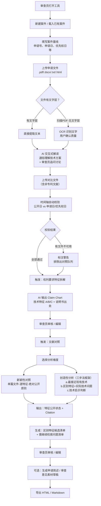
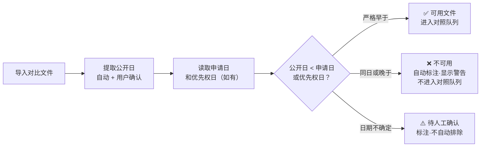
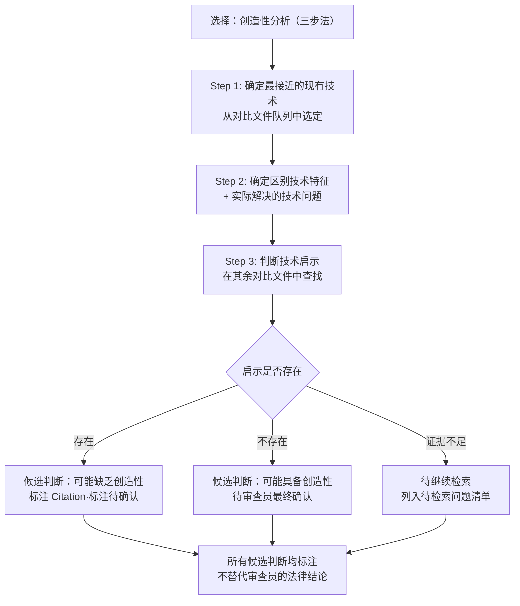
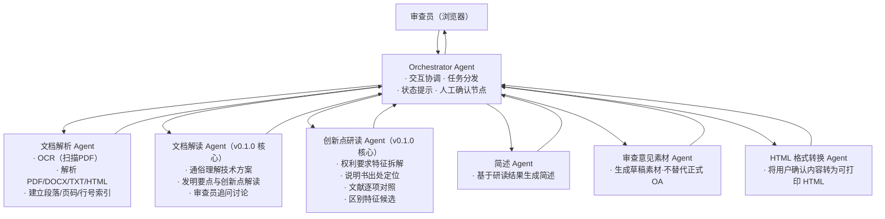
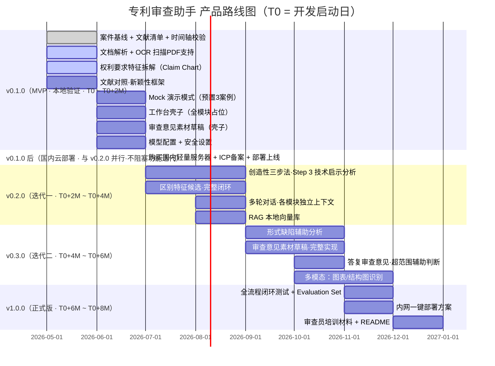

# 专利审查助手 — 产品需求文档 (PRD)

<p align="right">2026-05，wukun2005@gmail.com</p>

---

## 1. 产品概述

| 项目 | 内容 |
|------|------|
| 产品名称 | 专利审查助手（Patent Examination Assistant） |
| 版本 | v0.1.0 |
| 产品形态 | Web App（v0.1.0 本地/内网部署 → 验证后迁移国内云部署） |
| 目标用户 | 国家知识产权局协作中心发明专利实质审查员 |
| 核心价值 | 减少审查员在阅读申请文件、拆解权利要求、对照文献环节的重复性劳动 |
| 明确非目标 | 不替代已有审查系统、案件管理、发文系统；不作出法律结论 |
| 适用专利类型 | **仅限发明专利实质审查**；不覆盖实用新型（无实质审查）和外观设计 |
| 运行环境约束 | 仅可访问国内 URL；不能安装任何桌面应用；纯 Web App 浏览器打开即用 |
| 浏览器约束 | 需兼容 Firefox ≥ 100（审查员常用浏览器，版本可能非最新）；Chrome/Edge 为一等公民，Firefox 为次等但必须可用，核心功能不依赖 File System Access API |
| 文档规模 | 申请文件通常 30–100 页 PDF（含图片），多篇对比文件各 10–50 页；AI Provider 需 ≥ 128K context window |

---

## 2. 背景与动机

### 2.1 审查员的典型痛点

每位发明专利实质审查员每年需处理数十至数百件申请，每件申请的审查链路大致为：

> 收案 → 阅读申请文件 → 技术理解 → 检索对比文献 → 权利要求特征拆解 → 新颖性/创造性评价（三步法）→ 形式缺陷检查 → 起草审查意见 → 发出 OA → 处理答复 → 授权/驳回

其中**阅读与整理阶段**（阅读说明书/权利要求 + 理解技术方案 + 对照文献 + 整理引用出处）占用审查员大量精力，且具有高度重复性：每件申请都要从零做一遍，没有可复用的结构化中间产物。

### 2.2 AI 介入的机会点

- **文档阅读与摘要**：AI 可以快速提取申请文件的技术方案要素、权利要求结构、声称的技术效果。
- **AI 交互式解读**：审查员上传完整申请文件后，AI 以对话方式帮助其快速理解专利——用通俗语言解释技术方案、梳理发明要点、指出关键创新之处。审查员可随时追问（"这个技术方案的核心创新在哪里？""这段描述是否清楚？"），AI 在对话上下文中持续解答。这是审查员"舒了好大一口气"的核心体验——**不是结构化拆解，而是理解**。
- **特征拆解**：AI 可以按三步法框架输出结构化的 claim chart，并标注说明书出处。
- **文献对照**：AI 可以将权利要求技术特征与用户上传的对比文件逐项比对，标注公开状态和引用出处，并识别区别特征候选。
- **时间轴自动校验**：AI 可以自动核查每篇对比文件的公开日与申请日/优先权日的先后关系，过滤不可用文件。
- **OCR 解析**：对扫描版 PDF 申请文件先做 OCR 再解析，避免审查员手动转换格式。

### 2.3 产品边界声明

- **不接入**专利局内部检索系统（CNABS、PAPS、EPOQUE 等），对比文件由审查员自行检索后上传。
- **不替代**发文系统、OA 格式、法条引用、正式三步法论证，APP 产出是审查员起草 OA 的素材。
- **不作出**新颖性、创造性、授权或驳回的法律结论，所有候选判断均须审查员确认。

---

## 3. 用户画像（Persona）

**主要用户：** 资深发明专利实质审查员

| 维度 | 描述 |
|------|------|
| 专业背景 | 熟悉《专利法》《审查指南》，熟练使用发文系统和检索工具 |
| 工作状态 | 案件量大、时间压力高；专业文献阅读负担重 |
| 技术水平 | 熟悉 PC/浏览器基本操作；不要求会用命令行或部署工具 |
| 核心诉求 | 减少重复性阅读和整理；不引入不熟悉的大工具；审查结论主导权在自己手里；快速理解专利申请的技术内容 |
| 浏览器 | 以 Firefox 为主（版本可能非最新），兼顾 Chrome/Edge；不强制升级浏览器 |
| 典型场景 | 手上有一件待审申请文件 + 若干自己检索出的对比文件，需要在有限时间内整理出技术事实和审查思路 |
| 安全敏感点 | 申请文件为未公开内容，不能随意外发；审查意见为保密内容 |

---

## 4. Happy Path Scenario（典型使用旅程）

> 本节描述一位审查员从打开工具到获得有用输出的完整理想流程，帮助理解产品体验目标。

**背景：** 审查员小李手上有一件电子领域发明专利申请（扫描 PDF 格式），以及她从 CNABS 检索到的两篇对比文件（一篇专利、一篇期刊论文）。她想在开会前 30 分钟内整理出权利要求技术特征和初步文献对照结果。

**Step 1 — 打开工具**
小李在浏览器里输入内网地址，工具秒开。顶部显示"演示模式"横幅，她点击切换为"真实模式"，弹出安全提示，她确认 API Key 已配置，点击继续。

**Step 2 — 新建案件**
点击"新建案件"，填写申请号、发明名称、**申请日**（关键）。工具提示"是否主张优先权"，她选否。

**Step 3 — 上传申请文件（扫描 PDF）**
她直接把扫描版 PDF 拖入上传区。工具检测到无文字层，自动启动 OCR，进度条显示"正在识别文字内容…"（约 15–30 秒，基于现代硬件）。OCR 完成后提示"已识别 XX 页，请确认文字质量"，她快速扫了一眼，点击确认。

**Step 3.5 — AI 解读申请文件（核心体验）**
她点击"解读此专利"。APP 弹出发送确认框，她确认后约 15 秒，AI 返回一份通俗易懂的专利解读：技术方案概述、发明要解决的问题、关键技术手段、独立权利要求的核心保护范围。她读完后追问："这个技术方案和现有技术相比的创新点主要在哪？"AI 在对话上下文中给出分析。她心里有了底，继续下一步。**这个环节是审查员"舒了好大一口气"的关键——先理解，再拆解。**

**Step 4 — 上传对比文件**
她点击"选择文件夹"，授权 APP 访问她的检索结果文件夹，两篇文件自动导入。APP 提取两篇文件的公开日，**自动完成时间轴校验**：一篇通过（绿色 ✅），一篇公开日与申请日同日（橙色 ⚠️ 标注"同日公开·不可用于新颖性评价"）。

**Step 5 — 触发权利要求特征拆解**
她点击"分析权利要求1"，APP 弹出发送确认框，显示将发送的内容范围（OCR 后的权利要求文字），她点击确认。约 20 秒后，Claim Chart 生成：权利要求1 被拆解为特征 A、B、C 三项，每项标注了说明书出处段落号。

**Step 6 — 查看和微调**
她发现特征 B 的说明书出处标注为"待确认"（黄色标注），直接在表格里点击编辑，手动补充正确段落号。右侧 AI 对话框里她追问："特征 B 和特征 C 是否可以合并为一个技术特征？"，AI 给出分析，她决定保持拆解不变。

**Step 7 — 触发新颖性对照**
她选择通过时间轴校验的那篇对比文件，点击"新颖性对照"。APP 逐特征输出对照表：A 已公开（附引用段落），B 未找到对应公开，C 可能公开但需确认（附引用段落和不一致说明）。

（另含"不适用"状态，用于特征与对比文件无关的情况，见 §6.5.1 正式定义表。）

**Step 8 — 导出**
她点击"导出 HTML"，得到一份清晰的对照表文件，文件名自动生成为"CN2023XXXXX_发明名称_新颖性对照_20260503.html"，直接打印带去会议室。

**整个过程耗时：约 15 分钟**（其中 OCR 约 1 分钟，AI 解读约 2 分钟，AI 分析约 3 分钟，人工操作约 9 分钟，含确认、编辑、追问、导出）。

**分支场景 — 零对比文件：** 如果审查员尚未上传对比文件，工具可正常完成 Claim Chart 拆解（同时跳过文献清单和时间轴校验）。Claim Chart Agent 的输出附带一份"待检索问题清单"（基于权利要求特征提示应检索的技术方向），文献对照区显示"未上传对比文件，跳过新颖性/创造性对照"，并展示该清单。审查员可先保存案件，后续补充对比文件后再触发对照。有对比文件时，检索问题清单由 Novelty Agent 补充/覆盖。

> **说明：** 安装和首次配置（运行 `npm start`、填写 API Key）由技术人员协助完成，不计入 Happy Path 时间。安装说明见 README（代码完成后提供）。

---

## 5. 核心流程图

### 5.1 整体使用流程

<!-- Mermaid 图表需 Mermaid ≥ 10.0（使用 `&` 连接符语法） -->



### 5.2 时间轴校验流程

<!-- Mermaid ≥ 10.0 -->



### 5.3 文献对照流程（创造性·三步法）

<!-- Mermaid ≥ 10.0 -->



### 5.4 Multi-Agent 架构

<!-- Mermaid ≥ 10.0 -->



> **注意：** 上图各 Agent 为逻辑角色（route handler 级别的 LLM 调用分工），非独立进程。v0.1.0 落地架构见 Development Plan §4.1。
>
> **Agent ↔ 功能模块映射：** 文档解析 Agent → §6.3；文档解读 Agent → §6.3.5；创新点研读 Agent → §6.4/6.5；简述 Agent → §6.7；审查意见素材 Agent → §6.8；HTML 格式转换 Agent → §6.10。
>
> **Agent ↔ Design/Dev Plan ID 映射：** 本图 Agent 为逻辑角色名。Design/Dev Plan 中以技术 ID 引用：文档解读 Agent → `interpret`（`moduleScope: "case"`）；创新点研读 Agent → `claim-chart` + `novelty`（两个 Agent）；简述 Agent → `summary`；审查意见素材 Agent → `draft`；另有 `chat` Agent（各模块独立对话）和 Orchestrator（前端 `AgentClient` + 后端 `AI Gateway`，非独立 Agent）。HTML 格式转换不作为 Agent，由导出模块直接处理。

---

## 6. 功能需求详述

### 6.1 案件基线模块（壳子 + 基础可编辑）

| 字段 | 说明 | v0.1.0 状态 |
|------|------|------------|
| 申请号 | 用户手动录入或从文件提取，提取不确定标"待确认" | ✅ 实现 |
| 发明名称 | 同上 | ✅ 实现 |
| 申请人 | 同上 | ✅ 实现 |
| 申请日 | **关键字段**，用于时间轴校验 | ✅ 实现 |
| 优先权日 | 若主张优先权则填写，优先于申请日用于时间轴校验 | ✅ 实现 |
| 申请类型 | 发明专利（v0.1.0 固定，不做选择） | ✅ 实现 |
| 当前审查文本版本 | 原始申请 / 第N次修改版 | ✅ 实现 |
| 目标权利要求 | 用户指定分析的编号（默认：独权1） | ✅ 实现 |
| 适用规则版本 | 《专利审查指南》年份版本（默认 2023，当前最新版本） | 壳子 |
| 审查员备注 | 自由文本 | ✅ 实现 |

v0.1.0 不接入 CNIPA 官方案件系统，所有字段手动录入或从文件提取。

切换"当前审查文本版本"时，已生成的 Claim Chart / 新颖性对照 / 创造性分析自动标记为 stale 并提示用户重新生成。

### 6.2 资源/文献清单模块

**输入方式：**
- 上传单个文件（.pdf / .docx / .txt / .html）；单文件上限 200 页 / 100 MB
- 选择本地文件夹（仅 Chrome/Edge 支持 File System Access API；Firefox/Safari 用户使用多文件上传 `<input type="file" multiple>` 替代）
- 手动添加文献条目（标题 + 文献号 + 公开日 + 摘要）
- 对比文件数量上限：10 篇（超出提示用户合并或分批分析）

**文献条目自动提取字段：**

| 字段 | 提取方式 |
|------|---------|
| 标题 | 自动提取 + 用户确认 |
| 文献号/出处 | 正则提取（CN/US/EP 专利号模式）+ 用户确认 |
| 公开日/发表日 | **关键**，用于时间轴校验；提取不确定标注"待确认" |
| 技术领域 | AI 提取 |
| 关键段落摘要 | AI 提取 |
| 与本申请相关点 | AI 提取（候选，需人工确认）|
| 可靠性标记 | 可用 / 待校验公开日 / 不可用 |

**时间轴校验规则：**
- 公开日 **严格早于** 申请日（或优先权日）：✅ 可用
- 公开日 **同日或晚于** 申请日（或优先权日）：❌ 标注不可用，不进入对照队列
- 公开日不确定：⚠️ 标注待确认，不自动排除

**RAG 支持（v0.2.0）：** 对已上传文献建立本地向量索引，减少幻觉。v0.1.0 保留数据模型与接口占位，不做向量检索。

### 6.3 文档 OCR 解析（v0.1.0 必做）

**目标：** 支持扫描版 PDF 申请文件，无需审查员手动转换格式。

| 场景 | 处理方式 |
|------|---------|
| 文档尚未处理 | 初始状态（unknown），等待文件处理流程 |
| PDF 含文字层 | 直接提取文本，无需 OCR |
| PDF 为扫描图像（无文字层） | 自动检测 → 启动 OCR → 提取文字 → 用户确认质量 |
| DOCX / TXT / HTML | 直接解析，无需 OCR |

**OCR 规范：**
- 单文件上限：200 页 / 100 MB；超出时提示用户拆分
- OCR 在浏览器端本地运行（Tesseract.js），扫描内容不外发（详见 Design ADR-006）
- 支持中英文混合识别（专利申请常见）
- OCR 完成后显示预览，用户可确认或手动修正识别错误
- OCR 处理时间较长（取决于页数），显示进度条和预计剩余时间
- OCR 结果缓存到本地，同一文件不重复 OCR
- OCR 完全失败时（WASM 崩溃 / 内存不足 / PDF 损坏），提示"无法识别文字，请提供含文字层的 PDF 或手动粘贴文本"，允许用户直接进入手动输入路径

### 6.3.5 专利文档解读（v0.1.0 必做核心）

**目标：** 审查员上传申请文件并完成文字提取后，AI 以对话方式帮助其快速理解整篇专利。这是审查员"舒了好大一口气"的核心体验——先理解，再拆解。

**触发时机：** 文字提取/OCR 确认后、进入权利要求拆解之前。用户可跳过此步直接进入拆解。

**AI 输出内容：**
- 技术方案概述（通俗语言，非照搬原文）
- 发明要解决的技术问题
- 关键技术手段与实施方式
- 独立权利要求的核心保护范围解读
- 初步创新点观察（候选，标注"仅供参考"）

**交互要求：**
- AI 首次输出后，审查员可**自由追问**（不限轮数），上下文持续累积
- 追问示例："这个技术方案的核心创新在哪？""这段描述是否清楚？""权利要求1和权利要求3的保护范围有什么区别？"
- 对话记录持久化到 IndexedDB，随案件保存
- 有独立 AI 对话框（`moduleScope: "case"`），上下文不与其它模块共享

**v0.1.0 定位：** 必做。此模块是审查员理解专利的"第一站"，优先级高于权利要求拆解。Mock 模式提供预置解读响应。

### 6.4 权利要求特征拆解（v0.1.0 必做核心）

**输出：Claim Chart（可编辑表格）**

| 特征编号 | 特征描述 | 说明书出处 | 备注 |
|---------|---------|-----------|------|
| A | … | 说明书第X段第Y行 | |
| B | … | 说明书第X段第Y行 | 出处待确认 |

**约束：**
- 候选判断不得包装成最终法律结论
- 出处无法定位时标注"出处待确认"，不得捏造
- 识别独立权利要求、从属权利要求、引用关系
- 用户可直接编辑表格；有独立 AI 对话框

### 6.5 文献对照与区别特征候选（v0.1.0 必做核心）

#### 6.5.1 新颖性对照（《专利法》§22.2）

**规则约束：**
- 只能用**一篇**对比文件；绝对公开原则
- 公开日必须严格早于申请日/优先权日

**输出：每个技术特征的公开状态标注 + Citation（文件/段/行）。页面顶部固定显示法律免责声明横幅（legalCaution）。**

| 特征 | 公开状态 | Citation | 不一致说明 |
|------|---------|---------|-----------|
| A | ✅ 已明确公开 | D1 §3 第12行 | |
| B | ⚠️ 可能公开·待确认 | D1 §5 第3行 | 表述不一致 |
| C | ❌ 未找到对应公开 | — | 可能区别特征 |
| D | — 不适用 | — | 该特征与对比文件无关 |

#### 6.5.2 创造性分析·三步法（《专利法》§22.3）

**法律依据：** 专利法第22条第3款；《审查指南》第二部分第四章

**三步法结构（v0.1.0 实现）：**

- **Step 1：** 确定最接近的现有技术（Closest Prior Art）
- **Step 2：** 确定区别技术特征 + 实际解决的技术问题
- **Step 3：** 判断技术启示（可组合多篇文件）；**仅基于上传的对比文件内容判断，不使用模型训练知识中的外部技术信息**

**v0.1.0 能力：** Mock 模式 G2 完整演示；真实模式可调用 AI 生成 Step 1/2/3 结构化骨架内容，所有结论字段必须以"候选/待确认"措辞标注。

**约束：** APP 只输出候选判断和事实依据，最终创造性结论由审查员作出。页面顶部固定显示法律免责声明横幅（legalCaution）。

### 6.6 形式缺陷检查（v0.1.0 壳子·用户手动标记）

| 缺陷类型 | 法律依据 | v0.1.0 状态 |
|---------|---------|------------|
| 说明书支持 | 专利法§26.4；审查指南二·二章 | 壳子·手动标记 |
| 清楚简要 | 专利法§26.3 第二句；审查指南二·二章 | 壳子·手动标记 |
| 单一性 | 专利法§31；审查指南二·六章 | 壳子·手动标记 |
| 充分公开 | 专利法§26.3 第三句；审查指南二·二章 | 壳子·手动标记 |

### 6.7 专利申请简述（v0.1.0 壳子·可选实现）

- 基于权利要求特征拆解结果生成 300–600 字技术简述
- 每条事实陈述均附 Citation；无出处内容只进入"AI 备注"区
- 用户可编辑正文，有独立 AI 对话框
- v0.1.0 为壳子：有入口与占位 UI，若实现必须基于已确认 Citation；不要求完整 AI 生成

### 6.8 审查意见素材草稿（v0.1.0 壳子·草稿）

- 基于 6.4/6.5 结果生成素材草稿：事实摘录、对照表、可能的缺陷提示、待确认问题清单
- **产出定位：** 审查员起草 OA 正文时的参考素材，不是格式化的 OA 通知书
- 显示分区：正文草稿 | AI 备注 | 分析策略 | 待确认事项（四区严格分离）

### 6.9 答复审查意见（v0.1.0 壳子·入口占位）

- 入口：上传申请人意见陈述书 + 修改后权利要求书
- v0.1.0 不实现自动分析，仅提供入口和字段占位
- **法律依据：** 专利法§33（不得超出原说明书和权利要求书记载的范围）

### 6.10 导出模块

- v0.1.0 实现 HTML 导出（可打印），样式清晰朴素
- v0.1.0 Markdown 导出为壳子（有入口与占位 UI，不要求完整输出）
- 文件命名规则：`申请号_发明名称_内容类型_日期.html`（发明名称中的文件名非法字符替换为 `_`，截断至 40 个 Unicode 字符）；同日同类型文件名冲突时自动追加序号 `_2`、`_3`；总文件名字符数 ≤ 200（适配 ext4/HFS+/NTFS），超出时优先缩短发明名称段

### 6.11 Mock 演示模式（v0.1.0 必做）

**目标：** 让用户在不消耗任何 Token、不需要 API Key、完全不联网的情况下，完整体验工具的所有核心流程。

| 规则 | 说明 |
|------|------|
| 零 Token 消耗 | 不调用任何 AI API，所有"AI 输出"均由预置响应替代 |
| 完全离线 | 不需要网络连接；不需要 API Key 配置 |
| 完整流程覆盖 | 所有 Agent 均有对应 Mock 响应 |
| 仿真延迟 | 模拟 800ms–2000ms 随机延迟；URL 参数 `?mockDelay=fast` 固定 200ms（快速演示） |
| E2E 测试加速 | URL 参数 `?mockDelay=0` 固定零延迟（E2E 自动化测试用）；JS 全局变量 `window.__PATENT_MOCK_DELAY__ = 0` 同效 |
| 明显标识 | 顶部常驻横幅"演示模式·所有 AI 输出为预置示例·不消耗 Token" |
| 默认开启 | 首次启动默认 Mock 模式；切换真实模式时显示安全提示 |

**预置案例（与附录C测试集对应）：**

| 预置案例 | 对应测试集 | 涵盖流程 |
|---------|-----------|---------|
| G1：LED 散热装置 | 附录C G1 | 文档解读、新颖性对照、时间轴校验、Citation |
| G2：锂电池快充方法 | 附录C G2 | 文档解读、创造性三步法 Step 1/2/3 |
| G3：智能温控传感器 | 附录C G3 | 文档解读、多从权、形式缺陷占位、零对比文件 |

Mock 响应与真实 AI 输出使用**相同 JSON schema**，切换模式时零改造。

### 6.12 案件历史与交互记录追溯（v0.1.0 壳子·v0.2.0 完整实现）

**用户需求：** 审查员需要完整保留每个专利审查案件中与 AI 的所有交互记录（包括文档解读对话、权利要求拆解追问、新颖性对照讨论等），以便专利复审时能够调阅参考。

**v0.1.0 壳子要求：** 左侧导航显示"案件历史"入口，点击后展示已有案件列表（从 IndexedDB `cases` store 读取），可点击载入任一案件继续工作。数据层完整（所有 ChatMessage 和 PatentCase 已写入 IndexedDB），缺的是浏览 UI。

**功能要求：**

| 能力 | v0.1.0 状态 | v0.2.0 状态 |
|------|------------|------------|
| 交互记录持久化 | ✅ 实现 — 所有 ChatMessage 写入 IndexedDB，按 `caseId + moduleScope + createdAt` 存储 | — |
| 案件列表浏览（查看已有案件） | 壳子 — 有入口与占位 UI | ✅ 完整实现 |
| 按案件查看完整交互历史 | 壳子 — 数据已存储但无浏览 UI | ✅ 完整实现 |
| 交互历史按模块分组展示 | — | ✅ 实现（按 claim-chart / novelty / inventive / case 等 scope 分组） |
| 搜索历史记录（按关键词） | — | ✅ 实现 |
| 导出交互历史（含在 HTML 导出中） | — | ✅ 实现 — HTML 导出附"AI 交互记录"章节 |
| 案件恢复（从 IndexedDB 载入已有案件继续工作） | ✅ 实现 — IndexedDB 持久化 + 案件载入 | — |

**数据要求：** 每条交互记录需包含：时间戳、模块范围（哪个功能区的对话）、用户提问内容、AI 回复内容、使用的 Provider 和模型、Token 消耗。v0.1.0 的 ChatMessage 类型已覆盖这些字段。

---

## 7. 非功能需求

### 7.1 安全与隐私（最高优先级）

| 要求 | 说明 |
|------|------|
| 数据不外发原则 | 外部 AI 调用前必须显示将发送的内容，用户确认后才发送 |
| 技术方案本身是敏感内容 | 不能仅用 PII 脱敏代替安全保护 |
| API Key 加密存储 | 用户主密码 + PBKDF2 派生密钥 + AES-256-GCM 加密；不明文存入 localStorage（详见 §12.2） |
| API Key 存储模式 | 默认仅存 server 进程内存（重启需重新输入）；用户可选持久化时使用 PBKDF2 + AES-256-GCM 加密至文件 |
| 脱敏字段用户自定义 | sanitize → AI API → restore 双向脱敏层已在 v0.1.0 实现，默认不启用；用户可在每次外发确认弹窗中选择启用 |
| 默认本地/内网运行 | 不默认连接外部云服务 |
| 仅国内 URL | 所有运行时资源（Tesseract、pdfjs worker 等）必须本地托管或国内 CDN，禁止引用海外 CDN |
| OCR 本地运行 | OCR 优先在本地（浏览器端 Tesseract.js）运行，扫描内容不外发；Tesseract WASM + Worker + 语言包全部本地化 |

### 7.2 性能

- 应用不能导致用户机器卡死；需与办公软件和浏览器共存
- 长任务（OCR、AI 分析）提供朴素进度提示
- 流式操作期间禁用主操作按钮（生成 Claim Chart、触发新颖性对照、触发创造性分析、导出 HTML），防止并发冲突（Mock 模式同样适用）
- OCR 结果本地缓存，同一文件不重复 OCR
- IndexedDB 存储生命周期：OCR 缓存 7 天自动过期；用户可在设置中一键清除所有本地数据

### 7.3 部署

**v0.1.0：本地验证阶段**
- 默认：本地单机或内网部署，冷启动一键/输入 URL 即可使用
- 受限网络环境（§7.1 仅国内 URL）下必须使用纯本地部署，不使用任何海外外部服务（Vercel、Supabase 等海外服务不可用）

**v0.1.0 后：国内云部署阶段**
- 本地验证通过后，迁移至国内云服务器（阿里云/腾讯云/华为云轻量应用服务器），绑定国内域名，提供可通过浏览器访问的国内 URL
- **不采用 Vercel + Supabase 方案：** 两者均为海外服务，在"仅可访问国内 URL"的网络约束下不可用
- 迁移成本低：当前架构为 Node Express 静态托管 + API，build 产物为单文件 `server/dist/index.js`，部署到国内云服务器后仅需将 `localhost:3000` 替换为国内域名，可选加 nginx 反向代理
- 推荐路线：先本地做产品验证 → 确认产品可用 → 购买国内轻量服务器（新用户首年几十元）→ 部署上线
- ICP 备案：使用国内域名需完成 ICP 备案（需中国大陆身份证明，域名需实名认证；免费，通常 1-2 周，以管局审核时间为准）
- **访问控制：** 云部署后域名对外可访问，必须加入身份认证（HTTP Basic Auth 或 IP 白名单）；未认证用户不得访问任何页面或 API。本地/内网部署无需认证
- **多用户：** 云部署 v0.1.0 仍为单用户部署，每位审查员部署独立实例；多用户隔离留到 v1.0.0
- **HTTPS：** 推荐配置 HTTPS（涉及 API Key 传输时应使用加密连接）；Let's Encrypt 免费证书 + nginx 配置即可
- **数据备份：** 云部署建议定期备份 `data/` 目录（含 keystore.enc）；可使用云服务商提供的快照功能

### 7.4 界面与体验

- 语言：中文
- UI：简单朴素，无复杂动画/渐变/流光
- 浏览器检测：首次访问时检测浏览器类型和版本，Firefox 用户显示非阻断性提示条（"检测到 Firefox 浏览器，部分功能（文件夹导入、文件保存对话框）不可用，您可通过多文件选择和下载方式替代"），不强制要求升级
- 数据持久化：低敏内容预填上次输入；生成结果保存到用户指定路径
- 各功能区独立 AI 对话上下文，不互相污染
- Token 预估：生成前显示估算值（基于字符比例公式，首次调用后自动校准）；生成后显示实际消耗
- 独立 AI 对话框规格：
  - 每个模块（Claim Chart / 新颖性 / 创造性 / 素材草稿 / 形式缺陷 / 文档解读 / 文档导入 / 简述）各有一个独立 AI 对话框（对应 moduleScope: claim-chart / novelty / inventive / draft / defects / case / documents / summary），**不共享 LLM session 历史**。
  - 支持两种操作：**追问**（基于当前上下文提问）和**请求重新分析**（用当前编辑后的数据重新触发 Agent）。
  - 对话上下文包含当前模块的输入数据快照（如当前 Claim Chart 特征列表），用户在表格中的修改会作为下一轮对话的上下文更新。
- 反馈系统：每个 AI 生成内容和每个对话回答支持 like / dislike / 可选评论，用于累计统计用户满意度（见 §8）

### 7.5 模型与 Agent 配置

**两级配置架构：**
- 第一级：模型连接（Provider + API Key + 模型 ID 列表）
- 第二级：Agent 角色分配（每个 Agent 选用哪个模型/推理强度）

**支持 Provider（国内）：** Kimi、GLM、Minimax、小米 MiMo（默认候选）

**Fallback 机制：** 配额错误自动切换下一个；其他错误指数退避后重试；用户可调整顺序。

### 7.6 资源库优化

- 段落级哈希去重（SHA-256）+ 磁盘缓存；资源库未更新时复用处理结果
- 按功能路由校准 maxTokens，防止 output token 浪费

---

## 8. 成功指标（Success Metrics）

| 指标 | 定义 | 测量方式 |
|------|------|---------|
| Time-To-First-Innovation-Map | 从上传文件到生成第一版"权利要求拆解 + 创新点候选 + 文献对照表"的时间 | 自动计时（秒） |
| Document Interpretation Usefulness | AI 文档解读是否帮助审查员快速理解专利技术方案 | 用户反馈 + 追问轮次 |
| Claim Feature Coverage | 目标权利要求的技术特征是否被完整拆解 | 人工评分 |
| Citation Accuracy | 每个特征、技术效果、文献对照结论是否精确定位到文件/段落/行号 | 人工抽样核查 |
| Time-Axis Check Rate | 对比文件公开日 vs 申请日/优先权日校验是否自动完成且无漏判 | 自动统计 |
| OCR Accuracy | OCR 识别后文字是否基本准确可用（用户无需大量手动修正） | 用户反馈 |
| Difference Candidate Usefulness | 区别特征候选和待检索问题是否对审查员有实际参考价值 | 用户反馈 |
| Human Correction Rate | 审查员需大幅修改 AI 输出的比例 | 用户行为统计 |
| 用户满意度 | 每个生成内容和每个回答支持 like / dislike / comment | 累计统计 |

**Evaluation Set（测试集）：** 见**附录C**，golden / adversarial / edge 各 3 条，含完整案件信息、权利要求原文、对比文件信息和期望输出。

**验证方法：**
- Mock 模式内置附录C的 Golden Cases（G1/G2/G3），可在不消耗 Token 的情况下验证 UI 和流程
- 真实 AI 模式下运行全部9条测试集，对照期望输出人工评分
- 每次版本迭代前必须跑一遍完整测试集

---

## 9. 权衡与设计决策（Trade-offs）

| 决策点 | 选择 | 理由 |
|--------|------|------|
| 小工具 vs 大平台 | 小工具 | v0.1.0 坚决只做既有流程的效率补充 |
| 专业判断 vs 重复整理 | 只辅助整理 | 法律结论必须由审查员作出 |
| 覆盖面 vs 可试用 | 可试用闭环 | 先把核心功能做成真实可用，其他做壳子 |
| OCR 本地 vs 云端 | 本地优先 | 扫描申请文件为未公开内容，不应外发 |
| 节省 token vs 延迟 | 精准节省 | 不影响 Citation 准确性；进度用朴素提示 |
| 安全 vs 便利 | 安全优先 | 未公开文件保护 > 调用便利；外发必须确认 |
| 接入检索系统 vs 用户上传 | 用户上传 | v0.1.0 无法接入 CNABS/PAPS；设计边界 |
| 云平台选择 | 国内云服务器 | Vercel/Supabase 为海外服务，在"仅国内 URL"约束下不可用；国内云轻量服务器首年几十元，架构零改动即可迁移 |

---

## 10. 风险与缓解措施

| 风险 | 概率 | 影响 | 缓解措施 |
|------|------|------|---------|
| AI 幻觉导致错误 Citation | 中 | 高 | 强制所有结论附 Citation；无出处内容只进 AI 备注区 |
| 未公开文件意外外发 | 低 | 极高 | 外发前强制确认弹窗；API Key 加密；默认内网部署 |
| 时间轴校验误判（日期提取错误） | 中 | 高 | 提取不确定时标注"待确认"而非自动决策 |
| 用户过度依赖 AI 候选判断 | 中 | 高 | UI 上明确标注"候选·待审查员确认"，不用定论性语言 |
| 新颖性/创造性维度混淆 | 低 | 高 | UI 明确分区标签，不可互相混用对比文件规则 |
| OCR 识别质量差（复杂格式） | 中 | 中 | OCR 后强制用户确认预览；提供手动修正入口 |
| 内网机器性能不足导致卡死 | 中 | 中 | 控制内存/CPU；长任务异步；进度提示 |
| ICP 备案周期影响上线时间 | 中 | 低 | 备案期间先用本地/内网部署；备案免费但需 1-2 周 |
| 国内云服务器运维能力不足 | 低 | 中 | 架构极简（单 Node 进程），无需复杂运维；可选 nginx |


---

## 11. 产品路线图（Roadmap）

> **T0** = 开发正式启动日（待定）。Gantt 图中的日期为占位渲染（以 T0=2026-05 为例），**不代表实际承诺时间**；T0 确定后需同步更新。



### 各版本里程碑说明

| 版本 | 启动时间 | 核心交付 | 明确不做 |
|------|---------|---------|---------|
| **v0.1.0** | T0 | OCR + 权利要求拆解 + 新颖性对照可真实使用；Mock 演示模式；全工作台壳子 | 创造性 Step 3、RAG、多轮对话 |
| **v0.1.0 后** | 本地验证通过后（与 v0.2.0 并行） | 国内云服务器部署上线（阿里云/腾讯云/华为云），绑定国内域名，含访问认证（HTTP Basic Auth/IP 白名单）+ HTTPS；每位审查员独立实例 | Vercel/Supabase（海外服务，网络约束下不可用）；多用户隔离（留到 v1.0.0） |
| **v0.2.0** | T0 + 2M | 创造性三步法完整实现；RAG；多轮对话 | 形式缺陷分析、答复审查意见 |
| **v0.3.0** | T0 + 4M | 形式缺陷辅助、审查意见草稿完整、答复审查、多模态 | — |
| **v1.0.0** | T0 + 6M | 全流程闭环、Evaluation Set 验证、一键部署、培训材料 | — |

---

## 12. 技术架构概要

### 12.1 前端

- **OCR：** Tesseract.js（浏览器端，本地运行，数据不外发）
- **文件处理：** File System Access API（选择文件夹）；FileReader（单文件上传）
- **持久化：** localStorage（低敏配置）；IndexedDB（生成结果本地缓存）
- **技术选型：** 详见 Design §4.1

### 12.2 后端

- **运行时：** Node.js（轻量，内网单机可运行）
- **API 网关：** 代理转发各 AI Provider 请求；脱敏拦截层在此实现（用户启用时生效，见 §7.1）
- **文档解析：** PDF → 文本（pdfjs-dist）；DOCX → 文本（mammoth）；OCR（浏览器端 Tesseract.js，详见 Design ADR-006）
- **向量检索（RAG）：** 本地轻量向量库（v0.2.0 实现）
- **加密：** API Key 默认仅保存在 server 进程内存；可选持久化时使用用户主密码 + PBKDF2 派生密钥 + AES-256-GCM 加密至 `data/keystore.enc`；浏览器端不持久保存任何 API Key 明文/密文（详见 Dev Plan §8.10）

### 12.3 部署架构

**当前（本地验证）：**

```
内网机器（单台）
  └── Node.js Server（本地 HTTP）
       ├── 前端静态文件
       ├── API 代理层（转发至外部 AI Provider）
       └── 本地文件系统（文献库、OCR 缓存、生成结果）
```

冷启动：`npm start` → 浏览器打开 `http://localhost:PORT`；无需数据库（v0.1.0）。

**后续（国内云部署）：**

```
国内云服务器（阿里云/腾讯云/华为云 轻量 ECS）
  ├── nginx（反向代理，推荐）
  │    ├── HTTPS 终止 + 域名绑定
  │    ├── HTTP Basic Auth 或 IP 白名单认证（必选）
  │    └── 代理 → localhost:3000
  └── Node.js Server（HTTP，PM2/systemd 进程管理）
       ├── 前端静态文件
       ├── API 代理层（转发至外部 AI Provider）
       └── 本地文件系统（文献库、OCR 缓存、生成结果）
       域名：https://your-domain.cn（需 ICP 备案）
```

架构不变，仅部署目标从 localhost 变更为国内域名。应用代码无需改动（仅部署配置），前提是已完成认证需求。

---

## 13. 明确非目标（Non-Goals）

1. 替代 CNIPA 已有审查系统、案件管理、发文系统
2. 接管案件流转、期限管理、内部审批流程
3. 接入官方检索系统（CNABS、PAPS、EPOQUE）
4. 自动生成可直接发文的格式化审查意见通知书（OA）
5. 替审查员作出新颖性、创造性、授权或驳回的最终法律结论
6. 在未确认安全边界前默认上传未公开申请文件到外部服务
7. 覆盖实用新型和外观设计审查
8. 多模态图表/结构图识别（留到 v0.3.0）
9. RAG 向量检索（留到 v0.2.0）

---

## 14. 参考文献

### 14.1 法律法规

| 文献 | 版本 | 关键条款 |
|------|------|---------|
| 《中华人民共和国专利法》 | 2021年修正版 | §22（新颖性/创造性/实用性）；§26（说明书/权利要求）；§31（单一性）；§33（修改范围）|
| 《中华人民共和国专利法实施细则》 | 2023年修订 | §17–§22（权利要求撰写）；§44–§54（实质审查程序） |

### 14.2 审查指南

| 文献 | 版本 | 关键章节 |
|------|------|---------|
| 《专利审查指南》 | 2023年版（国家知识产权局） | **第二部分第二章** 说明书及权利要求书；**第二部分第三章** 新颖性（绝对新颖性、单篇对比文件、公开日判断）；**第二部分第四章** 创造性（三步法）；**第二部分第六章** 单一性；**第三部分** 发明专利实质审查程序；**第三部分第二章** 审查意见通知书撰写 |

### 14.3 学术与实务参考

| 文献 | 说明 |
|------|------|
| 国家知识产权局，《专利审查实务指引》 | 补充审查实践中常见问题的处理方式 |
| 张晓都，《专利法详解》，知识产权出版社 | 国内权威法条注释 |
| 尹新天，《中国专利法详解》，知识产权出版社 | 实务参考 |
| EPO，《审查员实操手册（Examiner Handbook）》 | 三步法（Problem-Solution Approach）国际对比参考 |

### 14.4 技术参考

| 文献/项目 | 说明 |
|---------|------|
| ResumeTailor（https://github.com/wukun2005-gif/resumeTailor）| UI 交互模式、文件处理、AI 对话框等设计参考 |
| Tesseract.js（https://github.com/naptha/tesseract.js）| 浏览器端 OCR，支持中英文 |
| pdfjs-dist | PDF 文本提取 |
| mammoth.js | DOCX 文本提取 |
| Kimi API 文档（https://platform.moonshot.cn）| 国内 Provider API 接入 |
| GLM API 文档（https://open.bigmodel.cn）| 同上 |
| Minimax API 文档（https://www.minimaxi.com）| 同上 |

---

## 附录 A：关键术语表

| 术语 | 定义 |
|------|------|
| OA | Office Action，审查意见通知书，CNIPA 发文系统生成的格式文件 |
| Claim Chart | 权利要求特征对照表，将权利要求拆解为单独技术特征逐项列出 |
| 三步法 | 创造性审查的法定方法：①最接近现有技术 ②区别特征+实际技术问题 ③技术启示 |
| Citation | 事实依据引用出处，精确到文件/段落/行号 |
| 区别技术特征 | 申请权利要求相比最接近现有技术额外具有的技术特征 |
| 优先权日 | 首次提交申请的日期（主张优先权时），优先于申请日用于时间轴校验 |
| RAG | Retrieval-Augmented Generation，检索增强生成，用本地文献库提升 AI 回答质量 |
| OCR | Optical Character Recognition，光学字符识别，用于解析扫描版 PDF |
| 时间轴校验 | 核查对比文件公开日是否严格早于申请日/优先权日的必要步骤 |
| Human-in-the-Loop | 所有关键操作须人工确认，AI 不自动执行不可逆操作 |
| 壳子 | UI 入口存在但功能未实现，仅占位（如 Markdown 导出、形式缺陷手动标记） |
| T0 | 开发正式启动日，Roadmap 的相对时间基准 |

---

## 附录 B：v0.1.0 最小可用闭环定义

以下场景在 v0.1.0 中必须**端到端可真实运行**（不是壳子）：

1. 审查员上传一份发明专利申请文件（.pdf 或 .docx，**含扫描 PDF**）
2. 扫描 PDF 自动 OCR，用户确认识别质量
3. AI 交互式解读申请文件（通俗理解技术方案 + 审查员追问）
4. 填写案件基线：申请号、发明名称、申请日、优先权日（如有）、目标权利要求编号（默认 1）
5. 上传至少一篇对比文件，APP 自动提取公开日并完成时间轴校验
6. APP 生成 Claim Chart（权利要求1的特征拆解 + 说明书出处标注）
7. APP 对对比文件中每个技术特征进行新颖性对照，输出公开状态 + Citation
8. 审查员可编辑 Claim Chart 和对照表，并通过对话框追问
9. 导出对照表为 HTML 文件

以上 9 步形成 v0.1.0 的核心 MVP 闭环。

此外，v0.1.0 必须交付以下附加项（对应 §6.10/§6.11/§6.12）：

10. HTML 导出文件名自动生成（`申请号_发明名称_内容类型_日期.html`），可直接打印
11. 案件历史列表（壳子）：可浏览已有案件并载入继续工作
12. Mock 演示模式（默认开启，零 Token、零联网，完整覆盖上述 1–11），内置 G1/G2/G3 预置案例，作为独立验收项（见 §6.11）

其余模块在界面上有占位入口但可以是壳子。

---

## 附录 C：Evaluation Set 评测集（9条）

> **说明：** 以下案例为教学示例，申请号/文献号均为虚构，权利要求内容基于真实专利领域的典型写法构造，仅用于工具评测和 Mock 演示。不代表真实专利申请。

---

### C.1 Golden Cases（典型案例）

#### G1 — LED 灯具散热装置

| 字段 | 内容 |
|------|------|
| 发明名称 | 一种 LED 灯具用复合散热装置 |
| 申请号（虚构） | CN202310001001A |
| 申请日 | 2023-03-15 |
| 优先权日 | 无 |

**权利要求1：**
> 一种 LED 灯具用复合散热装置，其特征在于，包括：散热基板（A），由铝合金材料制成，表面设有均匀分布的散热翅片；导热界面层（B），设置在散热基板与 LED 芯片之间，为石墨烯复合导热膜，厚度 0.1mm–0.5mm；风冷模块（C），与散热翅片配合，包含离心风扇及导风罩。

**对比文件：**

| 编号 | 公开日 | 时间轴校验 |
|------|-------|-----------|
| D1（CN201510012345A·LED散热基板）| 2015-06-20 | ✅ |
| D2（CN202010056789A·石墨烯导热膜应用）| 2020-11-30 | ✅ |

**D1 关键内容（虚构）：** §0023 铝合金散热基板+散热翅片；§0031 导热硅脂连接（非石墨烯膜）；§0045 自然对流散热（无风冷模块）

**期望 AI 输出：**

| 特征 | 公开状态 | Citation |
|------|---------|---------|
| A（铝合金散热基板+翅片） | ✅ 已明确公开 | D1 §0023 |
| B（石墨烯导热膜·0.1–0.5mm） | ❌ 未找到对应公开 | D1 §0031（仅硅脂） |
| C（风冷模块） | ❌ 未找到对应公开 | D1 §0045（自然对流） |

区别特征候选：B、C。评分标准：时间轴校验正确(10)、特征全部识别(30)、Citation准确(30)、区别特征正确(30)。

---

#### G2 — 锂电池快速充电控制方法

| 字段 | 内容 |
|------|------|
| 发明名称 | 一种锂离子电池快速充电控制方法 |
| 申请号（虚构） | CN202310002002A |
| 申请日 | 2023-07-20 |

**权利要求1：**
> 步骤a（A）：以1C–3C恒定电流预充电至端电压4.0V；步骤b（B）：根据内阻实时检测动态调整充电电压，内阻每增加10mΩ则充电电压降低0.05V；步骤c（C）：温度超过45°C时自动停止充电并警报。

**对比文件：** D1（CN201910056789A·恒流恒压充电，2019-11-30✅，含步骤A+C，不含步骤B）；D2（US20200123456A1·EV动态调压，2020-05-15✅，含与步骤B参数一致的技术方案）

**期望三步法输出：**
- Step 1：D1 为最接近现有技术（共同特征 A+C）
- Step 2：区别特征 B（内阻动态调压）；实际技术问题：提高充电效率并降低极化损耗
- Step 3：D2 存在技术启示（相同参数 10mΩ→0.05V）→ 候选判断：可能缺乏创造性（待确认）

---

#### G3 — 智能温控传感器网络

| 字段 | 内容 |
|------|------|
| 发明名称 | 一种自校准智能温控传感器网络系统 |
| 申请号（虚构） | CN202310003003A |
| 申请日 | 2023-09-01 |
| 对比文件 | 无 |

**权利要求1（独权）：** 传感器节点（A·ADC模块）+ 中央控制单元（B·RS-485总线）+ 自校准模块（C·24h校准周期）。权利要求3（从权）：校准周期可自定义1h–168h。

**说明书支持检查重点：** 权利要求3的1h–168h范围仅有24h一个实施例支持 → ⚠️ 参数范围可能超出说明书支持。

**期望输出：** 正确识别独权+2个从权的结构；形式缺陷占位提示参数范围支持不足风险；无对比文件时提示"跳过文献对照"，不报错。

---

### C.2 Adversarial Cases（对抗性案例）

#### A1 — 功能性限定权利要求

**发明名称：** 一种自适应图像增强处理装置（申请日 2023-05-10）

**权利要求1（含大量功能性限定）：**
> 能够实时分析图像噪声分布并自动选择最优降噪算法的降噪单元；用于对降噪后图像进行自适应对比度增强以获得最佳视觉效果的增强单元；以最优方式协调上述两个单元的控制单元。

**期望输出：** 识别功能性限定语言并标注"⚠️ 技术特征边界不清晰·建议人工明确"；不崩溃；AI 备注区提示§26.4 支持范围风险。

---

#### A2 — 对比文件公开日当日边界

**申请日：** 2022-11-08

| 编号 | 公开日 | 期望校验结果 |
|------|-------|------------|
| D1 | 2022-11-07 | ✅ 早于申请日1天，可用 |
| D2 | **2022-11-08** | ❌ 同日，**不可用**（附法律依据：审查指南二·三章3.1节） |
| D3 | 2022-11-09 | ❌ 晚于申请日，不可用 |

**评分重点：** 同日是否被正确判断为不可用；法律依据引用是否正确。

---

#### A3 — PCT 转国家阶段·优先权日

| 字段 | 内容 |
|------|------|
| 发明名称 | 一种基于深度学习的医学图像分割方法 |
| 申请号（虚构） | CN202280078901A（PCT转国内） |
| 国际申请日 | 2022-06-15 |
| **优先权日** | **2021-07-20**（基于美国申请 US17/123456）|
| **时间轴校验基准** | **优先权日 2021-07-20** |

| 编号 | 公开日 | 期望校验结果 |
|------|-------|------------|
| D1 | 2021-07-19 | ✅ 早于优先权日1天，可用 |
| D2 | 2021-07-21 | ❌ 晚于优先权日，不可用 |
| D3 | 2022-05-01 | ❌ 不可用（虽早于国际申请日，但晚于优先权日） |

**评分重点：** 是否正确以优先权日（而非国际申请日）为基准。

---

### C.3 Edge Cases（边界案例）

#### E1 — 零对比文件

**发明名称：** 一种新型生物降解包装材料（申请日 2023-04-01）；未上传任何对比文件。

**期望输出：** 正常完成 Claim Chart；文献对照区提示"未上传对比文件，跳过新颖性/创造性对照"；生成"需继续检索的问题清单"提示审查员需检索的方向；不崩溃。

---

#### E2 — 扫描 PDF（OCR 场景）

**发明名称：** 一种热塑性弹性体复合材料（扫描版 PDF，无文字层）

**期望输出：**
- 自动检测无文字层 → 启动 OCR → 显示进度条
- OCR 完成后显示预览，用户确认文字质量
- 识别权利要求文字后，正常进入特征拆解流程
- 若 OCR 质量极差（识别率低于阈值），提示"识别质量较低，建议提供含文字层的PDF或手动粘贴权利要求文本"

**与原始版本的差异：** v0.1.0 已支持 OCR，本测试用例验证 OCR 流程的正确性，而非"不支持扫描件"的错误处理。

---

#### E3 — 多项独立权利要求（单一性问题）

**发明名称：** 一种热交换器、其制造方法及使用该热交换器的空调系统（申请日 2023-08-15）

**权利要求结构：** 权1（独权·装置）→ 权2–3（从权）；权4（独权·方法）→ 权5–7（从权）；权8（独权·系统）→ 权9–10（从权）

**期望输出：**
- 正确识别3个独立权利要求及各自从权链
- 形式缺陷检查（壳子）提示：存在多项独权，请确认是否满足单一性要求（§31）
- 用户指定"只分析权利要求1"时，APP 只对权1及从权2/3 进行分析

---

### C.4 评测集汇总

| 编号 | 类型 | 名称 | 主要考察点 | Mock 预置 |
|------|------|------|-----------|----------|
| G1 | Golden | LED 散热装置 | 新颖性对照、时间轴校验、Citation | ✅ 内置 |
| G2 | Golden | 锂电池快充方法 | 创造性三步法完整流程 | ✅ 内置 |
| G3 | Golden | 智能温控传感器 | 多从权、形式缺陷、零对比文件 | ✅ 内置 |
| A1 | Adversarial | 功能性限定权利要求 | 模糊输入优雅降级 | — |
| A2 | Adversarial | 公开日当日边界 | 边界日期时间轴校验 | — |
| A3 | Adversarial | PCT转国家·优先权日 | 优先权日 vs 申请日 | — |
| E1 | Edge | 零对比文件 | 空文件列表处理 | — |
| E2 | Edge | 扫描PDF·OCR | OCR 流程正确性 | — |
| E3 | Edge | 多独权·单一性 | 权利要求引用链识别 | — |
