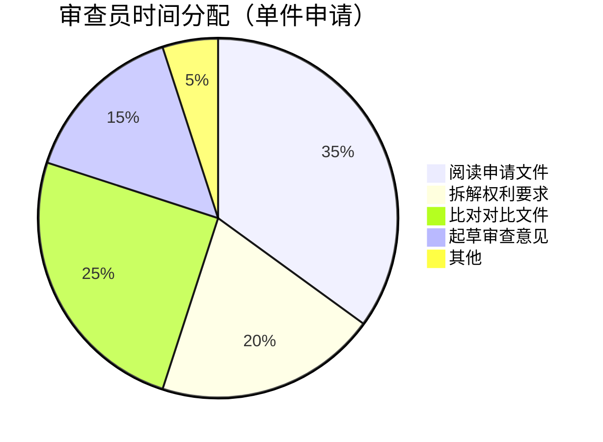
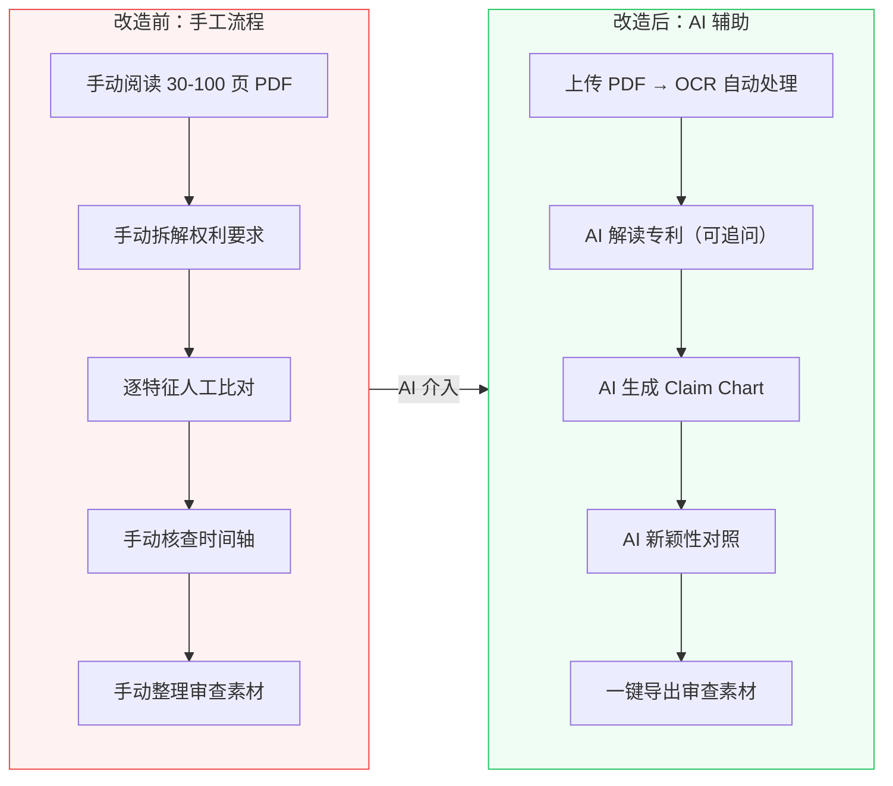
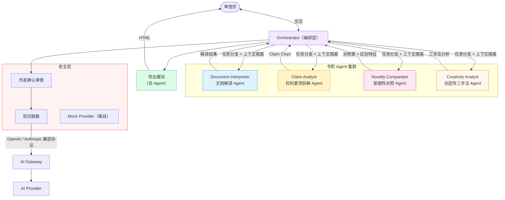
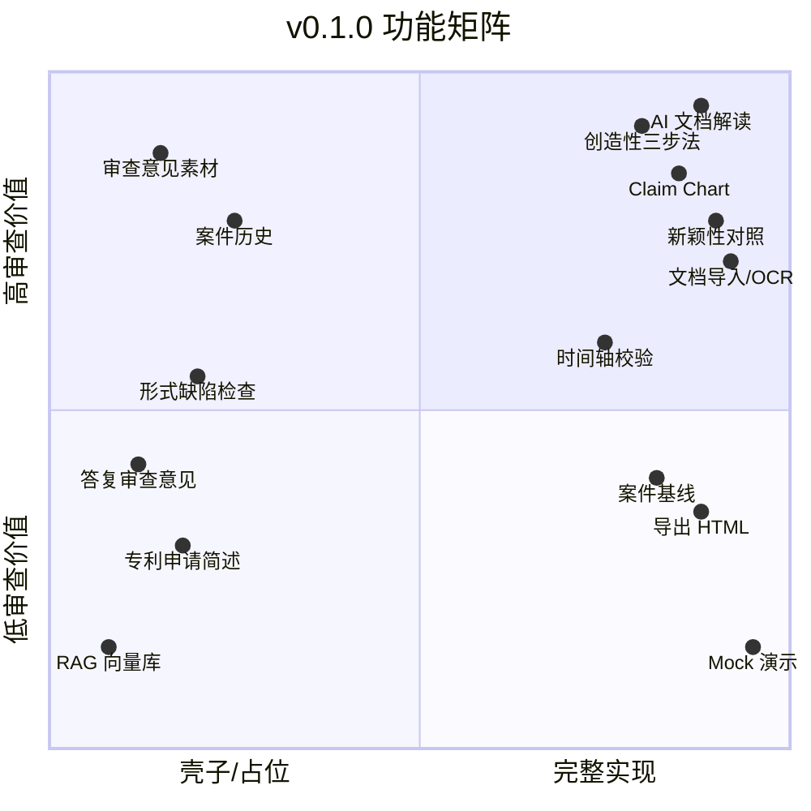
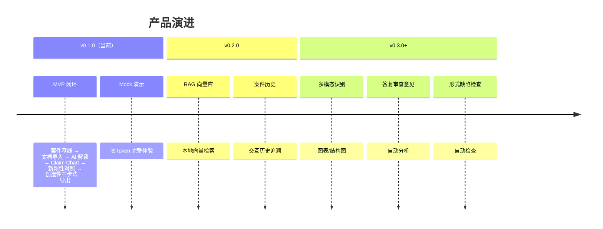

# 专利审查助手

> AI 辅助发明专利实质审查的 Web 工具

[](LICENSE)


---

## 问题：审查员的每一天

每位发明专利审查员每年处理数十至数百件申请，每件的审查链路：

```
收案 → 阅读申请文件 → 技术理解 → 检索对比文献 → 权利要求拆解 → 新颖性/创造性评价 → 起草审查意见
```

**其中"阅读与整理"阶段占据了大量时间，且每件都要从零做一遍。**



| 痛点 | 现状 | 后果 |
|------|------|------|
| **重复阅读** | 每件申请手动阅读 30-100 页 PDF | 大量时间消耗在理解技术方案上 |
| **手动拆解** | 权利要求特征全靠人工拆解，标注说明书出处费时 | 容易遗漏，无法复用 |
| **逐项比对** | 新颖性对照需逐特征人工比对 | 高度重复，疲劳出错 |
| **时间轴核查** | 手动核查对比文件公开日与申请日关系 | 容易遗漏不可用文件 |
| **格式转换** | 扫描版 PDF 需手动 OCR | 工具分散，流程割裂 |

---

## 解决方案：AI 做苦力，审查员做判断



**核心原则：AI 提议，审查员做决定。** 所有 AI 输出均为审查素材，不构成法律结论。

---

## 核心功能

### AI 交互式解读

审查员上传申请文件后，AI 以通俗语言解读技术方案。支持自由追问，对话上下文持续累积。

> 这是审查员"先理解，再拆解"的核心体验。

### 权利要求特征拆解 (Claim Chart)

AI 将权利要求拆解为结构化特征表，标注说明书出处。审查员可直接编辑修正。

### 新颖性对照

逐特征比对权利要求与对比文件，输出公开状态 + 引用出处 + 区别特征候选。

### 创造性三步法

最接近现有技术 → 区别特征 + 实际解决的技术问题 → 技术启示判断。三步结构化输出，结论标注"候选/待审查员确认"。

### 时间轴校验

自动核查对比文件公开日与申请日/优先权日的关系，过滤不可用文件。

### 文档导入与 OCR

支持 PDF / DOCX / TXT / HTML。扫描版 PDF 自动 OCR，全程浏览器端处理，数据不外发。

### 导出

一键导出可打印 HTML，文件名自动生成。

---

## 多 Agent 协作架构

专利审查助手采用**多 Agent 编排架构**，将审查流程拆分为多个专职 Agent，各司其职、协同工作：



| Agent | 职责 | 设计要点 |
|-------|------|---------|
| **Orchestrator** | 编排调度、任务分发、人工确认节点 | 每个 Agent 上下文隔离，互不干扰 |
| **文档解读 Agent** | 通俗语言解读技术方案 | 对话上下文累积，支持自由追问 |
| **权利要求拆解 Agent** | 权利要求特征拆解 + 说明书出处标注 | 输出可编辑 Claim Chart |
| **新颖性对照 Agent** | 逐特征新颖性对照 + 区别特征识别 | 四档公开状态 + 待检索问题清单 |
| **创造性分析 Agent** | 创造性三步法分析 | 最接近现有技术 → 区别特征 → 显而易见性判断 |
| **简述 Agent** | 基于已确认 Claim Chart 生成技术简述 | 每条事实附 Citation |
| **审查意见素材 Agent** | 生成审查素材草稿（四分区） | 正文草稿 / AI 备注 / 分析策略 / 待确认事项 |
| **对话 Agent** | 各模块独立追问对话 | 每模块上下文隔离，不共享 LLM session |

> 导出模块不作为独立 Agent，由前端直接处理 HTML 格式转换。

**为什么不用单个 AI？**

| 问题 | 单 Agent | 多 Agent |
|------|---------|---------|
| 角色冲突 | 自己拆解自己评价 | 各 Agent 独立，无偏见 |
| 上下文污染 | 所有任务共享上下文 | 上下文隔离，精准聚焦 |
| 可控性 | 黑盒 | 每个环节审查员可介入 |
| 安全性 | 难以细粒度控制 | 每次外发独立确认 |

---

## 产品边界



> **读图说明：** x 轴右侧为 v0.1.0 完整实现的功能，左侧（x < 0.3）为壳子/占位功能（有入口与数据结构，不要求完整 AI 分析）。

### 明确不做

- 不接入任何内部检索系统
- 不替代发文系统、案件管理、OA 格式
- 不作出法律结论（新颖性/创造性/授权/驳回）
- 不默认上传未公开申请文件到外部服务
- 不覆盖实用新型和外观设计审查

---

## 产品路线图



---

## 安全设计

| 层级 | 机制 | 说明 |
|------|------|------|
| L1 | 外发确认弹窗 | 真实模式下每次 AI 请求前弹出确认框，显示将发送的内容范围 |
| L2 | 双向脱敏 | 敏感信息在发送前自动过滤，返回后自动恢复 |
| L3 | 本地处理 | OCR、PDF 解析在浏览器端完成，数据不外发 |
| L4 | Key 保护 | API Key 不在 localStorage 明文存储，服务端 AES-256-GCM 加密 |
| L5 | Mock 默认 | 默认 Mock 演示模式，不会意外触发真实 API 调用 |

---

## 文档索引

| 文档 | 内容 |
|------|------|
| [PRD.md](./PRD.md) | 产品需求：用户画像、功能范围、Happy Path |
| [DESIGN.md](./DESIGN.md) | 详细设计：架构、ADR、领域模型、安全 |
